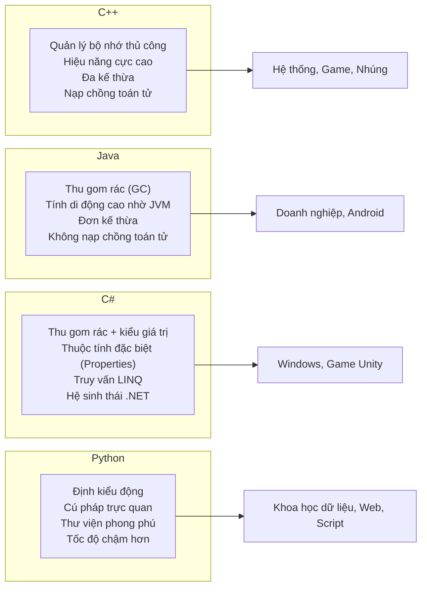

# Chương 15: So sánh với các Ngôn ngữ Lập trình Hướng đối tượng khác (Comparison with Other OOP Languages)

C++ chỉ là một trong nhiều ngôn ngữ lập trình hướng đối tượng, và mỗi ngôn ngữ đều được thiết kế dựa trên các đánh đổi kỹ thuật riêng. Việc thấu hiểu chi tiết sự khác biệt giữa C++ với Java, C#, và Python sẽ giúp bạn lựa chọn chính xác công cụ phù hợp nhất cho mỗi vấn đề kỹ thuật và dễ dàng thích ứng khi chuyển dịch giữa các ngôn ngữ khác nhau.

## C++ so với Java

Java ban đầu được thiết kế để đơn giản hóa C++ bằng cách loại bỏ hoàn toàn các tính năng dễ gây lỗi logic hoặc phụ thuộc vào nền tảng phần cứng. Cả hai ngôn ngữ chia sẻ nhiều nét tương đồng về cú pháp nhưng khác biệt sâu sắc ở cơ chế quản lý bộ nhớ, mô hình kế thừa, và hệ thống kiểm soát kiểu.

### Cơ chế Đa kế thừa (Multiple Inheritance)

C++ hỗ trợ cơ chế đa kế thừa (multiple inheritance) – một lớp con có khả năng kế thừa đồng thời từ nhiều lớp cơ sở. Java chỉ cho phép đơn kế thừa (single inheritance) đối với các lớp thông thường, nhưng cho phép đa kế thừa giao diện thông qua từ khóa `interface`.

```cpp
// Triển khai đa kế thừa trong C++
class Printable { public: virtual void print() = 0; };
class Serializable { public: virtual void serialize() = 0; };
class Document : public Printable, public Serializable {
    void print() override { /* ... */ }
    void serialize() override { /* ... */ }
};
```

```java
// Triển khai đơn kế thừa kết hợp đa giao diện trong Java
interface Printable { void print(); }
interface Serializable { void serialize(); }
class Document implements Printable, Serializable {
    public void print() { ... }
    public void serialize() { ... }
}
```

### Nạp chồng Toán tử (Operator Overloading)

C++ cho phép nạp chồng hầu hết các toán tử (ví dụ: `+`, `-`, `[]`, `()`), mang lại cú pháp tự nhiên và trực quan cho các kiểu dữ liệu tự định nghĩa. Java hoàn toàn không hỗ trợ nạp chồng toán tử – bắt buộc bạn phải gọi qua các hàm có tên tường minh như `add()` hoặc `get()`.

```cpp
// Nạp chồng toán tử + cho số phức trong C++
Complex operator+(const Complex& a, const Complex& b) {
    return Complex(a.real + b.real, a.imag + b.imag);
}
Complex c = a + b;
```

```java
// Gọi qua phương thức thông thường trong Java
Complex c = a.add(b);
```

### Con trỏ và Tham chiếu (Pointers and References)

C++ hỗ trợ quản lý con trỏ (pointers) tường minh cho phép gán trị null, gán lại vùng nhớ mới, và hỗ trợ các phép toán dịch chuyển con trỏ (pointer arithmetic). Java chỉ hỗ trợ tham chiếu (references) (bị giới hạn chặt chẽ hơn, không cho phép dịch chuyển con trỏ). Các tham chiếu trong Java hoạt động tương đối giống con trỏ C++ ở khía cạnh trỏ đến đối tượng, nhưng bạn hoàn toàn không thể thực hiện các phép toán số học trên đó.

```cpp
int* p = nullptr;
int x = 5;
p = &x;
int* q = p + 1; // Phép toán số học trên con trỏ – cho phép sử dụng nhưng rất nguy hiểm
```

```java
// Java chỉ sử dụng tham chiếu, không cho phép phép toán số học
Integer ref = null;   // Có thể gán null
ref = new Integer(5);
// Integer ref2 = ref + 1; // Lỗi biên dịch
```

### Hàm hủy so với Bộ thu gom rác (Destructors vs Garbage Collection)

C++ sử dụng cơ chế hủy đối tượng xác định (deterministic destruction) thông qua các hàm hủy (destructors). Các đối tượng cấp phát trên vùng nhớ Stack sẽ tự động bị hủy ngay khi ra khỏi phạm vi hoạt động; các đối tượng trên Heap sẽ bị hủy ngay khi gọi toán tử `delete`. Java sử dụng cơ chế thu gom rác tự động (GC - Garbage Collection) – đối tượng sẽ tự động được thu hồi khi không còn bất kỳ tham chiếu nào trỏ đến nó, nhưng thời điểm thu hồi cụ thể là không xác định. Các hàm hủy C++ là nền tảng để áp dụng triết lý RAII (tự động đóng tệp, giải phóng mutex). Java yêu cầu lập trình viên phải chủ động gọi phương thức `close()` hoặc ứng dụng cấu trúc `try‑with‑resources`.

```cpp
// Hàm hủy C++ tự động đóng và giải phóng tệp tin
void read() {
    std::ifstream file("data.txt");
    // ... tệp tin tự động đóng tại cuối khối lệnh
}
```

```java
// Java yêu cầu chủ động đóng tệp (hoặc dùng try‑with‑resources)
void read() {
    try (FileInputStream file = new FileInputStream("data.txt")) {
        // Tự động đóng nhờ try‑with‑resources (Java 7+)
    } catch (IOException e) { }
}
```

### Cấp phát đối tượng trên vùng nhớ Stack

C++ cho phép khởi tạo trực tiếp các đối tượng trên vùng nhớ Stack mà không cần dùng từ khóa `new`. Trong khi đó, các đối tượng trong Java (ngoại trừ các kiểu nguyên thủy) luôn bắt buộc phải được cấp phát trên Heap. Cấp phát trên Stack trong C++ mang lại tốc độ thực thi nhanh vượt trội và tự động giải phóng vùng nhớ cực kỳ an toàn.

```cpp
MyClass obj;          // Cấp phát trên Stack – không sử dụng new
MyClass* p = new MyClass(); // Cấp phát trên Heap
```

```java
MyClass obj = new MyClass(); // Luôn cấp phát trên Heap và bắt buộc phải dùng new
```

**Bảng so sánh chi tiết – C++ so với Java**:

| Đặc tính | C++ | Java |
|---|---|---|
| **Đa kế thừa lớp** | Có hỗ trợ | Không (chỉ hỗ trợ đa kế thừa giao diện) |
| **Nạp chồng toán tử** | Có hỗ trợ | Không hỗ trợ |
| **Quản lý con trỏ** | Có (cho phép phép toán số học con trỏ) | Không (chỉ dùng tham chiếu an toàn) |
| **Quản lý bộ nhớ** | Thủ công (`new`/`delete`) + Triết lý RAII | Thu gom rác tự động (Garbage Collection) |
| **Hàm hủy (Destructors)** | Có (thời điểm hủy xác định rõ ràng) | Không (phương thức `finalize` cũ đã bị loại bỏ) |
| **Cấp phát Stack cho đối tượng** | Có hỗ trợ | Không (đối tượng luôn nằm trên Heap) |
| **Khuôn mẫu lớp** | Có hỗ trợ (khởi tạo tại lúc biên dịch) | Sử dụng Generics (áp dụng cơ chế xóa kiểu) |
| **Cơ chế Phản chiếu (Reflection)** | Hạn chế (chỉ qua RTTI lúc chạy) | Rất mạnh mẽ (qua gói `java.lang.reflect`) |
| **Cơ chế biên dịch** | Biên dịch trực tiếp ra mã máy gốc | Biên dịch ra mã bytecode chạy trên JVM |

## C++ so với C#

C# được tập đoàn Microsoft thiết kế như một giải pháp thay thế hiện đại cho Java, nhưng ngôn ngữ này cũng chia sẻ rất nhiều nét đặc trưng tương đồng với C++. C# chạy trên nền tảng .NET (CLR) và tích hợp cơ chế thu gom rác tự động, tuy nhiên nó hỗ trợ các kiểu giá trị (`struct`) có khả năng được cấp phát trực tiếp trên Stack giống như C++.

### Khái niệm Properties so với Getters/Setters

C# tích hợp cấu trúc **Properties** (Thuộc tính đặc biệt) ở cấp độ ngôn ngữ giúp đóng gói các phương thức getter và setter một cách vô cùng ngắn gọn. Trong C++, bạn phải tự viết thủ công các hàm dạng `getX()` và `setX()`.

```csharp
// Sử dụng Property trong C#
public class Person {
    private string name;
    public string Name {
        get { return name; }
        set { name = value; }
    }
}
// Hoặc sử dụng auto‑implemented property ngắn gọn
public int Age { get; set; }
```

```cpp
// Định nghĩa getter/setter thủ công trong C++
class Person {
    std::string name_;
public:
    std::string getName() const { return name_; }
    void setName(const std::string& n) { name_ = n; }
};
```

### Kiểu giá trị và Kiểu tham chiếu (Value Types and References)

C# phân định rõ ràng giữa **Kiểu giá trị (Value types)** (`struct`) được cấp phát trên Stack (hoặc nằm trực tiếp trong đối tượng chứa) và **Kiểu tham chiếu (Reference types)** (`class`) được cấp phát trên Heap. Trong C++, bạn có toàn quyền tự quyết định phân bổ bộ nhớ Stack hay Heap cho mỗi đối tượng tại thời điểm khởi tạo bất kể định nghĩa kiểu của nó là gì.

```csharp
struct Point { public int X, Y; }  // Kiểu giá trị (Value type)
class Circle { public Point Center; public int Radius; } // Kiểu tham chiếu (Reference type)
```

**Bảng so sánh chi tiết – C++ so với C#**:

| Đặc tính | C++ | C# |
|---|---|---|
| **Đa kế thừa** | Có hỗ trợ | Không (chỉ hỗ trợ giao diện) |
| **Nạp chồng toán tử** | Có hỗ trợ hầu hết các toán tử | Hỗ trợ hạn chế một số toán tử |
| **Hủy đối tượng xác định** | Có (qua các hàm hủy tự động) | Không (thu gom rác tự động, hỗ trợ `IDisposable`) |
| **Templates so với Generics** | Templates (biên dịch sinh mã, chuyên biệt hóa) | Generics (an toàn kiểu tại lúc chạy) |
| **Quản lý con trỏ** | Có hỗ trợ | Có hỗ trợ (nhưng phải nằm trong khối `unsafe`) |
| **Bộ tiền xử lý** | Có hỗ trợ mạnh mẽ (`#define`, `#ifdef`) | Không (chỉ có các thuộc tính biên dịch có điều kiện) |

## C++ so với Python

Python là một ngôn ngữ lập trình thông dịch (interpreted) và định kiểu động (dynamically-typed). C++ là ngôn ngữ định kiểu tĩnh (statically-typed) và được biên dịch trực tiếp ra mã máy. Triết lý thiết kế của hai ngôn ngữ này hoàn toàn khác biệt.

### Định kiểu tĩnh so với Định kiểu động (Static Typing vs Dynamic Typing)

C++ yêu cầu mọi biến số phải được xác định rõ ràng kiểu dữ liệu tại thời điểm biên dịch. Python tự động xác định kiểu của biến số tại thời điểm chạy.

```cpp
// Cơ chế định kiểu tĩnh trong C++
int x = 5;
x = "hello"; // Lỗi biên dịch: không thể gán chuỗi cho biến kiểu int
```

```python
# Cơ chế định kiểu động trong Python
x = 5   # Biến x có kiểu int
x = "hello"  # Hoàn toàn hợp lệ, x chuyển sang kiểu str
```

Khuôn mẫu C++ mang lại khả năng đa hình tĩnh an toàn tại lúc biên dịch; cơ chế duck typing của Python mang lại sự linh hoạt tối đa lúc chạy.

### Hiệu năng thực thi (Performance)

C++ có tốc độ thực thi nhanh vượt trội so với Python nhờ cơ chế biên dịch trực tiếp ra mã máy gốc, loại bỏ hoàn toàn chi phí của bộ thông dịch, và cho phép can thiệp tối ưu hóa hiệu năng cấp thấp. Python có tốc độ thực thi chậm hơn đáng kể nhưng bù lại mang lại tốc độ phát triển dự án nhanh chóng và cú pháp vô cùng trực quan, dễ học.

| Khía cạnh so sánh | C++ | Python |
|---|---|---|
| **Tốc độ thực thi** | Cực nhanh (mã máy gốc) | Chậm hơn (thông dịch, thường chậm hơn 10‑100 lần) |
| **Biên dịch** | Biên dịch trước khi chạy (Ahead‑of‑time) | Biên dịch động (Just‑in‑time / thông dịch) |
| **Kiểm soát bộ nhớ** | Thủ công (qua RAII, các bộ cấp phát) | Tự động hoàn toàn (thu gom rác) |
| **Kiểm tra kiểu** | Tại thời điểm biên dịch | Tại thời điểm chạy |
| **Mức độ súc tích** | Dài dòng và chặt chẽ hơn | Ngắn gọn và trực quan hơn |
| **Siêu lập trình** | Dùng Templates, từ khóa `constexpr` | Hỗ trợ động, decorators, metaclasses |

### Các trường hợp ứng dụng thực tế

- **C++**: Các hệ thống yêu cầu hiệu năng cực cao, lõi công cụ phát triển game (game engines), các ứng dụng thời gian thực (real-time), hệ thống nhúng, và tính toán số học quy mô lớn.
- **Python**: Viết kịch bản tự động (scripting), khoa học dữ liệu và trí tuệ nhân tạo (NumPy, pandas, TensorFlow), lập trình phía máy chủ (Django, Flask), và xây dựng nhanh các sản phẩm thử nghiệm (rapid prototyping).

## Các lĩnh vực C++ là sự lựa chọn số một

C++ là sự lựa chọn không thể thay thế cho các lĩnh vực kỹ thuật đòi hỏi:

### Lập trình Hệ thống (System Programming)
Các hệ điều hành lớn (lõi hệ điều hành Windows, các trình điều khiển thiết bị Linux drivers), trình biên dịch, và phần mềm phân sụn (embedded firmware). C++ mang lại khả năng truy cập phần cứng trực tiếp, cơ chế dọn dẹp bộ nhớ xác định, và sự trừu tượng hóa không chi phí phát sinh (zero‑overhead abstractions).

### Các hệ thống thời gian thực (Real‑Time Systems)
Lĩnh vực chế tạo robot, hàng không vũ trụ, hệ thống điều khiển công nghiệp, và các hệ thống giao dịch tài chính tần suất cao. C++ đảm bảo hiệu năng thực thi có thể dự đoán trước một cách chính xác tuyệt đối, loại bỏ hoàn toàn các điểm dừng không mong muốn của bộ thu gom rác, và hỗ trợ can thiệp sâu vào cấu trúc luồng và bố cục bộ nhớ.

### Công nghệ phát triển Game (Game Engines)
Các lõi công cụ phát triển game nổi tiếng như Unreal Engine hay Unity. Hiệu năng thực thi tối đa của C++, khả năng tự quản lý bộ nhớ thủ công, và khả năng tương tác trực tiếp với các thư viện đồ họa cấp thấp (DirectX, Vulkan) giúp C++ thống trị hoàn toàn trong lĩnh vực phát triển game.

### Hệ thống Nhúng (Embedded Systems)
Các bộ vi điều khiển, thiết bị kết nối IoT, và công nghệ phần mềm ô tô (chuẩn AUTOSAR). C++ cho phép sinh mã nguồn cực kỳ nhỏ gọn và tối ưu hóa dung lượng lưu trữ, giúp C++ hiện đại (C++14/17/20) ngày càng được ứng dụng rộng rãi trong các hệ thống nhúng đòi hỏi độ an toàn cực cao (tuân thủ các hướng dẫn nghiêm ngặt như MISRA C++).

### Tính toán hiệu năng cao (HPC)
Các hệ thống mô phỏng số học phức tạp, dự báo thời tiết, và lõi suy luận trí tuệ nhân tạo AI. C++ kết hợp tối ưu với các thư viện hiệu năng cao như Eigen, Blaze, hoặc lập trình GPU qua thư viện CUDA.

### Các công cụ Cơ sở dữ liệu (Database Engines)
Các lõi hệ quản trị cơ sở dữ liệu lớn như MySQL (lõi InnoDB), RocksDB, hay MongoDB. C++ cho phép tự viết các bộ cấp phát bộ nhớ tùy biến riêng, hỗ trợ thao tác đọc xuất dữ liệu không sao chép (zero-copy I/O), và hiện thực hóa các cấu trúc dữ liệu không khóa (lock-free).

## Sơ đồ tổng quan so sánh giữa các ngôn ngữ



## Hướng dẫn lựa chọn ngôn ngữ phù hợp

| Khi mục tiêu thiết kế yêu cầu … | Ngôn ngữ tối ưu là … | Lý do lựa chọn cốt lõi |
|---|---|---|
| **Hiệu năng thực thi tối đa, kiểm soát bộ nhớ cấp thấp** | C++ | Sự trừu tượng hóa không chi phí phát sinh, không có GC |
| **Tính di động đa nền tảng, hệ thống thư viện doanh nghiệp** | Java | Máy ảo JVM, hệ sinh thái vô cùng lớn và tin cậy |
| **Phát triển ứng dụng Windows nhanh, lập trình game Unity** | C# | Tích hợp sâu với hệ sinh thái .NET, cú pháp hiện đại |
| **Xây dựng nhanh sản phẩm mẫu, phân tích dữ liệu chuyên sâu** | Python | Định kiểu động linh hoạt, hệ sinh thái thư viện khoa học dữ liệu khổng lồ |
| **Hệ thống thời gian thực / nhúng giới hạn tài nguyên phần cứng** | C++ | Cơ chế thực thi xác định, dung lượng tệp nhị phân nhỏ gọn |

Các ngôn ngữ này luôn cùng tồn tại và bổ trợ cho nhau – rất nhiều hệ thống phần mềm quy mô lớn trong thực tế sử dụng lõi hiệu năng cao bằng C++ kết hợp với giao diện hoặc logic xử lý cấp cao viết bằng Python hoặc Java. Làm chủ ngôn ngữ C++ giúp bạn thấu hiểu sâu sắc cách thức hoạt động ở tầng sâu bên dưới của hệ thống phần cứng cũng như cách các ngôn ngữ lập trình khác tự quản lý bộ nhớ và tối ưu hóa hiệu năng dưới mui xe.
