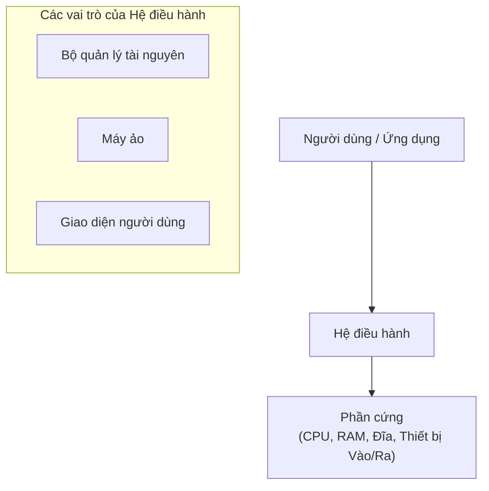
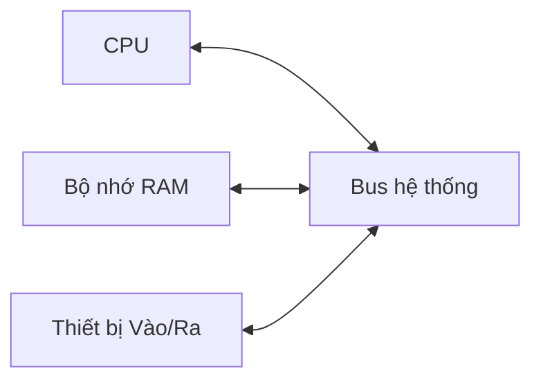
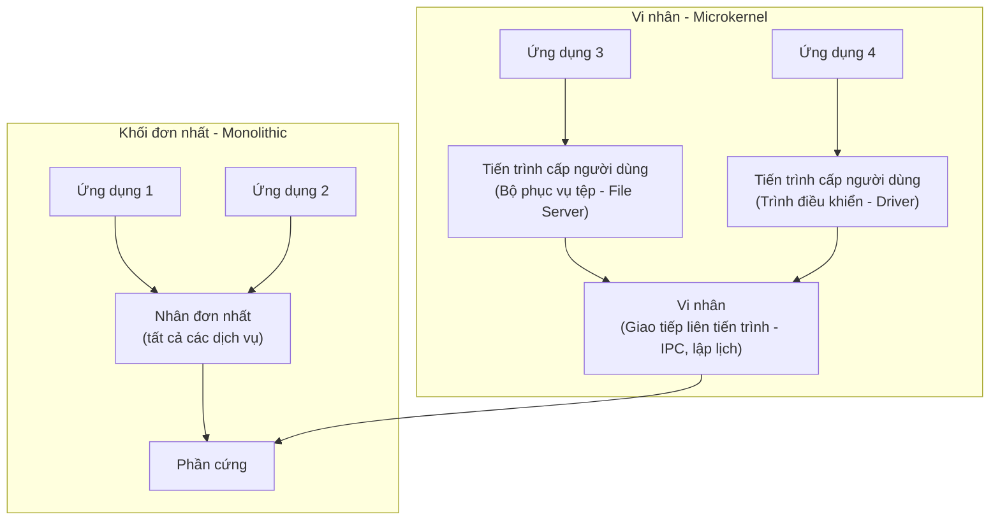
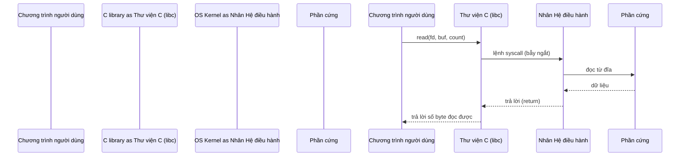
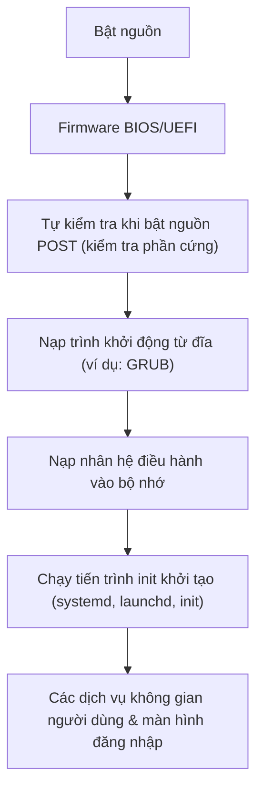

# Chương 1: Giới thiệu về Hệ điều hành (Introduction to Operating Systems)

Hệ điều hành (*Operating System - OS*) là phần mềm hệ thống cơ bản nhất chạy trên máy tính. Nó quản lý các tài nguyên phần cứng và cung cấp nền tảng để chạy các chương trình ứng dụng. Chương này giải thích các khái niệm cốt lõi, kiến trúc và dịch vụ của hệ điều hành hiện đại, đi kèm với các ví dụ thực tế trực quan để làm sâu sắc các ý tưởng.

---

## Hệ điều hành là gì?

Hệ điều hành là một lớp phần mềm trung gian nằm giữa người dùng (hoặc các chương trình ứng dụng) và phần cứng máy tính. Nhiệm vụ chính của nó là ẩn đi các chi tiết kỹ thuật phức tạp của phần cứng, cung cấp một môi trường sạch sẽ, thuận tiện và hiệu quả để các chương trình có thể thực thi.

**Một ví dụ so sánh thực tế dễ hiểu - Người quản lý khách sạn:**  
Hãy tưởng tượng các khách lưu trú (ứng dụng) yêu cầu phòng ở, đồ ăn, dịch vụ dọn dẹp... Người quản lý (*Hệ điều hành*) sẽ quyết định khách nào được nhận phòng nào, khi nào nhà bếp hoạt động, và đảm bảo các khách hàng không làm ảnh hưởng hay làm ồn lẫn nhau. Các phòng vật lý thực tế, thang máy và thiết bị bếp (*phần cứng*) được quản lý và bảo trì bởi nhân viên mà khách hàng không cần phải biết cách lắp đường ống nước hay sơ đồ đi dây điện của tòa nhà.

**Các hệ điều hành phổ biến** bạn thường gặp hàng ngày:
- **Windows** (trên máy tính để bàn, máy tính xách tay)
- **Linux** (trên máy chủ, điện thoại Android, thiết bị nhúng)
- **macOS** (trên máy tính để bàn và máy tính xách tay của Apple)
- **iOS** (trên iPhones, iPads)
- **Android** (trên điện thoại, máy tính bảng, smart TV)

---

## Các vai trò của một Hệ điều hành

Một hệ điều hành đóng ba vai trò lớn quan trọng.

### 1. Quản lý Tài nguyên (Resource Manager)

Các tài nguyên phần cứng (CPU, bộ nhớ, ổ đĩa, card mạng) luôn có giới hạn. Hệ điều hành chịu trách nhiệm phân bổ các tài nguyên này một cách công bằng, hợp lý và hiệu quả giữa các chương trình ứng dụng đang chạy đồng thời và cạnh tranh nhau.

### 2. Máy ảo (Virtual Machine)

Hệ điều hành tạo ra một biểu diễn trừu tượng của phần cứng giúp việc lập trình trở nên đơn giản hơn rất nhiều. Chẳng hạn, bạn chỉ cần thao tác với các tệp tin và thư mục thay vì phải đọc/ghi trực tiếp vào từng cung từ (sector) trên ổ đĩa vật lý; bạn nhìn thấy một cửa sổ phần mềm trực quan với con trỏ chuột thay vì phải trực tiếp điều khiển các bộ đệm điểm ảnh (pixel buffers) và xử lý ngắt phần cứng.

### 3. Giao diện (Interface)

Hệ điều hành cung cấp giao diện người dùng – có thể là giao diện dòng lệnh (Command-Line Interface - CLI) hoặc giao diện đồ họa (Graphical User Interface - GUI) – giúp người dùng có thể khởi chạy chương trình, quản lý tệp và cấu hình hệ thống.

Sơ đồ dưới đây biểu diễn các lớp kiến trúc cấu trúc:

---

## Kiến trúc Hệ thống Máy tính

Một hệ thống máy tính bao gồm bốn thành phần phần cứng chính. Chúng giao tiếp trực tiếp với nhau thông qua bus hệ thống (system bus).

### CPU (Bộ vi xử lý trung tâm - Central Processing Unit)

- Thực thi các lệnh máy (tính toán số học, logic, điều khiển luồng).
- Bao gồm nhiều nhân xử lý (mỗi nhân có thể chạy một chương trình/luồng riêng biệt).
- Tích hợp bộ nhớ đệm (*cache*) siêu nhanh nhưng dung lượng nhỏ.

### Bộ nhớ (RAM – Random Access Memory)

- Lưu trữ tạm thời dữ liệu và mã lệnh chương trình mà CPU đang hoạt động trực tiếp.
- Là bộ nhớ biến đổi (mất toàn bộ nội dung dữ liệu khi ngắt nguồn điện).
- Được chia nhỏ thành các byte, mỗi byte có một địa chỉ duy nhất.

### Các thiết bị Vào/Ra (I/O Devices)

- Đầu vào (Input): bàn phím, chuột, micro, máy quét.
- Đầu ra (Output): màn hình, máy in, loa.
- Lưu trữ: ổ đĩa cứng (HDD), ổ thể rắn (SSD), USB (được coi là thiết bị vào/ra đặc thù).
- Mạng: cổng Ethernet, card Wi-Fi (thiết bị vào/ra chuyên dụng kết nối mạng).

### Bus Hệ thống (System Bus)

- Đường truyền thông tin kết nối CPU, bộ nhớ RAM và các bộ điều khiển thiết bị vào/ra.
- Bao gồm bus địa chỉ (address bus), bus dữ liệu (data bus) và bus điều khiển (control bus).

**So sánh thực tế:** Một nhà bếp nhà hàng trong đó nhà bếp (*CPU*) chế biến các món ăn sử dụng nguyên liệu lấy từ tủ lạnh (*bộ nhớ RAM*). Nhân viên phục vụ (*Thiết bị Vào/Ra*) ghi nhận đơn hàng từ thực khách và bưng món ăn đã hoàn thành ra ngoài. Quầy trung chuyển thức ăn (*Bus hệ thống*) là nơi đơn hàng và đĩa thức ăn được truyền qua lại.

---

## Cấu trúc Hệ điều hành: Khối đơn nhất, Phân tầng, Vi nhân, Lai

Hệ điều hành được xây dựng theo các phong cách kiến trúc khác nhau, mang lại các ưu và nhược điểm riêng về hiệu năng, độ an toàn và khả năng bảo trì.

### Nhân Khối đơn nhất (Monolithic Kernel)

Tất cả các dịch vụ của hệ điều hành đều chạy chung trong một không gian địa chỉ nhân duy nhất (chế độ đặc quyền - kernel mode). Kiến trúc này giúp hệ thống đạt tốc độ rất nhanh vì không tốn hao phí giao tiếp giữa các thành phần, nhưng chỉ cần một lỗi nhỏ (bug) ở bất kỳ module nào (ví dụ: lỗi driver) cũng có thể làm sập toàn bộ hệ thống.

- **Ví dụ**: Linux, các hệ điều hành UNIX đời đầu, MS-DOS.
- **So sánh thực tế**: Một cửa hàng tạp hóa nhỏ nơi người chủ tự mình làm tất cả mọi việc – nấu ăn, dọn dẹp, thu tiền. Rất nhanh chóng nhưng cực kỳ rủi ro; chỉ một sai lầm nhỏ cũng có thể làm gián đoạn mọi thứ.

### Nhân Phân tầng (Layered Kernel)

Hệ điều hành được chia thành các tầng (lớp) xếp chồng lên nhau, tầng dưới cung cấp các dịch vụ làm nền tảng cho tầng ngay trên nó sử dụng. Cấu trúc này giúp hệ thống có tính module hóa cao, dễ viết mã, nhưng hiệu năng có thể bị ảnh hưởng do độ trễ khi dữ liệu phải truyền qua nhiều tầng trung gian.

- **Ví dụ**: Hệ thống THE (Dijkstra thiết kế năm 1968).

### Vi nhân (Microkernel)

Chỉ các dịch vụ tối thiểu và cốt lõi nhất (giao tiếp liên tiến trình IPC, quản lý bộ nhớ cơ bản, lập lịch cơ bản) mới được chạy trong chế độ đặc quyền (kernel mode). Các dịch vụ khác như trình điều khiển thiết bị (drivers), hệ thống tệp và giao thức mạng sẽ chạy dưới dạng các tiến trình cấp người dùng bình thường (user mode). Kiến trúc này cực kỳ an toàn và ổn định, nhưng hiệu năng bị giảm sút do tần suất chuyển đổi ngữ cảnh (context switch) giữa các tiến trình diễn ra liên tục.

- **Ví dụ**: QNX, L4, MINIX (hệ điều hành truyền cảm hứng cho thiết kế ban đầu của Linux).
- **So sánh thực tế**: Một tập đoàn lớn nơi mỗi phòng ban (bảo vệ, ăn uống, IT) hoạt động độc lập. Nếu bộ phận ăn uống gặp sự cố, tập đoàn vẫn duy trì hoạt động bình thường.

### Nhân Lai (Hybrid Kernel)

Là sự kết hợp trung hòa – đưa hầu hết các dịch vụ cốt lõi vào không gian nhân để đạt hiệu năng xử lý cao, nhưng vẫn giữ cấu trúc module của vi nhân để tăng khả năng quản lý.

- **Ví dụ**: Windows NT (và các phiên bản Windows hiện đại sau này), macOS XNU.

---

## Chế độ Người dùng (User Mode) vs. Chế độ Đặc quyền (Kernel Mode)

Bộ vi xử lý (CPU) hỗ trợ ít nhất hai cấp độ đặc quyền khác nhau để bảo vệ hệ điều hành khỏi các chương trình bị lỗi hoặc cố ý phá hoại phần cứng.

- **Chế độ Đặc quyền (Kernel mode)** (còn gọi là chế độ giám sát - supervisor mode, Ring 0 trên x86):
  - Có quyền thực thi tất cả các **lệnh đặc quyền** (privileged instructions - ví dụ: dừng hoạt động CPU, thay đổi ánh xạ bộ nhớ ảo, truy cập trực tiếp vào thiết bị vào/ra vật lý).
  - Có toàn quyền truy cập vào toàn bộ bộ nhớ vật lý của hệ thống.
  - Nhân (kernel) của hệ điều hành hoạt động hoàn toàn ở chế độ này.

- **Chế độ Người dùng (User mode)** (Ring 3 trên kiến trúc x86):
  - Không thể thực thi các lệnh đặc quyền trực tiếp.
  - Khả năng truy cập bộ nhớ bị giới hạn trong không gian địa chỉ được cấp phát riêng của tiến trình đó.
  - Tất cả các chương trình ứng dụng của người dùng đều hoạt động ở chế độ này.

**Làm thế nào để CPU biết đang ở chế độ nào?**  
Một biến cờ **mode bit** trong thanh ghi trạng thái của CPU sẽ biểu thị chế độ hiện tại: chế độ đặc quyền (0) hoặc chế độ người dùng (1).

**Chuyển đổi từ Chế độ người dùng sang Chế độ đặc quyền**:
- **Lời gọi hệ thống (System call)** (ví dụ: yêu cầu đọc một tệp tin) – chương trình thực thi một lệnh đặc biệt (lệnh `syscall` hoặc `int 0x80`).
- **Ngắt (Interrupt)** (ví dụ: ngắt từ bộ định thời timer, ngắt từ bàn phím).
- **Ngoại lệ (Exception)** (ví dụ: lỗi chia cho số 0, lỗi trang - page fault).

Khi xảy ra sự kiện chuyển đổi này, CPU sẽ lưu lại trạng thái hoạt động hiện tại và nhảy tới chạy trình xử lý đã được định nghĩa trước của nhân hệ điều hành. Sau khi xử lý xong, hệ thống sẽ trả quyền điều khiển và đưa CPU quay lại chế độ người dùng.

**So sánh thực tế:**  
- **Chế độ người dùng**: Bạn được phép đi lại tự do trong trung tâm thương mại (khu vực công cộng). Bạn không thể tự ý vào phòng két sắt hoặc phòng vận hành hệ thống điện của tòa nhà.  
- **Chế độ đặc quyền**: Nhân viên an ninh có thẻ đặc quyền có thể đi đến bất kỳ đâu, mở bất kỳ cánh cửa nào và ngắt toàn bộ hệ thống điều hòa nếu cần.  
- **Lời gọi hệ thống**: Bạn yêu cầu nhân viên an ninh mở khóa một căn phòng chuyên dụng để bạn có thể vào lấy đồ.

---

## Lời gọi Hệ thống (System Calls) và API

Một **lời gọi hệ thống (system call)** là một yêu cầu từ một chương trình chạy ở chế độ người dùng gửi tới hệ điều hành để yêu cầu thực thi một dịch vụ đặc quyền (ví dụ: mở tệp, tạo tiến trình mới, cấp phát bộ nhớ RAM). Lời gọi hệ thống là con đường duy nhất để chương trình ứng dụng tiếp cận các chức năng của nhân hệ điều hành.

**Các lời gọi hệ thống phổ biến** (trên hệ điều hành Linux/UNIX):

| Danh mục | Các ví dụ cụ thể |
| :--- | :--- |
| **Quản lý tiến trình** | `fork()`, `exec()`, `wait()`, `exit()` |
| **Quản lý tệp tin** | `open()`, `read()`, `write()`, `close()` |
| **Quản lý thiết bị** | `ioctl()`, `read()`, `write()` |
| **Quản lý thông tin** | `getpid()`, `time()` |
| **Truyền thông mạng** | `socket()`, `send()`, `recv()` |

**API (Application Programming Interface)** – Là tập hợp các hàm được cung cấp bởi một thư viện lập trình (như thư viện chuẩn C - libc) đóng vai trò bao bọc (wrap) các lời gọi hệ thống bên dưới. Một hàm API có thể gọi một hoặc nhiều lời gọi hệ thống, hoặc tự xử lý công việc mà không cần gọi xuống hệ điều hành.

- **Ví dụ**: Hàm `printf()` trong C gọi lời gọi hệ thống `write()` để in ký tự ra màn hình, nhưng trước đó nó cũng thực hiện định dạng chuỗi ký tự.
- **Tại sao cần dùng API?** Để tăng tính di động của mã nguồn – cùng một hàm API có thể hoạt động nhất quán trên các hệ điều hành khác nhau, dù hệ điều hành bên dưới sử dụng các lời gọi hệ thống khác biệt hoàn toàn.

**Trình tự thực hiện một lời gọi hệ thống (ví dụ: đọc dữ liệu từ tệp tin)**:

**So sánh thực tế:**  
Bạn (*chương trình ứng dụng*) muốn rút tiền từ tài khoản ngân hàng. Bạn điền thông tin vào phiếu rút tiền (*gọi hàm API*). Giao dịch viên (*trình xử lý system call*) tiếp nhận, kiểm tra số dư của bạn trên hệ thống (*nhân hệ điều hành*), vào kho tiền lấy tiền mặt (*phần cứng*) và đưa tiền cho bạn. Bạn không bao giờ được phép tự mình bước chân vào kho tiền của ngân hàng.

---

## Các Dịch vụ và Tiện ích của Hệ điều hành

Hệ điều hành cung cấp một bộ các **dịch vụ** cốt lõi giúp cuộc sống của lập trình viên và người dùng trở nên dễ dàng hơn.

| Dịch vụ | Mô tả chi tiết | Ví dụ thực tế |
| :--- | :--- | :--- |
| **Thực thi chương trình** | Nạp một chương trình vào bộ nhớ RAM và điều khiển để chạy nó | Kích đúp chuột vào một tệp `.exe` hoặc chạy lệnh `./a.out` |
| **Thực hiện thao tác I/O** | Đọc/ghi dữ liệu từ các thiết bị ngoại vi, ổ đĩa | Hàm `printf`, `scanf`, truy xuất ổ cứng |
| **Thao tác hệ thống tệp** | Tạo, xóa, đổi tên các tệp tin và thư mục | Lệnh `mkdir`, `rm`, trình duyệt quản lý tệp Explorer |
| **Truyền thông tin** | Trao đổi dữ liệu giữa các tiến trình đang chạy (cùng máy hoặc qua mạng) | Đường ống (pipes), socket mạng, bộ nhớ chia sẻ |
| **Phát hiện lỗi** | Giám sát và xử lý các lỗi phần cứng, lỗi bộ nhớ, chia cho số 0 | Trình xử lý lỗi Segmentation fault |
| **Cấp phát tài nguyên** | Phân chia thời gian xử lý CPU, dung lượng RAM cho các tác vụ | Trình lập lịch (scheduler), trình quản lý bộ nhớ |
| **Thống kê (Accounting)** | Ghi lại việc sử dụng tài nguyên của từng tài khoản người dùng | Các lệnh `top`, `ps`, tệp nhật ký hệ thống logs |
| **Bảo vệ (Protection)** | Ngăn chặn truy cập trái phép vào các vùng dữ liệu | Phân quyền tệp (permissions), bảo vệ các vùng nhớ |

**Các tiện ích (Utilities)** là các chương trình ứng dụng cấp người dùng đi kèm với hệ điều hành (ví dụ: `ls`, `cp`, `grep`, trình quản lý tác vụ Task Manager). Chúng sử dụng các lời gọi hệ thống bên dưới để thực hiện công việc của mình.

---

## Quy trình Khởi động Máy tính (Booting Process)

Khởi động hệ thống (*Booting*) là chuỗi các thao tác tự động giúp nạp nhân hệ điều hành vào bộ nhớ RAM và thiết lập trạng thái hoạt động ban đầu khi bạn nhấn nút nguồn bật máy tính.

### Các bước của quy trình khởi động:

### Giải thích chi tiết các bước:

1. **Bật nguồn** – CPU được cấp điện hoạt động ở chế độ thực tế (real mode - memory truy cập hạn chế) và tự động nhảy tới chạy mã lệnh tại một địa chỉ bộ nhớ được cố định sẵn, nơi lưu trữ firmware BIOS của bo mạch chủ.

2. **BIOS hoặc UEFI** – Phần mềm BIOS (đời cũ) hoặc UEFI (hiện đại) tiến hành khởi tạo các phần cứng cơ bản của máy tính: thiết lập xung nhịp, cấu hình bộ điều khiển RAM, dò tìm các ổ đĩa cứng kết nối.

3. **POST (Power‑On Self Test)** – Chương trình tự kiểm tra xem các phần cứng quan trọng (CPU, RAM, card đồ họa, bộ điều khiển đĩa) có hoạt động bình thường không. Nếu phát hiện lỗi nghiêm trọng, hệ thống sẽ phát ra các tiếng bíp cảnh báo hoặc hiển thị mã lỗi lên màn hình.

4. **Nạp trình khởi động (Bootloader)** – BIOS/UEFI tìm kiếm thiết bị khởi động ưu tiên, đọc cung mồi đầu tiên (Master Boot Record - MBR hoặc phân vùng EFI) để nạp một chương trình nhỏ gọi là bootloader (như GRUB, Windows Boot Manager) vào bộ nhớ RAM.

5. **Nạp nhân hệ điều hành (Kernel)** – Trình bootloader đọc tệp nhân hệ điều hành (ví dụ: `vmlinuz` trên hệ điều hành Linux) từ ổ cứng và nạp vào bộ nhớ RAM, có thể đi kèm một phân đĩa RAM ảo tạm thời (initrd) chứa các driver cần thiết để gắn kết hệ thống tệp thực sự.

6. **Khởi tạo nhân** – Nhân hệ điều hành bắt đầu chạy, cấu hình các chế độ bảo vệ nâng cao của CPU, khởi tạo trình quản lý bộ nhớ, thiết lập bảng vector ngắt, nạp các trình điều khiển thiết bị (drivers) và tiến hành gắn kết hệ thống tệp gốc (`/` trên hệ thống Linux).

7. **Khởi chạy tiến trình Init** – Nhân hệ điều hành khởi chạy tiến trình cấp người dùng đầu tiên, thường là `/sbin/init` (trên Linux hiện nay phổ biến là `systemd`, `launchd` trên macOS). Tiến trình gốc này sẽ chịu trách nhiệm khởi chạy tất cả các dịch vụ hệ thống khác (như mạng, ghi nhật ký log, giao diện đồ họa).

8. **Màn hình đăng nhập** – Cuối cùng, hệ thống hiển thị màn hình đăng nhập (dạng dòng lệnh hoặc đồ họa). Sau khi xác thực thành công, môi trường làm việc hoặc giao diện desktop sẽ sẵn sàng phục vụ người dùng.

---

## Bảng Tổng kết Chương

| Khái niệm | Điểm cốt lõi cần nhớ |
| :--- | :--- |
| **Định nghĩa Hệ điều hành** | Phần mềm hệ thống quản lý phần cứng, tạo môi trường máy ảo trừu tượng và cung cấp giao diện giao tiếp. |
| **Các vai trò chính** | Quản lý tài nguyên, cung cấp máy ảo trừu tượng, cung cấp giao diện người dùng. |
| **Kiến trúc máy tính** | Các thiết bị CPU, RAM, Vào/Ra giao tiếp đồng bộ thông qua Bus hệ thống. |
| **Cấu trúc nhân OS** | Khối đơn nhất (nhanh, dễ hỏng), vi nhân (an toàn, chậm hơn do chuyển ngữ cảnh), nhân lai (cân bằng hiệu năng). |
| **Chế độ User vs. Kernel** | Phân tách đặc quyền an toàn; lời gọi hệ thống (system call) là cơ chế chuyển giao chế độ đặc quyền. |
| **Lời gọi hệ thống** | Yêu cầu dịch vụ đặc quyền từ nhân; được che giấu và đóng gói thuận tiện bởi các hàm API. |
| **Dịch vụ Hệ điều hành** | Thực thi ứng dụng, vào/ra dữ liệu, quản lý tệp, truyền thông, bảo vệ an ninh... |
| **Quy trình Khởi động** | Bật nguồn → Khởi chạy BIOS/UEFI → Thực hiện POST → Nạp Bootloader → Khởi chạy Kernel → Chạy Init → Đăng nhập. |

Việc nắm vững các nền tảng cơ bản này là điều kiện tiên quyết trước khi chúng ta đi sâu vào tìm hiểu về quản lý tiến trình, lập lịch CPU và quản lý bộ nhớ – các chủ đề sẽ được trình bày chi tiết trong các chương tiếp theo.
