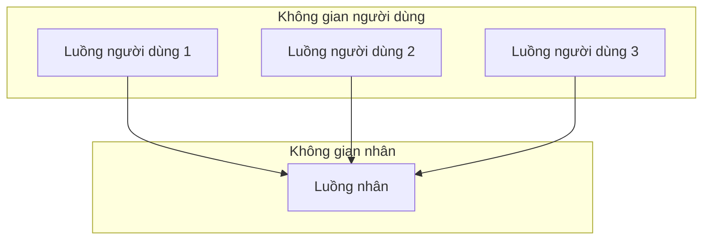
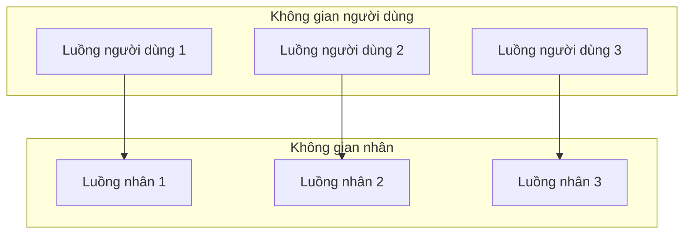
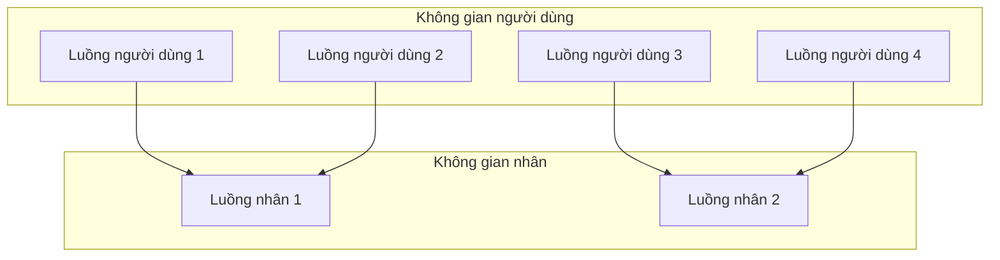

# Chương 2: Quản lý Tiến trình (Process Management)

Tiến trình (*Process*) là khái niệm cốt lõi của bất kỳ hệ điều hành nào. Chương này giải thích tiến trình là gì, cách hệ điều hành quản lý nó và cách các hệ thống hiện đại sử dụng luồng (*threads*) để nâng cao hiệu năng cũng như tốc độ phản hồi.

---

## Khái niệm Tiến trình: Chương trình vs. Tiến trình

Một **chương trình** (*program*) là một thực thể thụ động – là một tệp lưu trữ trên ổ đĩa chứa mã lệnh và dữ liệu (ví dụ: `a.out`, `chrome.exe`). Một **tiến trình** (*process*) là một thực thể chủ động – là một chương trình đang trong quá trình thực thi, đi kèm bộ nhớ, các thanh ghi và trạng thái hoạt động riêng của nó.

**Sự khác biệt cốt lõi**:
- **Chương trình**: Tĩnh, lưu trên đĩa cứng, chưa được cấp phát tài nguyên.
- **Tiến trình**: Động, được nạp vào bộ nhớ RAM, do hệ điều hành sở hữu và điều phối.

**So sánh thực tế**: Một công thức nấu ăn (*chương trình*) chỉ là chữ viết trên giấy. Khi bạn thực sự bắt tay vào nấu – bật bếp, thái hành, đảo thịt – đó là một tiến trình. Cùng một công thức đó có thể được nấu bởi nhiều đầu bếp khác nhau cùng một lúc, mỗi người là một tiến trình riêng biệt và độc lập.

---

## Các Trạng thái của Tiến trình (Process States)

Trong quá trình thực thi, tiến trình thay đổi trạng thái liên tục. Hệ điều hành theo dõi chặt chẽ các trạng thái này để phân bổ tài nguyên CPU và bộ nhớ hợp lý.

| Trạng thái | Mô tả |
| :--- | :--- |
| **Mới (New)** | Tiến trình đang được tạo lập (ví dụ: lời gọi hàm `fork()` được kích hoạt nhưng chưa sẵn sàng chạy). |
| **Sẵn sàng (Ready)** | Tiến trình đã được nạp vào RAM, đang xếp hàng chờ cấp phát CPU để chạy. |
| **Đang chạy (Running)** | Các lệnh mã máy của tiến trình đang thực sự được CPU thực thi. |
| **Đang chờ (Waiting / Blocked)** | Tiến trình bị dừng để đợi một sự kiện (như hoàn thành việc vào/ra dữ liệu I/O, hoặc nhận tín hiệu). |
| **Kết thúc (Terminated)** | Tiến trình đã hoàn thành toàn bộ công việc thực thi (ví dụ: gọi hàm `exit()`). |

Để hình dung quá trình chuyển đổi giữa các trạng thái tiến trình, bạn có thể tham khảo sơ đồ kinh điển sau:
1. **New** → (Admitted) → **Ready**
2. **Ready** → (Scheduler dispatch) → **Running**
3. **Running** → (Interrupt) → **Ready**
4. **Running** → (I/O or event wait) → **Waiting**
5. **Waiting** → (I/O or event completion) → **Ready**
6. **Running** → (Exit) → **Terminated**

**So sánh thực tế - Thực khách trong nhà hàng:**
- **New** – Bước chân vào cửa, chưa được xếp bàn.
- **Ready** – Đang đứng xếp hàng đợi nhân viên dẫn vào bàn trống.
- **Running** – Đã ngồi vào bàn và đang ăn uống ngon miệng.
- **Waiting** – Đang ngồi đợi nhân viên đem hóa đơn thanh toán ra.
- **Terminated** – Thanh toán xong và rời khỏi nhà hàng.

---

## Khối Quản lý Tiến trình (Process Control Block - PCB)

Với mỗi tiến trình đang chạy, hệ điều hành duy trì một cấu trúc dữ liệu lưu trữ nội bộ gọi là **Khối Quản lý Tiến trình** (Process Control Block - PCB, hay còn gọi là khối quản lý tác vụ). Nó chứa toàn bộ các thông tin cần thiết để hệ thống quản trị tiến trình.

**Các thông tin chính trong PCB**:

| Trường dữ liệu | Mô tả chi tiết |
| :--- | :--- |
| **Process ID (PID)** | Mã định danh duy nhất bằng số của tiến trình. |
| **Program counter (PC)** | Con trỏ chương trình lưu địa chỉ lệnh tiếp theo sẽ thực thi. |
| **Thanh ghi CPU** | Lưu trữ toàn bộ trạng thái các thanh ghi đa năng, con trỏ ngăn xếp (stack pointer)... |
| **Giới hạn bộ nhớ** | Thông tin về thanh ghi cơ sở (base), thanh ghi giới hạn (limit), và các bảng trang (page tables). |
| **Danh sách tệp đang mở** | Danh sách các mô tả tệp (file descriptors) và quyền hạn đi kèm của tiến trình. |
| **Trạng thái I/O** | Các thiết bị ngoại vi đang được cấp phát riêng cho tiến trình này. |
| **Trạng thái tiến trình** | Mới, sẵn sàng, đang chạy, đang chờ, kết thúc. |
| **Độ ưu tiên** | Độ ưu tiên lập lịch CPU (nếu có áp dụng). |
| **Thông tin thống kê** | Tổng thời gian CPU đã sử dụng, tài khoản người dùng sở hữu tiến trình... |

Khi hệ điều hành tạm dừng một tiến trình để nhường CPU cho tiến trình khác, hệ thống sẽ lưu lại toàn bộ trạng thái các thanh ghi CPU hiện tại vào khối PCB của tiến trình đó. Khi kích hoạt tiến trình này chạy lại, hệ thống sẽ khôi phục dữ liệu từ PCB nạp ngược lại vào các thanh ghi của CPU để chạy tiếp.

---

## Hàng đợi Lập lịch Tiến trình (Process Scheduling Queues)

Hệ điều hành sử dụng các hàng đợi khác nhau để quản lý vòng đời của tất cả các tiến trình.

| Hàng đợi | Mục đích sử dụng |
| :--- | :--- |
| **Hàng đợi Công việc (Job queue)** | Chứa tất cả các tiến trình có mặt trong hệ thống (nằm trên đĩa cứng hoặc RAM). |
| **Hàng đợi Sẵn sàng (Ready queue)** | Chứa các tiến trình đang ở trạng thái **Ready** để chờ được cấp CPU. Được cài đặt dưới dạng một danh sách liên kết của các khối PCB. |
| **Hàng đợi Thiết bị (Device queue)** | Chứa các tiến trình đang bị chặn để đợi một thiết bị I/O cụ thể (như ổ đĩa, máy in). Mỗi thiết bị có một hàng đợi riêng biệt. |

**Luồng chuyển dịch**: Tiến trình mới được tạo → Đưa vào Hàng đợi sẵn sàng (Ready queue) → Cấp phát CPU để chạy (Running) → Nếu có yêu cầu I/O → Đưa vào Hàng đợi thiết bị (Device queue) → Khi I/O hoàn thành → Đưa quay lại Hàng đợi sẵn sàng → Kết thúc (Terminated).

```mermaid
flowchart LR
    New["Tiến trình mới"] --> ReadyQueue["Hàng đợi sẵn sàng (Ready Queue)"]
    ReadyQueue --> CPU
    CPU -->|hết lát cắt thời gian (timeslice)| ReadyQueue
    CPU -->|yêu cầu I/O| DeviceQueue["Hàng đợi thiết bị (Device Queue)"]
    DeviceQueue -->|hoàn thành I/O| ReadyQueue
    CPU -->|kết thúc (exit)| Terminated["Kết thúc (Terminated)"]
```

---

## Chuyển đổi Ngữ cảnh (Context Switching)

**Chuyển đổi ngữ cảnh** (*Context switching*) là hành động lưu lại trạng thái hoạt động hiện tại (vào PCB) của tiến trình đang chạy trên CPU và nạp trạng thái đã lưu từ PCB của một tiến trình mới vào CPU để khởi chạy. Quá trình này giúp CPU có thể luân chuyển nhanh chóng giữa các tiến trình, tạo ra cảm giác chạy song song (đồng thời).

**Các bước thực hiện**:
1. Lưu lại các thanh ghi CPU và con trỏ chương trình hiện tại của tiến trình đang chạy vào PCB của nó.
2. Cập nhật trạng thái tiến trình trong PCB (ví dụ: chuyển từ Đang chạy → Sẵn sàng).
3. Đưa PCB này vào hàng đợi thích hợp (hàng đợi sẵn sàng hoặc hàng đợi thiết bị).
4. Lựa chọn một tiến trình mới từ hàng đợi sẵn sàng (thông qua bộ lập lịch scheduler).
5. Nạp dữ liệu từ PCB của tiến trình mới đó vào lại các thanh ghi và con trỏ chương trình của CPU.
6. CPU bắt đầu thực thi tiến trình mới.

**Hao phí (Overhead)**: Chuyển đổi ngữ cảnh hoàn toàn là thời gian hao phí vô ích – CPU không thực hiện được bất kỳ công việc hữu ích nào cho chương trình của người dùng trong lúc chuyển đổi. Chi phí này phụ thuộc rất nhiều vào hỗ trợ của phần cứng (số lượng thanh ghi cần lưu) và cấu trúc quản lý bộ nhớ (có phải xóa toàn bộ bộ đệm TLB hay không).

**So sánh thực tế**: Một giảng viên đang chấm bài thi. Khi một sinh viên bước đến hỏi bài, giảng viên phải đánh dấu lại dòng đang chấm (*lưu PCB*), quay sang giải đáp thắc mắc cho sinh viên (*tiến trình mới*), sau khi sinh viên rời đi, giảng viên quay lại đọc tiếp bài thi từ dòng đã đánh dấu (*khôi phục trạng thái*).

---

## Tạo lập và Kết thúc Tiến trình

### Tạo lập Tiến trình (Creation)

Một tiến trình có thể tạo ra các tiến trình khác bằng cách sử dụng lời gọi hệ thống `fork()` (trên hệ điều hành Unix/Linux) hoặc hàm `CreateProcess()` (trên Windows). Tiến trình tạo gọi là **tiến trình cha** (parent process), tiến trình mới được sinh ra gọi là **tiến trình con** (child process).

**Lời gọi `fork()`** (trên Unix/Linux):
- Nhân bản chính xác tiến trình cha (sao chép toàn bộ mã lệnh, phân đoạn dữ liệu, heap và ngăn xếp stack).
- Tiến trình con được cấp một mã PID mới và sở hữu vùng nhớ hoàn toàn độc lập.
- Hàm `fork()` trả về giá trị đặc biệt:
  - Trả về `0` cho tiến trình con.
  - Trả về mã PID của con cho tiến trình cha.
  - Trả về `-1` nếu xảy ra lỗi tạo lập.

**Họ hàm `exec()`** – Thay thế toàn bộ vùng nhớ hiện tại của tiến trình bằng một chương trình hoàn toàn mới. Thường được gọi ngay sau lệnh `fork()` để chạy một chương trình khác.

```c
pid_t pid = fork();
if (pid == 0) {
    // Đây là Tiến trình con
    execlp("/bin/ls", "ls", NULL);
} else {
    // Đây là Tiến trình cha
    wait(NULL);
}
```

**Phân biệt `fork()` vs. `exec()`**:
- `fork()` nhân bản (clones) tiến trình đang gọi.
- `exec()` thay thế toàn bộ mã lệnh bằng một chương trình mới, giải phóng mã cũ.

### Kết thúc Tiến trình (Termination)

Tiến trình kết thúc thông qua lời gọi hệ thống `exit()`. Các nguyên nhân:
- Hoàn thành công việc bình thường (trả về từ hàm `main` hoặc gọi `exit`).
- Gặp lỗi kỹ thuật hoặc lỗi hệ thống nghiêm trọng.
- Bị buộc dừng bởi tiến trình khác (ví dụ: dùng lệnh `kill` trên Unix).

Khi một tiến trình kết thúc, hệ điều hành sẽ:
- Giải phóng toàn bộ tài nguyên (giải phóng RAM, đóng các tệp đang mở, xóa bộ đệm I/O).
- Xóa khối PCB của nó ra khỏi các hàng đợi hoạt động.
- Thông báo cho tiến trình cha biết trạng thái kết thúc (qua hàm `wait()` hoặc gửi tín hiệu signal).

**Tiến trình thây ma (Zombie process):** Là tiến trình con đã kết thúc hoàn toàn công việc nhưng tiến trình cha chưa gọi hàm `wait()` để thu nhận trạng thái kết thúc. Khối PCB của con vẫn được giữ lại tạm thời trong hệ thống.  
**Tiến trình mồ côi (Orphan process):** Là tiến trình con đang hoạt động nhưng tiến trình cha của nó đã bị kết thúc trước. Trên hệ điều hành Unix, các tiến trình con mồ côi này sẽ tự động được nhận nuôi bởi tiến trình khởi tạo gốc `init` (PID 1) để `init` gọi `wait()` xử lý thu dọn khi chúng kết thúc.

---

## Hệ phân cấp Tiến trình (Process Hierarchies)

Các hệ điều hành thường tổ chức các tiến trình hoạt động dưới dạng một cấu trúc **cây**. Gốc của cây là tiến trình đầu tiên được khởi tạo của hệ thống (ví dụ: tiến trình `init` hoặc `systemd` trên Linux, `launchd` trên macOS).

- Tiến trình cha tạo ra các tiến trình con.
- Các tiến trình con tiếp tục tạo các con của riêng chúng – tạo nên cây phân cấp.
- Hệ điều hành có thể lan truyền các tín hiệu (ví dụ: `SIGTERM`) đi dọc từ trên xuống dưới cây tiến trình để tắt đồng loạt.

**Ví dụ cấu trúc cây** (trên Unix):
```
init (PID 1)
├─ systemd-logind
├─ sshd
│   └─ bash (đăng nhập người dùng)
│       └─ gcc (trình biên dịch)
└─ chrome
    ├─ chrome (tiến trình quản lý tab 1)
    └─ chrome (tiến trình quản lý GPU)
```

**So sánh thực tế**: Giám đốc điều hành của công ty (*init*) tuyển dụng các quản lý cấp trung (*tiến trình cha*), các quản lý này tiếp tục tuyển dụng các nhân viên (*tiến trình con*). Nếu một quản lý nghỉ việc đột ngột, các nhân viên dưới quyền có thể được chuyển giao trực tiếp cho giám đốc điều hành quản lý (*nhận nuôi mồ côi*).

---

## Tiến trình so với Luồng (Process vs. Thread)

Một **luồng** (*thread*) là một đơn vị thực thi mã lệnh siêu nhẹ nằm bên trong một tiến trình. Mỗi tiến trình có ít nhất một luồng hoạt động chính (gọi là luồng chính - main thread). Nhiều luồng khác nhau trong cùng một tiến trình sẽ chia sẻ chung vùng không gian địa chỉ bộ nhớ và tài nguyên của tiến trình cha đó.

| Đặc điểm | Tiến trình (Process) | Luồng (Thread) |
| :--- | :--- | :--- |
| **Không gian vùng nhớ** | Có vùng không gian địa chỉ độc lập hoàn toàn | Chia sẻ chung không gian địa chỉ của tiến trình cha |
| **Hao phí tài nguyên** | Cao (cần PCB, các bảng trang, mô tả tệp riêng) | Rất thấp (chỉ cần ngăn xếp stack, tập thanh ghi và PC riêng) |
| **Thời gian tạo lập** | Chậm (phải sao chép vùng nhớ, khởi tạo bảng trang) | Rất nhanh (sử dụng chung tài nguyên có sẵn) |
| **Chuyển đổi ngữ cảnh** | Tốn kém (phải xóa bộ đệm TLB, nạp lại bản đồ nhớ) | Rất rẻ (chạy chung vùng nhớ, không cần xóa bộ đệm TLB) |
| **Cơ chế giao tiếp** | Sử dụng IPC (pipes, sockets, bộ nhớ chia sẻ) | Truyền thông tin trực tiếp qua các biến chia sẻ |
| **Tính độc lập / Cách ly** | Cao (tiến trình này lỗi không làm hỏng tiến trình khác) | Yếu (một luồng gặp lỗi Fatal Crash có thể làm sập cả tiến trình cha) |
| **Ví dụ minh họa** | Chạy hai cửa sổ trình duyệt độc lập | Mỗi tab bên trong một cửa sổ trình duyệt |

**So sánh thực tế**: 
- **Tiến trình** = Một ngôi nhà hoàn chỉnh: Có nhà bếp, nhà vệ sinh, phòng ngủ riêng biệt – hoàn toàn cách ly với các ngôi nhà khác.
- **Luồng** = Các thành viên sống chung trong ngôi nhà đó: Mọi người dùng chung nhà bếp, nhà vệ sinh. Họ nói chuyện trực tiếp với nhau rất dễ dàng, nhưng nếu một người vô tình làm cháy bếp, toàn bộ ngôi nhà và mọi người đều bị ảnh hưởng.

---

## Luồng cấp Người dùng vs. Luồng cấp Nhân

Các luồng có thể được hiện thực hóa ở hai cấp độ kiến trúc khác nhau.

### Luồng cấp Người dùng (User‑Level Threads - ULT)

- Được quản lý hoàn toàn bởi thư viện phần mềm ở không gian người dùng (ví dụ: POSIX Pthreads trên một số hệ thống).
- Nhân hệ điều hành hoàn toàn không nhận biết được sự hiện diện của các luồng này – hệ thống chỉ nhìn thấy duy nhất một tiến trình cha.
- **Ưu điểm**: Tạo lập và chuyển đổi luồng cực kỳ nhanh (không cần chuyển đổi CPU sang chế độ đặc quyền kernel mode). Tính di động cao.
- **Nhược điểm**: Nếu một luồng thực hiện lời gọi I/O bị chặn (blocking I/O), toàn bộ tiến trình cha sẽ bị chặn theo (vì nhân không biết để lập lịch cho luồng khác của tiến trình đó chạy). Không thể tận dụng được sức mạnh xử lý song song của nhiều nhân CPU.

### Luồng cấp Nhân (Kernel‑Level Threads - KLT)

- Được quản lý trực tiếp bởi nhân hệ điều hành. Nhân quản lý riêng lẻ từng luồng cụ thể.
- **Ưu điểm**: Đạt hiệu năng song song hóa thực sự trên nhiều nhân CPU; một luồng bị chặn I/O không làm ảnh hưởng đến các luồng còn lại.
- **Nhược điểm**: Thời gian tạo và chuyển đổi luồng chậm hơn (do bắt buộc phải thực hiện các lời gọi hệ thống). Hao phí quản lý trên mỗi luồng cao hơn.

| Tiêu chí so sánh | Luồng cấp Người dùng | Luồng cấp Nhân |
| :--- | :--- | :--- |
| **Bên quản lý** | Thư viện không gian người dùng | Nhân hệ điều hành |
| **Tốc độ chuyển đổi** | Siêu nhanh (không cần vào kernel) | Chậm hơn (cần lời gọi hệ thống) |
| **Xử lý Chặn I/O** | Chặn toàn bộ tiến trình cha | Chỉ chặn duy nhất luồng đó |
| **Hỗ trợ đa nhân CPU** | Không (tiến trình chỉ chạy trên 1 nhân) | Hỗ trợ toàn diện (các luồng chạy trên nhiều nhân) |
| **Ví dụ điển hình** | Green threads trên Java phiên bản cũ | Linux hiện đại (NPTL), luồng trên Windows |

---

## Các Mô hình Đa luồng (Multithreading Models)

Mối quan hệ ánh xạ giữa các luồng cấp người dùng (user threads) và luồng cấp nhân (kernel threads) được định nghĩa qua ba mô hình kinh điển.

### 1. Mô hình Nhiều-Một (Many‑to‑One Model)

- Nhiều luồng cấp người dùng được ánh xạ vào duy nhất một luồng cấp nhân tương ứng.
- **Ưu điểm**: Quản lý luồng siêu nhẹ ở không gian người dùng.
- **Nhược điểm**: Không có tính song song (chỉ có duy nhất một luồng thực thi tại một thời điểm); một luồng bị chặn I/O làm dừng toàn bộ tiến trình.
- **Ví dụ**: Các thư viện luồng trên hệ thống Unix cổ (nay đã lỗi thời).



### 2. Mô hình Một-Một (One‑to‑One Model)

- Mỗi luồng cấp người dùng được ánh xạ trực tiếp tới một luồng cấp nhân riêng biệt.
- **Ưu điểm**: Đạt hiệu năng chạy song song thực sự trên phần cứng đa nhân; một luồng bị chặn không ảnh hưởng đến các luồng khác.
- **Nhược điểm**: Gây hao phí lớn cho nhân hệ điều hành khi số lượng luồng tăng cao; bị giới hạn bởi số lượng luồng tối đa của nhân.
- **Ví dụ**: Linux (thư viện NPTL), hệ điều hành Windows, macOS.



### 3. Mô hình Nhiều-Nhiều (Many‑to‑Many Model)

- Nhiều luồng cấp người dùng được ánh xạ dồn dịch vào một số lượng luồng cấp nhân ít hơn hoặc bằng.
- **Ưu điểm**: Cân bằng tối ưu giữa hiệu năng song song và hao phí hệ thống; lập trình viên có thể tạo bao nhiêu luồng tùy ý.
- **Nhược điểm**: Cực kỳ phức tạp để hiện thực hóa trong thực tế (đòi hỏi cơ chế kích hoạt bộ lập lịch - scheduler activations).
- **Ví dụ**: Hệ điều hành Solaris thế hệ đầu (nay hầu hết đã chuyển sang mô hình Một-Một do chi phí tạo luồng cấp nhân trên các hệ thống hiện đại đã trở nên rất rẻ).



---

## Bảng Tổng kết Chương

| Khái niệm | Điểm cốt lõi cần nhớ |
| :--- | :--- |
| **Chương trình vs. Tiến trình** | Chương trình là thực thể tĩnh trên đĩa cứng; tiến trình là thực thể động chạy trong RAM kèm trạng thái riêng. |
| **Trạng thái tiến trình** | Vòng đời chuyển dịch: mới (new) → sẵn sàng (ready) → đang chạy (running) → đang chờ (waiting) → kết thúc (terminated). |
| **PCB** | Cấu trúc dữ liệu của nhân lưu trữ toàn bộ thông tin chi tiết phục vụ quản trị từng tiến trình. |
| **Hàng đợi lập lịch** | Hàng đợi công việc, hàng đợi sẵn sàng, hàng đợi thiết bị điều phối luồng chạy tiến trình. |
| **Chuyển đổi ngữ cảnh** | Lưu và khôi phục PCB để luân chuyển hoạt động CPU giữa các tiến trình khác nhau. |
| **Tạo tiến trình mới** | Hàm `fork()` thực hiện nhân bản; họ hàm `exec()` thay thế mã lệnh trong bộ nhớ. |
| **Kết thúc tiến trình** | Hàm `exit()` thu hồi tài nguyên; tiến trình cha dùng `wait()` để đón nhận kết quả. |
| **Hệ phân cấp** | Tổ chức tiến trình theo sơ đồ cây với nút gốc khởi tạo là `init` / `systemd`. |
| **Tiến trình vs. Luồng** | Các luồng chia sẻ chung không gian nhớ trong tiến trình cha; luồng nhẹ và tạo nhanh hơn tiến trình. |
| **Luồng User vs. Luồng Kernel** | Luồng User: thư viện quản lý, siêu nhanh, không chạy song song thực tế; Luồng Kernel: nhân quản lý, hỗ trợ đa nhân tốt. |
| **Các mô hình đa luồng** | Nhiều-Một (cổ điển), Một-Một (phổ biến hiện nay), Nhiều-Nhiều (trung hòa phức tạp). |

Hiểu sâu sắc về cơ chế quản lý tiến trình và luồng sẽ là chìa khóa vàng giúp bạn tiếp thu hiệu quả các bài học tiếp theo về Lập lịch CPU và Đồng bộ hóa tiến trình.
