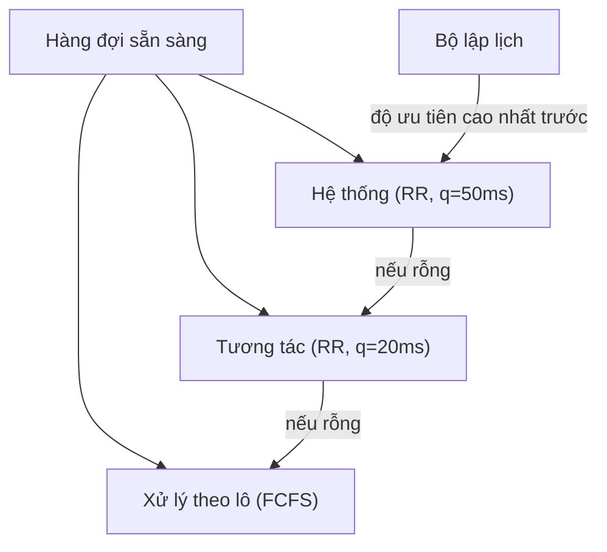

# Chương 3: Lập lịch CPU (CPU Scheduling)

Lập lịch CPU (*CPU scheduling*) là nền tảng cốt lõi của hệ thống đa nhiệm. Hệ điều hành quyết định tiến trình (hoặc luồng) nào được phép sử dụng CPU, sử dụng trong bao lâu và khi nào phải chuyển giao. Chương này giải thích các mục tiêu, thuật toán và sự đánh đổi thiết kế giúp máy tính hiện đại hoạt động hiệu quả, mượt mà và phản hồi nhanh chóng.

---

## Tiêu chí Lập lịch (Scheduling Criteria)

Để so sánh và đánh giá hiệu quả của các thuật toán lập lịch khác nhau, chúng ta sử dụng một số tiêu chí đo lường định lượng. Các kỹ sư thiết kế Hệ điều hành luôn cố gắng tối ưu hóa (tối đa hóa hoặc tối thiểu hóa) các giá trị này.

| Tiêu chí | Định nghĩa | Mục tiêu tối ưu |
| :--- | :--- | :--- |
| **Hiệu suất sử dụng CPU (CPU utilisation)** | Tỷ lệ phần trăm thời gian CPU bận rộn thực thi các công việc hữu ích của tiến trình. | **Tối đa hóa** (giữ CPU bận rộn nhất có thể). |
| **Thông lượng (Throughput)** | Số lượng tiến trình hoàn thành việc thực thi trên một đơn vị thời gian (ví dụ: số tiến trình/giây). | **Tối đa hóa**. |
| **Thời gian hoàn thành (Turnaround time)** | Tổng thời gian từ lúc tiến trình gia nhập hệ thống đến khi kết thúc hoàn toàn (thời gian chờ + chạy + I/O). | **Tối thiểu hóa**. |
| **Thời gian chờ (Waiting time)** | Tổng thời gian tiến trình phải xếp hàng chờ đợi trong hàng đợi sẵn sàng (ready queue). | **Tối thiểu hóa**. |
| **Thời gian phản hồi (Response time)** | Thời gian từ lúc gửi yêu cầu (ví dụ: nhấn phím) đến khi có phản hồi đầu tiên (không phải thời gian hoàn thành hoàn toàn). | **Tối thiểu hóa** (cực kỳ quan trọng đối với các hệ thống tương tác đồ họa). |

**So sánh thực tế - Quán cà phê:**
- **Hiệu suất sử dụng CPU** – Mức độ bận rộn của nhân viên pha chế (bận 80% là tốt, bận 100% liên tục nghĩa là khách hàng sẽ phải đợi rất lâu).
- **Thông lượng** – Số cốc cà phê pha chế hoàn thành được trong mỗi giờ.
- **Thời gian hoàn thành** – Thời gian từ lúc bạn xếp hàng mua cà phê cho đến khi bạn cầm được cốc cà phê trên tay và uống.
- **Thời gian chờ** – Thời gian bạn phải đứng đợi trong hàng chờ trước khi nhân viên pha chế bắt đầu làm đồ uống cho bạn.
- **Thời gian phản hồi** – Thời gian từ lúc bạn gọi món cho đến khi nhân viên pha chế gật đầu xác nhận: "Tôi sẽ làm đồ uống cho bạn ngay bây giờ" (phản hồi ghi nhận đầu tiên).

---

## Lập lịch Trưng dụng (Preemptive) vs. Không Trưng dụng (Non‑Preemptive)

- **Lập lịch Không trưng dụng (Non‑preemptive scheduling)**: Một khi tiến trình đã được cấp CPU để chạy, nó sẽ giữ CPU đó cho đến khi kết thúc hoàn toàn hoặc tự nguyện giải phóng CPU (ví dụ: khi phải đợi vào/ra dữ liệu I/O). Bộ lập lịch không thể ép buộc thu hồi CPU từ tiến trình.
- **Lập lịch Trưng dụng (Preemptive scheduling)**: Bộ lập lịch có quyền ngắt hoạt động của tiến trình đang chạy và cấp phát CPU đó cho tiến trình khác. Quyết định này có thể dựa trên bộ định thời thời gian (hết lát cắt thời gian - time quantum) hoặc do sự xuất hiện của một tiến trình có độ ưu tiên cao hơn.

| Tiêu chí so sánh | Không trưng dụng (Non-preemptive) | Trưng dụng (Preemptive) |
| :--- | :--- | :--- |
| **Quyền kiểm soát** | Tiến trình tự quyết định khi nào giải phóng CPU | Hệ điều hành quyết định khi nào thu hồi CPU |
| **Hao phí hệ thống** | Thấp (ít xảy ra chuyển đổi ngữ cảnh) | Cao hơn (nhiều chuyển đổi ngữ cảnh hơn) |
| **Tính công bằng** | Kém – tiến trình dài có thể chiếm dụng làm đói các tiến trình ngắn | Tốt – mỗi tiến trình được chia đều các lát cắt thời gian |
| **Thời gian phản hồi** | Rất kém đối với các tác vụ tương tác | Cực kỳ xuất sắc |
| **Ví dụ điển hình** | Hệ thống xử lý lô cũ (batch systems) | Tất cả các OS hiện đại (Linux, Windows, macOS) |

**So sánh thực tế**:
- **Không trưng dụng** – Phòng họp công ty: Nhóm đầu tiên đã đăng ký phòng họp sẽ sử dụng cho đến khi họ tự nguyện dọn đồ đi ra.
- **Trưng dụng** – Lớp học có chuông báo: Cứ sau đúng 50 phút chuông reo, lớp học bắt buộc phải kết thúc và giáo viên phải nhường phòng cho lớp tiếp theo, bất kể bài giảng đã xong hay chưa.

---

## Các Giải thuật Lập lịch CPU

Dưới đây là các giải thuật lập lịch CPU kinh điển. Mỗi giải thuật đều có các ưu điểm và hạn chế riêng.

### Đến trước, Phục vụ trước (First‑Come, First‑Served - FCFS)

Là thuật toán đơn giản nhất: các tiến trình được cấp CPU thực thi theo đúng thứ tự thời gian chúng gia nhập hàng đợi sẵn sàng – giống như xếp hàng mua vé (hàng đợi FIFO).

- Thuộc loại **Không trưng dụng**.
- **Ưu điểm**: Cực kỳ dễ cài đặt và quản lý.
- **Nhược điểm**: Hiện tượng **hộ tống (convoy effect)** – một tiến trình lớn, tốn nhiều thời gian chạy trước sẽ chặn toàn bộ các tiến trình ngắn hơn phía sau nó, làm tăng thời gian chờ trung bình của toàn hệ thống một cách đáng kể.

**Ví dụ** (các tiến trình đều đến tại thời điểm 0):

| Tiến trình | Thời gian thực thi (Burst time) |
| :--- | :--- |
| P1 | 24 |
| P2 | 3 |
| P3 | 3 |

Sơ đồ Gantt:  
`| P1 (24) | P2 (3) | P3 (3) |`  
Thời gian chờ: P1 = 0, P2 = 24, P3 = 27. Thời gian chờ trung bình = (0 + 24 + 27)/3 = 17 ms.

---

### Công việc Ngắn nhất Trước (Shortest Job First - SJF)

Ưu tiên cấp CPU cho tiến trình có **thời gian thực thi tiếp theo nhỏ nhất**. Thuật toán này được chứng minh toán học là tối ưu nhất để giảm thiểu thời gian chờ trung bình của hệ thống.

#### SJF Không trưng dụng (Non-Preemptive SJF)
Một khi tiến trình đã được cấp CPU, nó sẽ chạy cho đến khi kết thúc. Tại mỗi thời điểm cần ra quyết định lập lịch, hệ thống sẽ chọn tiến trình ngắn nhất trong số các tiến trình đang có mặt trong hàng đợi sẵn sàng.

**Ví dụ** (tất cả tiến trình đến tại thời điểm 0):

| Tiến trình | Thời gian thực thi (Burst time) |
| :--- | :--- |
| P1 | 6 |
| P2 | 8 |
| P3 | 7 |
| P4 | 3 |

Thứ tự thực thi: P4 (3) → P1 (6) → P3 (7) → P2 (8).  
Thời gian chờ: P4 = 0, P1 = 3, P3 = 9, P2 = 16. Thời gian chờ trung bình = (0 + 3 + 9 + 16)/4 = 7 ms (tốt hơn FCFS rất nhiều).

#### SJF Trưng dụng (Preemptive SJF - còn gọi là SRTF: Shortest Remaining Time First)
Nếu một tiến trình mới gia nhập hàng đợi có thời gian thực thi ngắn hơn **thời gian còn lại** của tiến trình đang chạy trên CPU, bộ lập lịch sẽ lập tức thu hồi CPU từ tiến trình đang chạy để cấp cho tiến trình mới.

**Ví dụ** (đi kèm thời điểm đến khác nhau):

| Tiến trình | Thời điểm đến (Arrival) | Thời gian thực thi (Burst) |
| :--- | :--- | :--- |
| P1 | 0 | 8 |
| P2 | 1 | 4 |
| P3 | 2 | 9 |
| P4 | 3 | 5 |

Sơ đồ thực thi SRTF:
- Từ 0‑1: Chạy P1 (còn lại 7). P2 đến tại thời điểm 1 với burst 4 < 7 → Trưng dụng CPU để chạy P2.
- Từ 1‑5: Chạy P2 đến khi kết thúc. Tại thời điểm 5, trong hàng đợi có P1 (7), P3 (9), P4 (5) → Chọn chạy P4.
- Từ 5‑10: Chạy P4 đến khi kết thúc. Tại thời điểm 10, chọn chạy P1 (7).
- Từ 10‑17: Chạy P1 đến khi kết thúc. Sau đó chạy P3 (9).
- Từ 17‑26: Chạy P3 đến khi kết thúc.

**Nhược điểm của nhóm thuật toán SJF**: 
- **Đói tài nguyên (Starvation)**: Các tiến trình dài có thể không bao giờ được cấp CPU nếu các tiến trình ngắn liên tục gia nhập hệ thống.
- Khó dự đoán chính xác thời gian thực thi (burst time) tiếp theo của tiến trình trong thực tế (thường phải dự đoán gián tiếp bằng phương pháp trung bình mũ).

---

### Lập lịch Xoay vòng (Round Robin - RR)

Được thiết kế chuyên biệt cho các hệ thống chia sẻ thời gian (time-sharing systems). Mỗi tiến trình được cấp một đơn vị thời gian sử dụng CPU nhỏ gọi là **lát cắt thời gian (time quantum)** (thường từ 10 đến 100 ms). Khi hết lát cắt này, tiến trình đang chạy sẽ bị trưng dụng và đưa về cuối hàng đợi sẵn sàng để nhường CPU cho tiến trình tiếp theo.

- Thuộc loại **Trưng dụng** (dựa trên bộ định thời timer).
- **Ưu điểm**: Tính công bằng cực cao và thời gian phản hồi rất tốt.
- **Nhược điểm**: Hiệu năng phụ thuộc chặt chẽ vào kích thước của lát cắt thời gian.
  - Lát cắt quá lớn → Thuật toán thoái hóa thành FCFS.
  - Lát cắt quá nhỏ → Hệ thống tốn quá nhiều thời gian cho việc chuyển đổi ngữ cảnh (context switch) liên tục, gây hao phí hiệu năng.
- **Quy tắc thiết kế**: Lát cắt thời gian phải lớn hơn rất nhiều so với thời gian thực hiện một lần chuyển đổi ngữ cảnh (ví dụ: lát cắt 10-100 ms so với thời gian chuyển ngữ cảnh khoảng 1-10 µs).

**Ví dụ**: Lát cắt thời gian = 4 ms. Các tiến trình đến tại thời điểm 0: P1 (24), P2 (3), P3 (3).  

```mermaid
gantt
    title Lập lịch Xoay vòng Round Robin (Lát cắt thời gian = 4)
    dateFormat X
    axisFormat %s
    section Tiến trình
    P1 : 0, 4
    P2 : 4, 7
    P3 : 7, 10
    P1 : 10, 14
    P1 : 14, 18
    P1 : 18, 22
    P1 : 22, 24
```



---

### Lập lịch theo Độ ưu tiên (Priority Scheduling)

Mỗi tiến trình được gán một chỉ số độ ưu tiên (thường là số nguyên). CPU luôn được ưu tiên cấp phát cho tiến trình có độ ưu tiên cao nhất (quy ước số nguyên càng nhỏ thì độ ưu tiên càng cao).

- Có thể thiết kế theo cả hai dạng: **Trưng dụng** hoặc **Không trưng dụng**.
- **Vấn đề**: **Đói tài nguyên (Starvation)** – Tiến trình có độ ưu tiên thấp có thể phải chờ vô hạn và không bao giờ được chạy nếu hệ thống liên tục nhận các tiến trình ưu tiên cao hơn.
- **Giải pháp**: **Tăng tuổi (Aging)** – Tăng dần độ ưu tiên của các tiến trình đang phải xếp hàng chờ đợi theo thời gian.

**Ví dụ** (không trưng dụng, độ ưu tiên tăng dần theo số nhỏ):

| Tiến trình | Thời gian thực thi | Độ ưu tiên |
| :--- | :--- | :--- |
| P1 | 10 | 3 (Thấp) |
| P2 | 1 | 1 (Cao) |
| P3 | 2 | 2 (Trung bình) |

Thứ tự thực thi: P2 → P3 → P1.  
Nhờ cơ chế **tăng tuổi (aging)**: Nếu P1 phải chờ quá lâu, độ ưu tiên của nó sẽ tự động được nâng lên (3 → 2 → 1) để đảm bảo cuối cùng nó chắc chắn sẽ được cấp CPU.

---

### Hàng đợi Lập lịch Nhiều cấp (Multilevel Queue Scheduling)

Các tiến trình được phân loại cứng vào các **hàng đợi khác nhau** dựa trên đặc tính của chúng (ví dụ: tiến trình tương tác chạy ở phân vùng trước, tiến trình xử lý lô chạy ẩn ở phân vùng sau). Mỗi hàng đợi áp dụng thuật toán lập lịch riêng biệt.

- Gán vị trí **cố định** – Tiến trình không thể tự chuyển đổi giữa các hàng đợi.
- **Lập lịch giữa các hàng đợi**: Thường sử dụng cơ chế độ ưu tiên cố định có trưng dụng – hàng đợi có độ ưu tiên cao hơn luôn được chạy trước.



- **Ưu điểm**: Phân chia phân vùng rõ ràng, cực kỳ phù hợp cho các hệ thống có các lớp tiến trình khác biệt rõ rệt.
- **Nhược điểm**: Thiếu tính linh hoạt do tiến trình bị khóa cứng trong một hàng đợi duy nhất suốt vòng đời.

---

### Hàng đợi Phản hồi Nhiều cấp (Multilevel Feedback Queue - MLFQ)

Là giải thuật lập lịch linh hoạt, tổng quát và được áp dụng rộng rãi nhất trong các hệ điều hành hiện đại ngày nay (như trên UNIX cổ điển, BSD và Windows). Nó cho phép tiến trình di chuyển **động** giữa các hàng đợi dựa trên hành vi thực tế của nó.

**Các quy tắc vận hành cơ bản**:
1. Thiết lập nhiều hàng đợi với các độ ưu tiên và lát cắt thời gian khác nhau. Hàng đợi có độ ưu tiên càng cao thì lát cắt thời gian càng ngắn.
2. Một tiến trình mới gia nhập hệ thống sẽ luôn được xếp vào hàng đợi có độ ưu tiên cao nhất.
3. Nếu tiến trình sử dụng hết toàn bộ lát cắt thời gian được cấp mà chưa xong việc, nó sẽ bị đẩy xuống hàng đợi có độ ưu tiên thấp hơn.
4. Nếu tiến trình tự nguyện nhường CPU trước khi hết lát cắt thời gian (ví dụ để đợi I/O), nó sẽ được giữ nguyên ở hàng đợi hiện tại hoặc được nâng lên hàng đợi cao hơn.
5. Cơ chế **tăng tuổi (aging)**: Sau một khoảng thời gian dài xếp hàng chờ ở hàng đợi thấp, tiến trình sẽ được nâng độ ưu tiên lên hàng đợi cao hơn để tránh đói tài nguyên.

```mermaid
flowchart LR
    New["Mới"] --> Q8["Q8 (quantum 8ms)"]
    Q8 -->|vượt quá quantum| Q7["Q7 (quantum 16ms)"]
    Q7 -->|vượt quá quantum| Q0["Q0 (FCFS)"]
    Q8 -->|nhường sớm| Q8
    Q7 -->|nhường sớm| Q7
    Q0 -->|tăng tuổi (aging)| Q7
```

**Ý nghĩa thực tế**:
- Các tiến trình hướng I/O (các tác vụ tương tác) sẽ luôn được đáp ứng nhanh chóng ở các hàng đợi ưu tiên cao.
- Các tiến trình hướng CPU (tính toán thuần túy) sẽ tự động bị đẩy dần xuống các hàng đợi thấp hơn để nhường không gian cho các tác vụ tương tác, giúp hệ thống phản hồi cực kỳ mượt mà.

---

## Lập lịch Luồng (Thread Scheduling)

Các hệ điều hành hiện đại lập lịch cho các **luồng (threads)** thực thi, không phải tiến trình. Cơ chế lập lịch phụ thuộc vào mô hình luồng được áp dụng:

- **Luồng cấp Người dùng (ULT)**: Nhân hệ điều hành chỉ lập lịch cho **tiến trình cha**. Thư viện luồng cấp người dùng sẽ tự đảm nhận việc chia sẻ thời gian và lập lịch cho các luồng con chạy trên luồng nhân duy nhất đó. Do nhân không biết về sự tồn tại của các luồng con, chỉ cần một luồng con bị chặn I/O là cả tiến trình cha sẽ bị dừng lại.
- **Luồng cấp Nhân (KLT)**: Nhân hệ điều hành trực tiếp lập lịch riêng lẻ cho từng luồng cụ thể. Điều này cho phép tận dụng tối đa kiến trúc đa nhân CPU để chạy song song thực sự.

- **Phạm vi Tranh chấp Tiến trình (Process-Contention Scope - PCS)**: Cơ chế lập lịch giữa các luồng cấp người dùng trong cùng một tiến trình (do thư viện không gian người dùng quản lý).
- **Phạm vi Tranh chấp Hệ thống (System-Contention Scope - SCS)**: Cơ chế lập lịch và tranh chấp giữa tất cả các luồng cấp nhân trên toàn hệ thống (do nhân hệ điều hành trực tiếp điều phối).

---

## Lập lịch Thời gian thực (Real‑Time Scheduling)

Các hệ thống thời gian thực đòi hỏi bắt buộc các tác vụ phải được hoàn thành trước một mốc thời gian nghiêm ngặt gọi là **hạn định (deadline)** (ví dụ: hệ thống bung túi khí ô tô, robot công nghiệp). Được phân làm hai loại chính:

- **Thời gian thực cứng (Hard real-time)**: Việc trễ hạn định (miss deadline) dù chỉ một lần cũng có thể gây ra thảm họa nghiêm trọng hoặc hỏng hóc hoàn toàn hệ thống.
- **Thời gian thực mềm (Soft real-time)**: Việc trễ hạn định làm giảm chất lượng dịch vụ của hệ thống nhưng không gây ra thảm họa chết người.

Các thuật toán lập lịch thời gian thực thường dựa trên cơ chế **ưu tiên có trưng dụng** với độ ưu tiên tĩnh hoặc động.

### Lập lịch Tần số Đơn điệu (Rate‑Monotonic Scheduling - RMS)

**Các giả định toán học**:
- Tất cả các tác vụ đều có tính chu kỳ (lặp lại sau các khoảng thời gian cố định).
- Hạn định bằng đúng chu kỳ (tác vụ phải hoàn thành trước khi chu kỳ tiếp theo bắt đầu).
- Các tác vụ hoàn toàn độc lập và hỗ trợ trưng dụng CPU.
- Hao phí chuyển đổi ngữ cảnh được coi là bằng 0 (mô hình lý thuyết).

**Quy tắc RMS**: Gán **độ ưu tiên cao hơn cho các tác vụ có chu kỳ ngắn hơn**. Đây là thuật toán lập lịch độ ưu tiên tĩnh tối ưu nhất cho lớp hệ thống này.

**Ví dụ**:

| Tác vụ | Chu kỳ (ms) | Thời gian thực thi (ms) |
| :--- | :--- | :--- |
| T1 | 50 | 10 |
| T2 | 100 | 25 |
| T3 | 200 | 30 |

Độ ưu tiên tĩnh theo RMS: T1 (chu kỳ ngắn nhất 50 ms) có độ ưu tiên cao nhất, T2 (100 ms) độ ưu tiên trung bình, T3 (200 ms) độ ưu tiên thấp nhất.

**Điều kiện khả thi**: Với tập hợp $n$ tác vụ chu kỳ, RMS đảm bảo luôn đáp ứng được hạn định nếu tổng hiệu suất sử dụng CPU thỏa mãn công thức:
$$
U = \sum \frac{C_i}{T_i} \le n(2^{1/n} - 1)
$$
Khi $n \to \infty$, giới hạn này tiệm cận về mức **69.3%**.

### Hạn định Sớm nhất Trước (Earliest Deadline First - EDF)

**Độ ưu tiên động**: Tại mỗi thời điểm lập lịch, hệ thống sẽ chọn thực thi tác vụ có **hạn định tuyệt đối gần nhất** để chạy.

- Là thuật toán **tối ưu tuyệt đối** trên hệ thống đơn nhân – nếu tồn tại bất kỳ phương án lập lịch nào có thể đáp ứng được các hạn định, thuật toán EDF chắc chắn sẽ tìm ra phương án đó.
- Hiệu suất sử dụng CPU có thể đạt tối đa đến mức **100%** (vượt trội hơn hẳn so với mức giới hạn ~69.3% của RMS).
- **Nhược điểm**: Tốn hiệu năng hệ thống để liên tục sắp xếp và cập nhật danh sách hạn định động; khi xảy ra quá tải hệ thống, EDF hoạt động rất khó dự đoán và có thể dẫn đến việc trễ hạn định hàng loạt.

**So sánh tổng quan RMS vs. EDF**:

| Tiêu chí | Lập lịch Tần số Đơn điệu (RMS) | Hạn định Sớm nhất Trước (EDF) |
| :--- | :--- | :--- |
| **Loại độ ưu tiên** | Tĩnh (cố định dựa theo chu kỳ) | Động (thay đổi theo hạn định thực tế) |
| **Độ phức tạp cài đặt** | Đơn giản, gọn nhẹ | Phức tạp hơn do phải sắp xếp hạn định liên tục |
| **Giới hạn hiệu suất** | Giới hạn thực tế tiệm cận ~69.3% | Đạt tối đa đến 100% |
| **Hành vi khi quá tải** | Dự đoán được (tác vụ ưu tiên thấp sẽ bị đói trước) | Khó dự đoán (lỗi dây chuyền trễ hạn định hàng loạt) |

---

## Bảng Tổng kết Chương

| Khái niệm | Điểm cốt lõi cần nhớ |
| :--- | :--- |
| **Tiêu chí lập lịch** | Bao gồm hiệu suất CPU, thông lượng, thời gian hoàn thành, thời gian chờ, thời gian phản hồi. |
| **Trưng dụng vs. Không trưng dụng** | Trưng dụng: OS có quyền ngắt ngang tiến trình; Không trưng dụng: Tiến trình tự chạy đến khi tự nguyện nhường CPU. |
| **Thuật toán FCFS** | Đơn giản nhưng dễ gặp hiện tượng hộ tống (convoy effect) làm giảm hiệu năng. |
| **Thuật toán SJF / SRTF** | Tối ưu thời gian chờ trung bình; đòi hỏi dự đoán thời gian burst tiếp theo. |
| **Thuật toán Round Robin** | Cực kỳ công bằng cho hệ thống tương tác; độ dài lát cắt thời gian quyết định hiệu năng. |
| **Lập lịch theo độ ưu tiên** | Ưu tiên cao chạy trước; khắc phục hiện tượng đói tài nguyên bằng giải pháp tăng tuổi (aging). |
| **Lập lịch Nhiều cấp** | Phân cấp cố định tiến trình vào các hàng đợi tĩnh riêng biệt. |
| **Lập lịch Phản hồi Nhiều cấp** | Tiến trình di chuyển động giữa các hàng đợi dựa trên hành vi chạy thực tế; tiêu chuẩn của OS hiện đại. |
| **Lập lịch luồng** | Nhân lập lịch độc lập cho luồng cấp nhân; luồng cấp người dùng chỉ được lập lịch gián tiếp qua tiến trình. |
| **Thuật toán RMS** | Thuật toán ưu tiên tĩnh thời gian thực dựa theo chu kỳ ngắn nhất; giới hạn hiệu suất ~69.3%. |
| **Thuật toán EDF** | Thuật toán ưu tiên động thời gian thực dựa theo hạn định gần nhất; hiệu suất tối đa 100%. |

Nắm vững các nguyên lý lập lịch CPU giúp bạn hiểu sâu sắc cách hệ điều hành điều phối nhịp nhàng toàn bộ các hoạt động của máy tính để đạt hiệu năng cao nhất.
