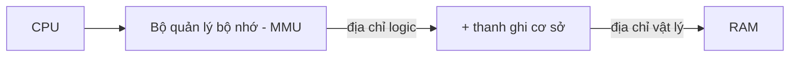
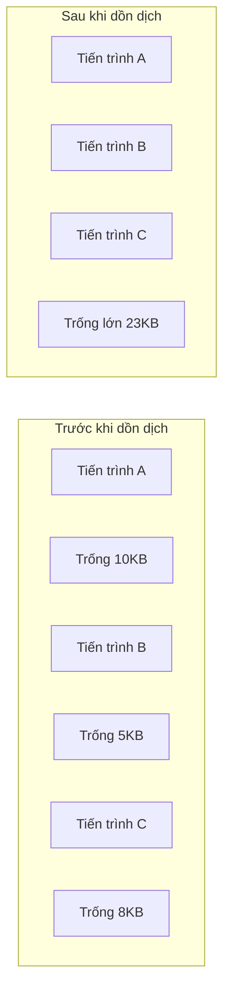
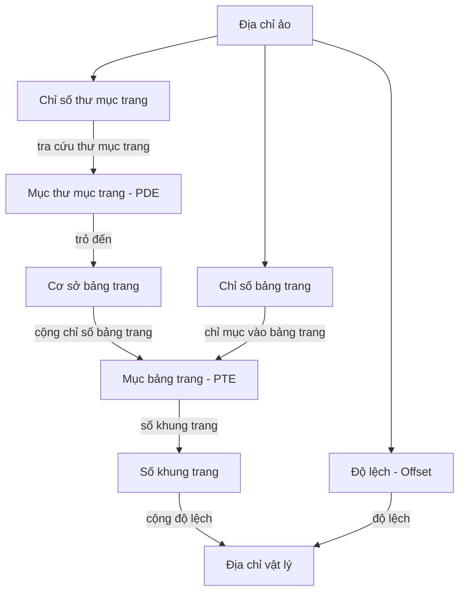

# Chương 6: Quản lý Bộ nhớ (Memory Management)

Bộ nhớ RAM là trái tim vật lý của mọi hệ thống máy tính. Hệ điều hành phải thực hiện cấp phát bộ nhớ cho các tiến trình hoạt động một cách hiệu quả nhất, bảo vệ an toàn phân vùng bộ nhớ của tiến trình này tránh bị xâm phạm bởi tiến trình khác, đồng thời tạo ra một không gian địa chỉ bộ nhớ ảo độc lập và rộng lớn cho lập trình viên. Chương này giải thích các kỹ thuật phần cứng và Hệ điều hành giúp hiện thực hóa việc quản lý bộ nhớ trong các máy tính hiện đại.

---

## Phân cấp Bộ nhớ (Memory Hierarchy)

Không phải mọi loại bộ nhớ đều giống nhau. Một hệ thống máy tính điển hình tổ chức bộ nhớ lưu trữ theo cấu trúc phân cấp, đi từ loại siêu nhanh, đắt đỏ cho đến loại chậm hơn nhưng có dung lượng lớn và giá rẻ.

| Phân cấp | Công nghệ chế tạo | Dung lượng điển hình | Thời gian truy cập | Quản lý bởi |
| :--- | :--- | :--- | :--- | :--- |
| **Thanh ghi (Registers)** | Tích hợp trong CPU | Vài trăm byte | 0.2 - 0.5 ns | Trình biên dịch |
| **Bộ nhớ đệm (Cache L1, L2, L3)** | SRAM tĩnh | 32 KB – 32 MB | 1 - 10 ns | Phần cứng CPU |
| **Bộ nhớ chính (RAM)** | DRAM động | 4 GB – 512 GB | 50 - 100 ns | Hệ điều hành |
| **Bộ nhớ trao đổi (Swap space)** | SSD / HDD | 100 GB – 2 TB | 0.1 - 10 ms | Hệ điều hành |
| **Lưu trữ tệp tin (Storage)** | SSD / HDD | 256 GB – nhiều TB | mili giây – giây | Người dùng / OS |

Trình quản lý bộ nhớ của Hệ điều hành che giấu toàn bộ cấu trúc phức tạp này, giúp bộ nhớ chính hiển thị dưới dạng một mảng byte tuyến tính nhất quán, đồng thời có thể mở rộng không gian nhớ tạm thời xuống ổ đĩa cứng (sẽ được trình bày chi tiết ở Chương 7: Bộ nhớ ảo).

**So sánh thực tế**:  
- **Thanh ghi**: Mặt bàn làm việc – nơi chứa tài liệu bạn đang cầm đọc và viết trực tiếp.
- **Cache**: Ngăn kéo bàn – chứa các cuốn sách tham khảo thường dùng, có thể lấy ra trong vài giây.
- **RAM**: Tủ hồ sơ trong phòng – chứa các tài liệu của dự án đang chạy hiện tại.
- **Ổ đĩa cứng**: Kho lưu trữ của công ty – chứa toàn bộ tài liệu lưu trữ cũ, tốn nhiều phút để tìm và lấy ra.

---

## Liên kết Địa chỉ (Address Binding)

Các chương trình phần mềm tham chiếu đến bộ nhớ thông qua địa chỉ. Quá trình liên kết (ánh xạ) các địa chỉ tượng trưng này thành các địa chỉ vật lý thực tế trên RAM có thể xảy ra ở ba thời điểm khác nhau.


### Ba Thời điểm Liên kết Địa chỉ

| Thời điểm | Đặc điểm hoạt động | Ví dụ điển hình | Ưu điểm & Nhược điểm |
| :--- | :--- | :--- | :--- |
| **Lúc biên dịch (Compile time)** | Các địa chỉ bộ nhớ vật lý được cố định ngay khi biên dịch chương trình | Mã nguồn tuyệt đối (như tệp `.COM` trên hệ điều hành MS-DOS cổ) | Rất nhanh nhưng cực kỳ cứng nhắc; chương trình bắt buộc phải được nạp vào đúng một địa chỉ cố định trên RAM để chạy. |
| **Lúc nạp (Load time)** | Trình nạp (loader) sẽ dịch chuyển các địa chỉ tương đối khi nạp chương trình vào RAM | Mã nguồn có thể định vị lại (như tệp `.exe` đi kèm địa chỉ cơ sở) | Linh hoạt hơn; tuy nhiên, một khi chương trình đã được nạp vào RAM thì không thể di chuyển vùng nhớ sang chỗ khác. |
| **Lúc thực thi (Execution time)** | Việc liên kết địa chỉ được trì hoãn hoàn toàn cho đến lúc chạy; sử dụng phần cứng MMU | Tất cả các hệ điều hành hiện đại (Linux, Windows) | Linh hoạt tối đa; cho phép dồn dịch bộ nhớ, phân trang và tráo đổi trang linh hoạt. |

---

## Không gian Địa chỉ Logic so với Vật lý

- **Địa chỉ logic** (*logical address / virtual address*): Là địa chỉ được tạo ra bởi CPU trong quá trình chương trình thực thi. Chương trình chỉ nhìn thấy và thao tác trên không gian địa chỉ ảo này.
- **Địa chỉ vật lý** (*physical address*): Địa chỉ thực tế trên thanh RAM phần cứng. Hệ điều hành phối hợp với phần cứng để dịch địa chỉ logic thành địa chỉ vật lý thực tế.

**Bộ quản lý bộ nhớ (Memory Management Unit - MMU)**: Thiết bị phần cứng thực hiện dịch địa chỉ logic sang vật lý lúc runtime. Trong mô hình đơn giản nhất, MMU sử dụng một **thanh ghi cơ sở (thanh ghi dịch chuyển - relocation register)**:

$$
\text{địa chỉ vật lý} = \text{địa chỉ logic} + \text{thanh ghi cơ sở}
$$



Kết hợp thêm **thanh ghi giới hạn (limit register)**, Hệ điều hành có thể bảo vệ bộ nhớ: Nếu địa chỉ logic vượt quá giới hạn cho phép, CPU sẽ kích hoạt một bẫy lỗi (trap) chuyển về cho Hệ điều hành xử lý lỗi xâm phạm bộ nhớ.

---

## Cấp phát Bộ nhớ (Memory Allocation)

Khi một tiến trình được tạo lập, Hệ điều hành phải cấp phát phân vùng RAM cho các phần mã lệnh, dữ liệu tĩnh, vùng heap và ngăn xếp stack của nó.

### Cấp phát Liên tục (Contiguous Allocation)
Mỗi tiến trình được cấp phát nằm hoàn toàn trong một khối liên tục duy nhất trên bộ nhớ vật lý.

#### Phân hoạch Cố định (Fixed Partitions - Tĩnh)
Bộ nhớ được chia thành các vùng có kích thước cố định sẵn khi khởi động hệ điều hành. Tiến trình sẽ được nạp vào phân hoạch nhỏ nhất nhưng có kích thước đủ chứa nó.
- **Ưu điểm**: Đơn giản, không bị phân mảnh ngoại vi.
- **Nhược điểm**: **Phân mảnh nội vi** (lãng phí không gian thừa bên trong phân hoạch); số lượng tiến trình đồng thời bị giới hạn cứng bởi số lượng phân hoạch.

#### Phân hoạch Động (Dynamic Partitions - Biến đổi)
Các phân hoạch được tạo lập động tương thích chính xác với kích thước yêu cầu của tiến trình. Hệ điều hành duy trì một danh sách các vùng nhớ trống (các lỗ - holes).

**Các giải thuật tìm kiếm lỗ trống**:
- **First‑fit (Khớp đầu tiên)**: Chọn lỗ trống đầu tiên tìm thấy có kích thước đủ chứa tiến trình. Thực thi nhanh, hiệu quả thực tế tốt.
- **Best‑fit (Khớp tốt nhất)**: Chọn lỗ trống nhỏ nhất vừa vặn với kích thước tiến trình. Giải thuật này đòi hỏi duyệt toàn bộ danh sách, có xu hướng để lại các lỗ trống siêu nhỏ vô dụng.
- **Worst‑fit (Khớp tệ nhất)**: Chọn lỗ trống có kích thước lớn nhất. Nhằm mục đích giữ lại lỗ trống thừa có kích thước lớn hơn để dùng sau.

---

### Phân mảnh (Fragmentation)

| Loại phân mảnh | Đặc điểm | Nguyên nhân |
| :--- | :--- | :--- |
| **Phân mảnh nội vi (Internal fragmentation)** | Không gian trống bị lãng phí nằm bên trong một phân hoạch đã được cấp phát. *Ví dụ: Phân hoạch kích thước 8MB, tiến trình chỉ cần 5MB → lãng phí 3MB thừa.* | Cấp phân hoạch cố định; hoặc do căn lề trang trong cơ chế phân trang. |
| **Phân mảnh ngoại vi (External fragmentation)** | Tổng dung lượng bộ nhớ trống đủ chứa tiến trình, nhưng bộ nhớ trống bị chia nhỏ thành nhiều mảnh rời rạc nên không có khối liên tục nào đủ lớn. | Cấp phân hoạch động – các tiến trình tắt/bật tạo nên các lỗ trống rải rác. |

**Dồn dịch bộ nhớ (Compaction)**: Kỹ thuật di chuyển toàn bộ vùng nhớ của các tiến trình đang chạy về một phía để gộp tất cả các lỗ trống nhỏ rải rác thành một khối trống lớn liên tục. Chỉ có thể thực hiện được nếu hệ thống hỗ trợ liên kết địa chỉ động lúc thực thi. Hao phí dịch chuyển rất đắt đỏ.



---

## Phân trang (Paging)

Phân trang giải quyết triệt để vấn đề phân mảnh ngoại vi bằng cách chia bộ nhớ vật lý thành các khối có kích thước cố định bằng nhau gọi là **khung trang (frames)** (thường là 4KB) và chia bộ nhớ logic của tiến trình thành các khối có cùng kích thước gọi là **trang (pages)**. Các trang của một tiến trình có thể được xếp rải rác ở bất kỳ khung trang trống nào trên RAM vật lý.

**Ý tưởng cốt lõi**: Địa chỉ logic gồm bộ đôi `<số trang, độ lệch>` (page number, page offset). Hệ điều hành quản lý việc ánh xạ số trang thành số khung trang thông qua một **bảng trang (page table)** của riêng từng tiến trình.

### Cơ chế Dịch Địa chỉ

Với địa chỉ logic có độ dài $m$ bit, kích thước trang là $2^n$ byte:
- **Số trang (p)** = $m-n$ bit cao.
- **Độ lệch (d)** = $n$ bit thấp.

*Ví dụ:* Địa chỉ logic 32-bit, trang 4KB ($2^{12}$). Số trang nằm ở các bit 31-12, độ lệch nằm ở các bit 11-0.

```mermaid
flowchart LR
    LA[Địa chỉ logic] --> Split[Tách: số trang (page number) + độ lệch (offset)]
    Split --> PT[Tra cứu bảng trang]
    PT -->|số khung trang| Combine[Gộp số khung trang + độ lệch]
    Combine --> PA[Địa chỉ vật lý]
```

### Mục Bảng Trang (Page Table Entry - PTE)

Mỗi mục PTE trong bảng trang chứa các thông tin trạng thái quan trọng:

| Trường thông tin | Ý nghĩa kỹ thuật |
| :--- | :--- |
| **Số khung trang (Frame number)** | Địa chỉ khung trang vật lý tương ứng trên thanh RAM nơi trang dữ liệu đang nằm. |
| **Bit hợp lệ (Valid / Present bit)** | Bằng `1` nếu trang hiện có trên RAM; bằng `0` nếu trang đang bị tráo đổi nằm trên ổ đĩa. |
| **Bit bẩn (Dirty / Modified bit)** | Bằng `1` nếu trang đã bị ghi thay đổi dữ liệu (cần phải ghi ngược lại đĩa khi bị thay thế). |
| **Bit truy cập (Reference / Accessed bit)** | Bằng `1` nếu trang vừa được đọc hoặc ghi (dùng cho các giải thuật thay thế trang). |
| **Các bit bảo vệ (Protection bits)** | Định cấu hình quyền đọc (read), ghi (write), hoặc thực thi (execute) của trang. |

### Bảng trang nhiều cấp (Multi‑level Page Tables)

Một bảng trang duy nhất cho không gian địa chỉ 64-bit sẽ có kích thước khổng lồ vượt quá dung lượng RAM vật lý thực tế. Bảng trang nhiều cấp giải quyết vấn đề này bằng cách phân cấp cấu trúc bảng trang; các bảng trang cấp dưới chỉ được cấp phát bộ nhớ khi không gian địa chỉ ảo tương ứng thực sự được tiến trình sử dụng.

*Ví dụ:* Bảng trang 2 cấp trên cấu trúc x86-32 (10 bit directory + 10 bit table + 12 bit offset):
- Thư mục trang (Page Directory index): 10 bit cao → chọn mục PDE chỉ đến địa chỉ gốc của bảng trang cấp 2.
- Bảng trang (Page Table index): 10 bit giữa → chọn mục PTE chỉ đến khung trang vật lý.
- Độ lệch (Offset): 12 bit thấp.



### Bảng trang nghịch đảo (Inverted Page Table)
Thay vì duy trì một bảng trang riêng cho mỗi tiến trình, hệ thống chỉ duy trì **một bảng trang nghịch đảo duy nhất cho toàn bộ hệ thống**, trong đó mỗi mục trong bảng tương ứng với một khung trang vật lý trên RAM. Mỗi mục sẽ lưu thông tin `<mã tiến trình PID, số trang>`.
- **Dung lượng**: Cố định và nhỏ gọn (phụ thuộc kích thước RAM vật lý, không phụ thuộc số lượng tiến trình).
- **Hao phí**: Tra cứu chậm hơn vì phải thực hiện tìm kiếm bảng băm để dịch địa chỉ.

### Bộ đệm dịch chuyển nhanh (Translation Lookaside Buffer - TLB)

Các bảng trang được lưu trữ trên RAM. Việc truy cập bộ nhớ thông qua phân trang sẽ tốn gấp đôi thời gian vì phải truy cập RAM hai lần (một lần đọc bảng trang, một lần đọc dữ liệu thực tế). Bộ đệm **TLB** là một bộ nhớ đệm phần cứng siêu nhanh chuyên dụng lưu trữ các phép dịch địa chỉ trang-sang-khung-trang vừa được sử dụng gần đây nhất.

- **TLB hit (Khớp bộ đệm)**: Phép dịch địa chỉ được tìm thấy ngay trong TLB → Chỉ mất đúng một lần truy cập RAM vật lý.
- **TLB miss (Trượt bộ đệm)**: Phải thực hiện tra cứu tuần tự bảng trang trên RAM → Tốn nhiều lần đọc RAM, sau đó lưu kết quả phép dịch mới này vào lại bộ đệm TLB.

**Không gian địa chỉ luân chuyển (Context Switch) và TLB**: Khi chuyển đổi giữa hai tiến trình, bộ đệm TLB chứa các phép dịch của tiến trình cũ. Giải pháp:
- Xóa sạch toàn bộ dữ liệu TLB (tốn chi phí hiệu năng).
- Sử dụng **ASID (Address Space Identifier)**: Gán nhãn mã định danh không gian địa chỉ vào mỗi mục TLB để phân biệt dữ liệu của các tiến trình khác nhau mà không cần xóa bộ đệm khi context switch.

---

## Phân đoạn (Segmentation)

Phân đoạn cung cấp cho lập trình viên một cái nhìn trừu tượng về bộ nhớ dưới dạng các **phân đoạn có kích thước thay đổi linh hoạt** – phân đoạn mã lệnh, phân đoạn dữ liệu, phân đoạn ngăn xếp stack, phân đoạn heap... – mỗi phân đoạn được quản lý bằng một địa chỉ cơ sở và giới hạn riêng biệt.

### Bảng Phân đoạn (Segment Table)
Mỗi tiến trình sở hữu một bảng phân đoạn. Địa chỉ logic có cấu trúc `<số phân đoạn, độ lệch>`. Mỗi mục trong bảng phân đoạn chứa:
- **Base (Cơ sở)**: Địa chỉ vật lý bắt đầu của phân đoạn trên RAM.
- **Limit (Giới hạn)**: Độ dài của phân đoạn.

Phần cứng MMU sẽ kiểm tra điều kiện `độ lệch < giới hạn`, sau đó tính toán: `địa chỉ vật lý = cơ sở + độ lệch`.

```mermaid
flowchart LR
    Segment[Số phân đoạn] --> ST[Bảng phân đoạn]
    Offset[Độ lệch - Offset] --> Compare{Độ lệch < giới hạn (limit)?}
    ST -->|cơ sở, giới hạn| Compare
    Compare -->|đúng| Add[cơ sở + độ lệch]
    Add --> Physical[Địa chỉ vật lý]
    Compare -->|sai| Trap[Bẫy ngắt đến OS]
```

**Ưu điểm**:
- Cho phép các phân đoạn co giãn độc lập (như ngăn xếp phình to).
- Bảo vệ an toàn chi tiết trên từng phân đoạn (ví dụ: đặt phân đoạn mã lệnh ở chế độ chỉ đọc read-only).
- Chia sẻ tài nguyên: Nhiều tiến trình có thể dùng chung thư viện mã lệnh bằng cách trỏ chung vào một địa chỉ cơ sở phân đoạn.
- *Hạn chế:* Bị phân mảnh ngoại vi do các phân đoạn yêu cầu các vùng nhớ vật lý liên tục.

### Phân đoạn kết hợp Phân trang (Intel x86)
Để tận dụng tối đa ưu điểm của cả hai cơ chế, kiến trúc Intel x86 kết hợp phân đoạn và phân trang đồng thời: Phân đoạn cung cấp giao diện quản lý trừu tượng logic, và sau đó mỗi phân đoạn lại tiếp tục được chia nhỏ thành các trang có kích thước cố định bằng nhau để tránh phân mảnh ngoại vi.

Hầu hết các hệ điều hành hiện đại (như Linux, Windows) hiện nay đều sử dụng **Mô hình bộ nhớ phẳng (Flat memory model)**: Cấu hình tất cả các phân đoạn có địa chỉ cơ sở bằng 0 và kích thước tối đa, từ đó vô hiệu hóa vai trò của phân đoạn và dựa hoàn toàn vào cơ chế phân trang để dịch địa chỉ và bảo vệ bộ nhớ.

---

## Bảng Tổng kết Chương

| Khái niệm | Điểm cốt lõi cần nhớ |
| :--- | :--- |
| **Phân cấp bộ nhớ** | Thanh ghi → Cache → RAM → Swap → Ổ đĩa; đánh đổi giữa tốc độ phản hồi và dung lượng lưu trữ. |
| **Liên kết địa chỉ** | Thực hiện ở thời điểm biên dịch, thời điểm nạp, hoặc thời điểm thực thi (tối ưu nhất). |
| **Logic vs. Vật lý** | Địa chỉ logic do CPU sinh ra; địa chỉ vật lý nằm trên thanh RAM; được dịch nguyên tử bởi phần cứng MMU. |
| **Cấp phát liên tục** | Chia phân hoạch cố định hoặc động; dễ gặp lỗi phân mảnh bộ nhớ. |
| **Phân mảnh** | Phân mảnh nội vi (lãng phí bên trong khối cấp); Phân mảnh ngoại vi (lỗ trống rải rác); khắc phục bằng dồn dịch (compaction). |
| **Phân trang** | Chia bộ nhớ thành các trang và khung trang cố định; triệt tiêu phân mảnh ngoại vi; quản lý ánh xạ bằng bảng trang. |
| **Thông tin PTE** | Chứa số khung trang vật lý cùng các cờ Valid, Dirty, Reference, Protection. |
| **Bảng trang nhiều cấp** | Giảm thiểu hao phí dung lượng bộ nhớ dùng để lưu trữ bảng trang cho các không gian địa chỉ ảo khổng lồ. |
| **Bộ đệm TLB** | Bộ đệm phần cứng lưu trữ tạm thời các phép dịch địa chỉ; yếu tố sống còn cho hiệu năng của cơ chế phân trang. |
| **Phân đoạn** | Quản lý bộ nhớ theo các khối logic kích thước biến đổi linh hoạt (code, data, stack) đi kèm cơ chế chia sẻ bảo vệ tốt. |
| **Cơ chế lai x86** | Thực hiện phân đoạn trước để lấy địa chỉ tuyến tính, sau đó tiếp tục dịch phân trang ra địa chỉ vật lý thực tế. |

Hiểu rõ sâu sắc về các nguyên lý quản lý bộ nhớ vật lý và phân trang sẽ là tiền đề vững chắc giúp bạn dễ dàng làm chủ bài học tiếp theo về **Bộ nhớ ảo (Virtual Memory)** và cơ chế trao đổi trang.
