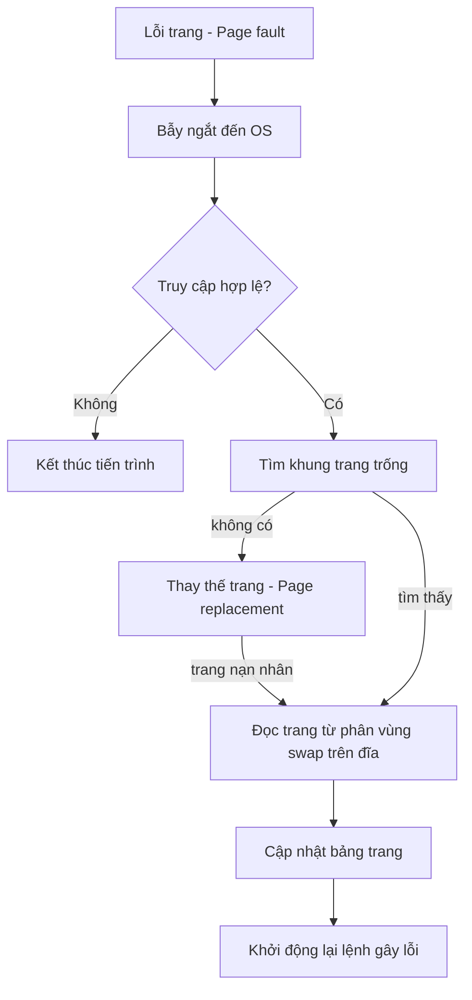
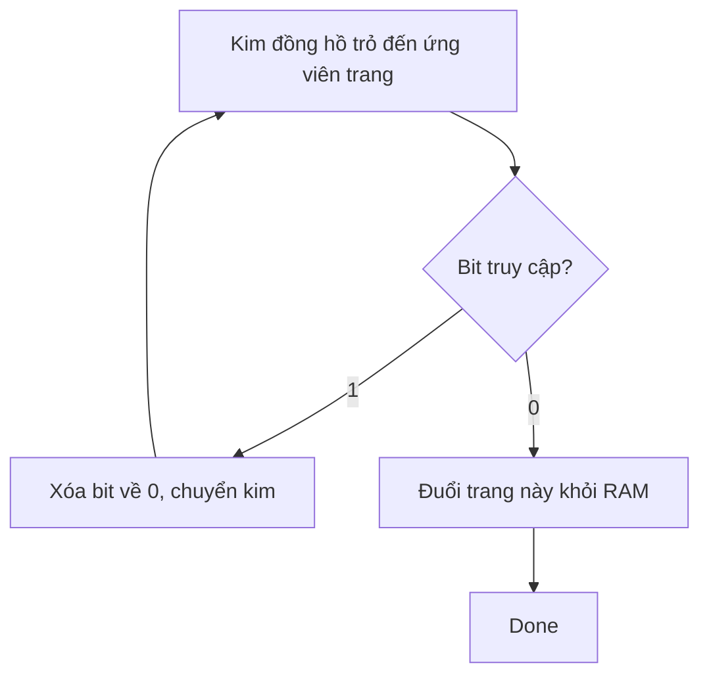

# Chương 7: Bộ nhớ ảo (Virtual Memory)

Bộ nhớ ảo (*Virtual memory*) là kỹ thuật tách biệt hoàn toàn không gian địa chỉ logic (địa chỉ ảo) của tiến trình khỏi bộ nhớ vật lý (RAM). Kỹ thuật này cho phép thực thi các chương trình có kích thước lớn hơn cả dung lượng RAM vật lý thực tế của máy tính, hỗ trợ chia sẻ tài nguyên cực kỳ hiệu quả và đơn giản hóa việc quản lý bộ nhớ. Chương này giải thích cách bộ nhớ ảo vận hành, cách Hệ điều hành xử lý lỗi trang (page faults) và các giải thuật thay thế trang dùng để quyết định trang nào được giữ lại trên RAM.

---

## Phân trang theo Yêu cầu (Demand Paging)

**Phân trang theo yêu cầu** (*Demand paging*) chỉ thực hiện nạp các trang dữ liệu vào bộ nhớ vật lý RAM khi tiến trình thực sự truy cập đến chúng (khi có yêu cầu), thay vì nạp toàn bộ chương trình ngay khi khởi chạy. Cơ chế này giúp tiết kiệm tối đa RAM và tăng tốc độ khởi động tiến trình.

Trong cơ chế phân trang theo yêu cầu, mỗi mục trong bảng trang sở hữu một **bit hợp lệ-không hợp lệ (valid‑invalid bit)**:
- **Hợp lệ (1)**: Trang hiện đang nằm trên bộ nhớ vật lý RAM (đã được cấp khung trang).
- **Không hợp lệ (0)**: Trang hiện không nằm trên RAM – có thể chưa bao giờ được nạp hoặc đã bị đẩy xuống ổ đĩa cứng (phân vùng trao đổi swap space).

Khi chương trình cố gắng truy cập vào một trang có trạng thái không hợp lệ (0), phần cứng CPU sẽ phát hiện và kích hoạt một bẫy lỗi chuyển giao về cho Hệ điều hành xử lý – sự kiện này gọi là **lỗi trang (page fault)**.

**Bộ tráo đổi trang lười biếng (Lazy swapper / pager)**: Là cơ chế của Hệ điều hành chỉ đưa trang vào RAM khi thực sự cần thiết, phân biệt với swapper truyền thống thực hiện di chuyển toàn bộ tiến trình.

**So sánh thực tế**: Thư viện trường đại học không mang tất cả sách từ trong kho chứa ra xếp sẵn trên bàn đọc của phòng đọc. Chỉ khi độc giả yêu cầu một cuốn sách cụ thể (*lỗi trang*), nhân viên thư viện mới đi xuống kho dưới tầng hầm để lấy cuốn sách đó lên phục vụ.

---

## Xử lý Lỗi Trang (Page Fault Handling)

Trình tự các bước xử lý của hệ thống khi xảy ra sự kiện lỗi trang:

1. Phần cứng CPU phát hiện lỗi trang, phát tín hiệu bẫy lỗi (trap) chuyển về nhân Hệ điều hành, đồng thời tự động lưu lại con trỏ chương trình và trạng thái tiến trình.
2. Hệ điều hành xác định trang ảo nào vừa bị truy cập lỗi (dựa trên địa chỉ gây lỗi lưu trong thanh ghi CPU).
3. Hệ điều hành kiểm tra tính hợp lệ của việc truy cập này (xem địa chỉ có nằm trong tầm vực cho phép của tiến trình không, tiến trình có đủ quyền đọc/ghi không). Nếu truy cập bất hợp pháp, Hệ điều hành sẽ cưỡng chế tắt tiến trình (lỗi *Segmentation fault*).
4. Hệ điều hành tìm kiếm một khung trang vật lý trống trên RAM. Nếu RAM đã đầy, chạy giải thuật thay thế trang để chọn ra một trang nạn nhân (*victim frame*) giải phóng khỏi RAM (xem mục 4).
5. Hệ điều hành lập lịch đọc ổ đĩa để nạp trang dữ liệu yêu cầu từ phân vùng swap trên đĩa cứng vào khung trang vật lý vừa chọn.
6. Trong thời gian chờ đợi đọc đĩa I/O (khá chậm), tiến trình yêu cầu sẽ bị chặn (block). Hệ điều hành thực hiện chuyển đổi ngữ cảnh để cấp CPU cho tiến trình khác chạy.
7. Khi thao tác đọc đĩa hoàn thành, Hệ điều hành cập nhật lại mục bảng trang tương ứng: đặt bit hợp lệ = 1, cập nhật số khung trang vật lý.
8. Hệ điều hành đánh thức tiến trình dậy, khởi động lại lệnh gây lỗi trang trước đó. Lúc này lệnh sẽ thực thi thành công vì dữ liệu đã có sẵn trên RAM.



**Đánh giá hiệu năng**: Thời gian truy cập hiệu dụng = $(1 - p) \times \text{thời gian truy cập RAM} + p \times \text{thời gian xử lý lỗi trang}$. Chỉ cần một tỷ lệ lỗi trang cực kỳ nhỏ ($p \approx 0.0001$) cũng có thể làm hệ thống chậm đi rõ rệt, do tốc độ đọc đĩa cứng chậm hơn RAM khoảng $10^6$ lần.

---

## Cơ chế Sao chép khi Ghi (Copy‑on‑Write - COW)

Lời gọi hệ thống tạo tiến trình con `fork()` theo cách truyền thống phải sao chép toàn bộ không gian địa chỉ bộ nhớ của tiến trình cha sang tiến trình con – quy trình này rất đắt đỏ và chậm. Cơ chế **Sao chép khi Ghi** (*Copy‑on‑write - COW*) trì hoãn việc sao chép này: Cả cha và con ban đầu dùng chung các trang vật lý trên RAM và đánh dấu các trang này ở chế độ chỉ đọc (read-only).
- Khi một trong hai tiến trình cố gắng ghi thay đổi dữ liệu vào một trang chung, lỗi trang sẽ xảy ra.
- Hệ điều hành sẽ nhân bản trang đó ra một khung trang vật lý mới dành riêng cho tiến trình thực hiện thao tác ghi.
- Cập nhật lại bảng trang của cả hai bên thành quyền đọc-ghi cho trang riêng biệt đó.

**Ưu điểm**: Lệnh `fork()` thực hiện cực kỳ nhanh. Các trang dữ liệu không bị sửa đổi sẽ không bao giờ phải sao chép lãng phí.  
**Ngữ cảnh sử dụng phổ biến**: Tiến trình con gọi ngay lệnh `exec()` ngay sau `fork()` – hệ thống hoàn toàn không phải sao chép bất kỳ trang vùng nhớ nào.

**So sánh thực tế**: Giáo viên phát chung một cuốn sách giáo khoa cho hai học sinh. Chừng nào hai học sinh chỉ đọc, họ dùng chung cuốn sách đó. Khi một học sinh muốn viết vẽ ghi chú vào một trang sách, giáo viên sẽ photo riêng trang đó ra cho học sinh đó tự do viết vẽ (*copy-on-write*).

---

## Các Giải thuật Thay thế Trang (Page Replacement Algorithms)

Khi xảy ra lỗi trang và RAM đã hoàn toàn hết khung trang trống, Hệ điều hành bắt buộc phải chọn và trục xuất (*evict*) một trang nạn nhân ra khỏi RAM để lấy chỗ nạp trang mới. Mục tiêu của các giải thuật thay thế trang là chọn ra trang nào ít có khả năng bị truy cập lại nhất trong tương lai gần để giảm thiểu số lần lỗi trang tiếp theo.

### 1. Giải thuật FIFO (First‑In, First‑Out)
Trục xuất trang đã nằm trong RAM từ lâu nhất. Được cài đặt dưới dạng hàng đợi vòng tròn.
- **Ưu điểm**: Rất đơn giản, dễ lập trình.
- **Nhược điểm**: Hiệu năng thực tế kém; gặp phải **Hiện tượng dị thường Belady (Belady's anomaly)** – Hiện tượng kỳ lạ khi ta cấp thêm khung trang vật lý cho hệ thống nhưng số lượng lỗi trang lại bị tăng lên.

*Ví dụ dị thường Belady của FIFO* (chuỗi truy cập trang: 1, 2, 3, 4, 1, 2, 5, 1, 2, 3, 4, 5):
- Cấp 3 khung trang → Xảy ra 9 lần lỗi trang.
- Cấp 4 khung trang → Xảy ra 10 lần lỗi trang (tệ hơn!).

### 2. Giải thuật Tối ưu (Optimal Algorithm - OPT / MIN)
Trục xuất trang sẽ không được sử dụng đến trong một **khoảng thời gian lâu nhất** ở tương lai. Thuật toán này được chứng minh toán học là tối ưu tuyệt đối để đạt số lần lỗi trang thấp nhất.
- **Ưu điểm**: Hiệu năng tốt nhất có thể đạt được (giới hạn dưới lý thuyết).
- **Nhược điểm**: Không thể hiện thực hóa trong các hệ điều hành thực tế do Hệ điều hành không thể biết trước tương lai tiến trình sẽ truy cập trang nào. Chỉ được dùng làm hệ quy chiếu lý thuyết để đánh giá các giải thuật khác.

### 3. Giải thuật LRU (Least Recently Used)
Trục xuất trang đã lâu nhất chưa được truy cập đến (dựa trên hành vi trong quá khứ). Giải thuật này xấp xỉ thuật toán tối ưu OPT bằng cách giả định hành vi của tiến trình tuân theo nguyên lý cận kề thời gian (temporal locality) – trang vừa dùng gần đây sẽ sớm được dùng lại.

**Các hướng cài đặt**:
- **Bộ đếm (Counters)**: Mỗi mục bảng trang có trường lưu thời gian truy cập cuối; mỗi lần CPU đọc/ghi trang sẽ cập nhật biến thời gian này. Khi cần thay thế trang, duyệt tìm trang có mốc thời gian nhỏ nhất. Khá tốn hiệu năng.
- **Ngăn xếp (Stack)**: Duy trì một ngăn xếp chứa các số hiệu trang; khi một trang được truy cập, đưa trang đó lên đỉnh ngăn xếp. Trang nằm ở đáy ngăn xếp chính là trang LRU cần trục xuất. Đòi hỏi hỗ trợ phần cứng để cập nhật nhanh.
- **Giải thuật LRU không gặp hiện tượng dị thường Belady**.

### 4. Giải thuật Cơ chế Đồng hồ (Clock / Second-Chance)
Là giải thuật xấp xỉ LRU hiệu quả trong thực tế, chỉ yêu cầu một **bit truy cập (reference bit)** đi kèm mỗi trang. Các trang được tổ chức dưới dạng một danh sách vòng tròn, có một con trỏ kim đồng hồ quản lý.

- Nếu kim đồng hồ trỏ vào trang có bit truy cập = 1: Đặt bit truy cập về 0 (cho trang cơ hội thứ hai) và chuyển kim sang trang tiếp theo.
- Nếu kim trỏ vào trang có bit truy cập = 0: Trục xuất trang này khỏi RAM.

**Giải thuật đồng hồ cải tiến (Enhanced Clock)**: Xét kết hợp cả bit truy cập và bit bẩn (dirty bit). Ưu tiên trục xuất các trang sạch (chưa bị sửa đổi dữ liệu) trước để tránh việc hệ thống phải mất công ghi dữ liệu ngược về đĩa cứng.



### 5. Giải thuật LFU (Least Frequently Used) & MFU (Most Frequently Used)
- **LFU**: Trục xuất trang có tần suất số lần truy cập ít nhất. Giả định trang dùng nhiều sẽ tiếp tục được dùng.
- **MFU**: Trục xuất trang có tần suất số lần truy cập nhiều nhất. Giả định trang dùng nhiều đã xử lý xong và không cần đến nữa.
- Cả hai giải thuật này đều ít dùng do hao phí quản lý bộ đếm lớn và dễ gặp lỗi logic (ví dụ: trang dùng nhiều lúc khởi động nhưng sau đó không dùng nữa vẫn được giữ lại RAM mãi).

**Bảng so sánh các giải thuật**:

| Giải thuật | Độ phức tạp cài đặt | Hiệu năng thực tế | Khả thi trong thực tế? |
| :--- | :--- | :--- | :--- |
| **FIFO** | Cực kỳ thấp | Kém, gặp dị thường Belady | Chỉ dùng cho hệ thống rất đơn giản |
| **Tối ưu (OPT)** | Không khả thi | Tốt nhất lý thuyết | Chỉ dùng làm hệ quy chiếu đánh giá |
| **LRU** | Cao (yêu cầu phần cứng) | Rất tốt | Khả thi nếu phần cứng hỗ trợ tốt |
| **Đồng hồ (Clock)** | Thấp (chỉ cần 1 bit) | Tốt (tiệm cận LRU) | Phổ biến nhất trong các hệ điều hành |
| **LFU** | Trung bình | Trung bình | Hiếm khi sử dụng |

---

## Trì trệ Hệ thống (Thrashing) và Mô hình Tập Làm việc

**Trì trệ hệ thống** (*Thrashing*) xảy ra khi một tiến trình dành phần lớn thời gian chỉ để **xử lý lỗi trang và nạp dữ liệu từ đĩa** thay vì thực thi các lệnh tính toán hữu ích. Ổ đĩa cứng trở thành nút thắt cổ chai, và hiệu suất sử dụng CPU của hệ thống bị sụt giảm nghiêm trọng tiệm cận về mức 0.

**Nguyên nhân**: Tiến trình không được cấp đủ số lượng khung trang vật lý cần thiết để chứa **tập cận kề (locality)** của nó – tập hợp các trang dữ liệu mà tiến trình đang tích cực thao tác. Hệ điều hành liên tục trục xuất các trang dữ liệu mà ngay lập tức sau đó tiến trình lại cần dùng đến và gây lỗi trang.

```
       CPU
   Utilisation
     ^
     |         / \
     |        /   \
     |       /     \
     |      /       \
     |     /         \
     |    /           \.......... Thrashing!
     |   /             \
     +---------------------------> Độ đa nhiệm (Degree of multiprogramming)
```

**Mô hình Tập Làm việc (Working Set Model)**:
Định nghĩa tập làm việc của tiến trình tại thời điểm $t$ là tập hợp tất cả các trang được truy cập trong khoảng thời gian $\Delta$ vừa qua.
- Nếu tổng kích thước các tập làm việc của tất cả các tiến trình vượt quá tổng số khung trang vật lý có sẵn của RAM → **Hệ thống sẽ bị trì trệ (thrashing)**.

**Các giải pháp phòng chống trì trệ**:
- **Thuật toán Tập làm việc**: Theo dõi tập làm việc của từng tiến trình; chỉ cho phép tiến trình chạy nếu RAM còn đủ chỗ chứa toàn bộ tập làm việc của nó.
- **Tần suất Lỗi Trang (Page Fault Frequency - PFF)**: Thiết lập ngưỡng lỗi trang trên và dưới cho tiến trình. Nếu tiến trình bị lỗi trang quá nhiều, cấp thêm khung trang cho nó; nếu tỷ lệ lỗi trang xuống rất thấp, thu hồi bớt khung trang để chia cho tiến trình khác.
- **Tạm dừng tiến trình**: Nếu RAM quá tải, tráo đổi toàn bộ tiến trình (swap out) ra đĩa cứng để nhường không gian cho các tiến trình còn lại chạy xong.

---

## Tệp Ánh xạ Bộ nhớ (Memory‑Mapped Files)

**Tệp ánh xạ bộ nhớ** (*Memory‑mapped files*) cho phép ánh xạ nội dung của một tệp tin trên đĩa cứng trực tiếp vào không gian địa chỉ bộ nhớ ảo của tiến trình. Việc đọc và ghi dữ liệu trên vùng nhớ ảo này sẽ tự động được đồng bộ hóa và phản ánh xuống tệp tin trên đĩa thông qua cơ chế quản lý trang.

**Cơ chế hoạt động**:
1. Hệ điều hành thiết lập bảng trang ánh xạ vùng địa chỉ ảo vào tệp tin.
2. Ban đầu, tất cả các trang đều được đánh dấu không hợp lệ (0).
3. Khi tiến trình truy cập vùng nhớ, lỗi trang xảy ra.
4. Hệ điều hành đọc khối tệp tương ứng từ đĩa cứng nạp vào một khung trang vật lý trên RAM.
5. Khi tiến trình thay đổi dữ liệu (trang trở thành dirty), Hệ điều hành sẽ tự động ghi dữ liệu từ RAM ngược về đĩa cứng khi giải phóng ánh xạ hoặc định kỳ.

**Lời gọi hệ thống**: Hàm `mmap()` (trên Unix/Linux), các hàm `CreateFileMapping()` và `MapViewOfFile()` (trên Windows).

**Ưu điểm**:
- Đơn giản hóa việc vào/ra tệp tin – Thao tác đọc ghi tệp dễ dàng giống như thao tác trên mảng dữ liệu trong bộ nhớ (không cần gọi hàm `read` hay `write` thủ công).
- Chia sẻ dữ liệu hiệu năng cao: Nhiều tiến trình có thể cùng ánh xạ vào một tệp tin để chia sẻ chung các khung trang vật lý trên RAM một cách an toàn.

---

## Bảng Tổng kết Chương

| Khái niệm | Điểm cốt lõi cần nhớ |
| :--- | :--- |
| **Phân trang theo yêu cầu** | Chỉ nạp trang vào RAM khi được truy cập; giúp tiết kiệm tài nguyên bộ nhớ tối đa. |
| **Lỗi trang (Page fault)** | CPU bẫy ngắt chuyển về OS khi tiến trình truy cập trang có bit Valid = 0; OS thực hiện nạp trang từ đĩa. |
| **Sao chép khi ghi (COW)** | Cơ chế tối ưu hóa lệnh `fork()` giúp chia sẻ chung trang cho đến khi phát sinh thao tác ghi dữ liệu. |
| **Thuật toán thay thế** | FIFO (dễ bị dị thường Belady), Tối ưu OPT (lý thuyết), LRU (rất tốt nhưng đắt), Clock (tiêu chuẩn thực tế). |
| **Trì trệ (Thrashing)** | Hệ thống kẹt cứng do liên tục lỗi trang và đọc đĩa; xảy ra khi RAM không đủ chứa tập làm việc (working set). |
| **Cỡ trang (Page size)** | Trang nhỏ giúp giảm phân mảnh nội vi, trang lớn (huge pages) tăng phạm vi che phủ của TLB cải thiện hiệu năng. |
| **Tệp ánh xạ bộ nhớ** | Ánh xạ tệp tin trực tiếp vào vùng nhớ ảo; OS tự động điều phối đọc/ghi thông qua cơ chế lỗi trang. |

Bộ nhớ ảo là mảnh ghép hoàn thiện bức tranh quản lý bộ nhớ của Hệ điều hành. Chương tiếp theo sẽ dẫn chúng ta chuyển sang tìm hiểu về thế giới lưu trữ: **Hệ thống Tệp tin (File Systems)** và cách Hệ điều hành quản lý dữ liệu trên các thiết bị lưu trữ vật lý.
