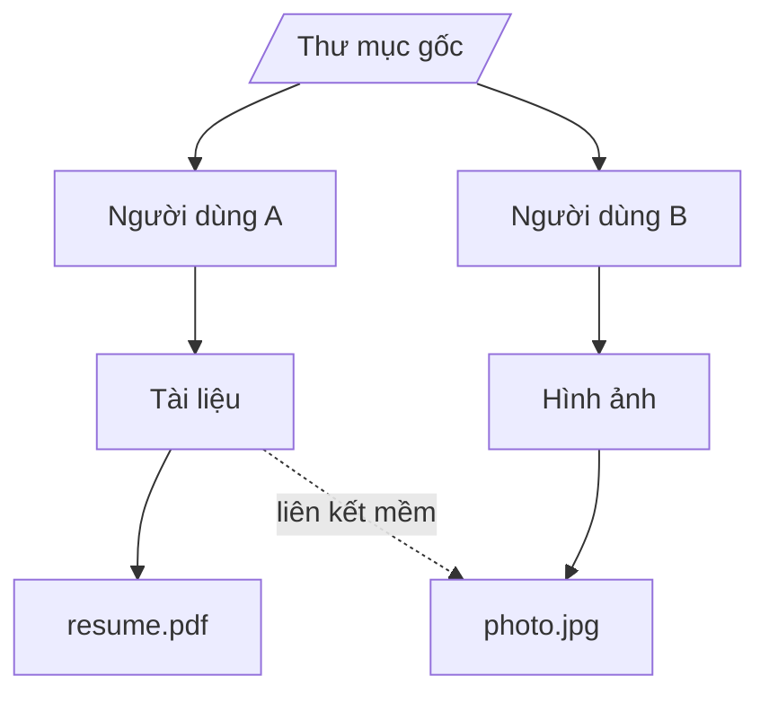
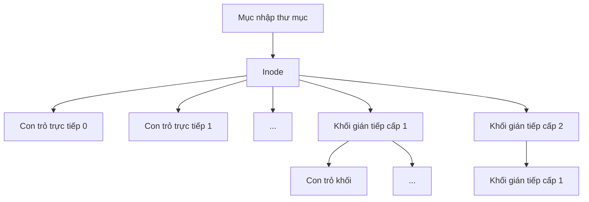
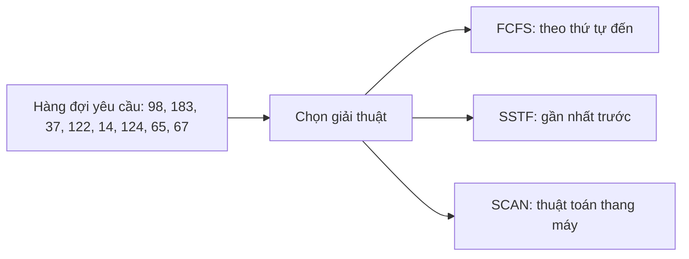

# Chương 8: Hệ thống Tệp tin (File Systems)

Hệ thống tệp tin (*File system*) là thành phần của Hệ điều hành quản lý cách dữ liệu được lưu trữ, tổ chức và truy xuất trên các thiết bị lưu trữ thứ cấp lâu bền (như ổ đĩa cứng HDD, ổ thể rắn SSD). Chương này giới thiệu các khái niệm tệp tin, cấu trúc thư mục, phương pháp cấp phát không gian lưu trữ, quản lý vùng trống, lập lịch dịch chuyển đầu đọc đĩa, và kiến trúc của các hệ thống tệp tin trong thực tế.

---

## Khái niệm Tệp tin (File Concept)

Một **tệp tin** (*file*) là một tập hợp các thông tin liên quan có cấu trúc và được đặt tên, được lưu trữ trên thiết bị lưu trữ thứ cấp lâu bền. Tệp tin là đơn vị lưu trữ logic, giúp che giấu đi các chi tiết kỹ thuật vật lý phức tạp của đĩa từ hoặc chip nhớ.

### Các Thuộc tính của Tệp tin

| Thuộc tính | Mô tả chi tiết |
| :--- | :--- |
| **Tên (Name)** | Mã định danh bằng chuỗi ký tự thân thiện với con người (ví dụ: `report.txt`). |
| **Mã định danh (Identifier)** | Mã số duy nhất (số hiệu inode) được Hệ điều hành sử dụng nội bộ để quản lý. |
| **Kiểu tệp (Type)** | Định dạng tệp (ví dụ: `.c`, `.pdf`, tệp thực thi). |
| **Vị trí (Location)** | Con trỏ chỉ đến vị trí vật lý lưu trữ tệp tin trên ổ đĩa. |
| **Kích thước (Size)** | Kích thước hiện tại của tệp tính bằng byte. |
| **Bảo vệ (Protection)** | Phân quyền truy cập tệp (đọc, ghi, thực thi cho chủ sở hữu/nhóm/người khác). |
| **Nhãn thời gian (Timestamps)** | Ghi nhận thời gian tạo lập, sửa đổi cuối và truy cập cuối của tệp. |
| **User ID / Chủ sở hữu** | Mã định danh tài khoản người dùng sở hữu tệp tin. |

### Các Thao tác trên Tệp tin

Các lời gọi hệ thống phổ biến dùng để thao tác với tệp tin:

| Thao tác | Mục đích kỹ thuật |
| :--- | :--- |
| `create` | Tạo một tệp mới (cấp phát không gian đĩa, thêm mục nhập vào thư mục). |
| `open` | Mở tệp để sẵn sàng sử dụng – trả về một mô tả tệp (file descriptor). |
| `read` | Chuyển đổi dữ liệu byte từ tệp tin trên đĩa vào bộ nhớ RAM. |
| `write` | Ghi dữ liệu từ RAM xuống tệp tin trên đĩa. |
| `seek` | Di chuyển con trỏ tệp đến vị trí mong muốn (hỗ trợ truy cập ngẫu nhiên). |
| `close` | Ghi nốt bộ đệm dữ liệu xuống đĩa và giải phóng tài nguyên. |
| `delete` | Xóa liên kết và giải phóng các khối đĩa của tệp. |
| `truncate` | Xóa toàn bộ nội dung dữ liệu bên trong nhưng vẫn giữ lại tệp trống. |

---

## Cấu trúc Thư mục (Directory Structure)

Một **thư mục** (*directory*) là một cấu trúc dữ liệu lưu trữ danh sách tên tệp và siêu dữ liệu (hoặc con trỏ trỏ đến siêu dữ liệu) đi kèm của chúng để tổ chức quản lý tệp theo hệ phân cấp.

### 1. Thư mục một cấp (Single‑Level Directory)
Tất cả các tệp tin trong hệ thống đều nằm chung trong một thư mục duy nhất. Đơn giản nhưng dễ gặp lỗi đụng độ tên tệp khi có nhiều người dùng.

### 2. Thư mục hai cấp (Two‑Level Directory)
Mỗi tài khoản người dùng sở hữu một thư mục riêng biệt: Một thư mục tệp chính (Master File Directory - MFD) quản lý các thư mục con của từng người dùng (User File Directory - UFD). Người dùng khác nhau có thể tạo các tệp có tên giống nhau mà không bị xung đột.

### 3. Thư mục cấu trúc Cây (Tree‑Structured Directory)
Mô hình phân cấp tổng quát phổ biến hiện nay: Thư mục có thể chứa các thư mục con khác mà không bị giới hạn cấp độ lồng nhau.
- **Đường dẫn tuyệt đối (Absolute path)**: Đi từ thư mục gốc `/` (ví dụ: `/home/user/file.txt`).
- **Đường dẫn tương đối (Relative path)**: Đi từ thư mục làm việc hiện tại (ví dụ: `./file.txt`).

### 4. Thư mục Đồ thị không chu trình (Acyclic‑Graph Directory)
Cho phép các thư mục khác nhau cùng chia sẻ một tệp tin hoặc thư mục con thông qua **liên kết (links)**:
- **Liên kết cứng (Hard link)**: Nhiều mục nhập thư mục khác nhau cùng trỏ trực tiếp đến cùng một tệp vật lý (chung số hiệu inode) – không thể liên kết xuyên qua các hệ thống tệp khác nhau.
- **Liên kết mềm (Soft link / Symbolic link)**: Một tệp đặc biệt chứa chuỗi đường dẫn dẫn đến tệp đích – có thể liên kết xuyên hệ thống tệp và đĩa.

### 5. Thư mục Đồ thị tổng quát (General Graph Directory)
Cho phép tồn tại các chu trình liên kết (ví dụ: thư mục con chứa liên kết trỏ ngược lại thư mục cha). Điều này gây lỗi lặp vô hạn khi duyệt cây thư mục và đòi hỏi các thuật toán thu gom rác bộ nhớ phức tạp.

---

## Gắn kết Hệ thống Tệp (File System Mounting)

**Gắn kết** (*Mounting*) là hành động liên kết cấu trúc của một hệ thống tệp (nằm trên một phân vùng đĩa, USB, CD-ROM) vào một đường dẫn thư mục hiện có trong cây thư mục chính. Thư mục tiếp nhận liên kết gọi là **điểm gắn kết (mount point)**.

**Quy trình thực hiện**:
1. Hệ điều hành kiểm tra tính hợp lệ của hệ thống tệp trên thiết bị (đọc superblock).
2. Hệ điều hành ghi lại thông tin điểm gắn kết vào bảng gắn kết (mount table) của hệ thống.
3. Mọi truy cập vào đường dẫn điểm gắn kết từ đó sẽ tự động được điều hướng đến thư mục gốc của hệ thống tệp vừa được gắn kết.

---

## Phương pháp Cấp phát Không gian File (File Allocation Methods)

Hệ điều hành phải quyết định cách phân bổ các khối (blocks) trên đĩa cứng cho tệp tin. Có ba phương pháp kinh điển:

### 1. Cấp phát Liên tục (Contiguous Allocation)
Mỗi tệp tin chiếm dụng một loạt các **khối liên tục nhau** trên đĩa cứng. Siêu dữ liệu thư mục chỉ cần lưu số hiệu khối bắt đầu và độ dài khối.
- **Ưu điểm**: Đơn giản, tốc độ đọc tuần tự và ngẫu nhiên cực nhanh (đầu đọc đĩa chỉ cần dịch chuyển một lần).
- **Nhược điểm**: Bị phân mảnh ngoại vi; rất khó tăng kích thước tệp (phải dịch chuyển tệp hoặc cấp phát thừa).

### 2. Cấp phát Liên kết (Linked Allocation)
Mỗi tệp tin được quản lý dưới dạng một **danh sách liên kết** các khối đĩa. Mục thư mục lưu con trỏ chỉ đến khối đầu tiên, cuối mỗi khối đĩa chứa con trỏ chỉ đến khối kế tiếp.
- **Ưu điểm**: Hoàn toàn không bị phân mảnh ngoại vi; tệp tin co giãn kích thước cực kỳ dễ dàng.
- **Nhược điểm**: Truy cập ngẫu nhiên rất chậm (phải duyệt tuần tự qua các khối); độ tin cậy kém (chỉ cần lỗi một con trỏ là hỏng toàn bộ phần sau của tệp).

**Bảng Cấp phát Tệp (File Allocation Table - FAT)**: Cải tiến bằng cách đưa tất cả các con trỏ liên kết khối vào một bảng tập trung (nằm ở đầu phân vùng đĩa). Mục thư mục lưu số hiệu khối đầu tiên, việc tra cứu liên kết khối được thực hiện nhanh trên RAM thông qua bảng FAT.

### 3. Cấp phát Chỉ mục (Indexed Allocation)
Mỗi tệp tin sở hữu riêng một **khối chỉ mục (index block / inode)** – là mảng chứa các con trỏ chỉ tới toàn bộ các khối dữ liệu thực tế của tệp đó trên đĩa.

**Mô hình Inode của hệ điều hành UNIX (phối hợp nhiều cấp)**:
- **Con trỏ trực tiếp (Direct pointers)**: Trỏ thẳng đến các khối dữ liệu (khoảng 12 con trỏ, tối ưu cho tệp nhỏ).
- **Con trỏ gián tiếp cấp 1 (Single indirect pointer)**: Trỏ đến một khối chứa các con trỏ chỉ đến khối dữ liệu.
- **Con trỏ gián tiếp cấp 2 (Double indirect pointer)** và **cấp 3**: Hỗ trợ lưu trữ các tệp tin có kích thước khổng lồ lên tới hàng TB.

---

## Quản lý Không gian Trống (Free Space Management)

Hệ điều hành phải liên tục theo dõi và quản lý danh sách các khối đĩa còn trống để cấp phát kịp thời cho tệp mới.

- **Vector bit (Bitmap)**: Sử dụng một mảng bit, mỗi bit đại diện cho một khối đĩa (bit = 1 là trống, bit = 0 là đã cấp). *Ví dụ: Ổ đĩa 1 TB sử dụng cluster 4 KB cần mảng bitmap dung lượng khoảng 256 MB.* Tìm kiếm khối trống rất nhanh thông qua quét bit 1.
- **Danh sách liên kết (Linked List)**: Liên kết tất cả các khối trống lại với nhau. Hệ điều hành giữ con trỏ chỉ đến khối trống đầu tiên. Không tốn dung lượng lưu trữ phụ, nhưng việc duyệt tìm khối trống liên tục yêu cầu đọc đĩa chậm.
- **Gom nhóm (Grouping)**: Khối trống đầu tiên sẽ lưu trữ địa chỉ của $N$ khối trống tiếp theo để giảm số lần đọc đĩa khi duyệt tìm.
- **Đếm số lượng (Counting)**: Ghi nhận địa chỉ khối trống đầu tiên và số lượng khối trống liên tục tiếp theo để tối ưu hóa không gian lưu trữ danh sách.

---

## Lập lịch Đĩa (Disk Scheduling)

Đối với ổ đĩa cứng cơ học HDD, tốc độ đọc/ghi phụ thuộc rất nhiều vào thời gian tìm kiếm đầu đọc đĩa (*seek time*). Hệ điều hành lập lịch thứ tự thực hiện các yêu cầu đọc/ghi để giảm thiểu tối đa quãng đường dịch chuyển của đầu đọc đĩa.

### Các Giải thuật Lập lịch Đĩa phổ biến

| Giải thuật | Nguyên lý hoạt động | Ưu điểm | Nhược điểm |
| :--- | :--- | :--- | :--- |
| **FCFS** | Đến trước, phục vụ trước theo thứ tự | Công bằng, đơn giản | Đầu đọc dịch chuyển liên tục, hiệu năng kém |
| **SSTF** | Chọn yêu cầu có thời gian tìm kiếm ngắn nhất tiếp theo | Tăng thông lượng rõ rệt | Dễ gây đói tài nguyên cho yêu cầu ở xa |
| **SCAN** | Đầu đọc quét liên tục từ đầu đĩa đến cuối đĩa và ngược lại (thang máy) | Công bằng, không bị đói | Yêu cầu ở hai đầu đĩa phải chờ lâu hơn |
| **C‑SCAN** | Quét một chiều từ đầu đến cuối, sau đó nhảy nhanh về đầu đĩa để quét tiếp | Thời gian chờ đợi đồng đều | Mất thời gian nhảy không tải về đầu đĩa |
| **LOOK / C‑LOOK** | Tương tự SCAN / C-SCAN nhưng dừng lại ngay khi xử lý xong yêu cầu cuối cùng ở biên đĩa | Tiết kiệm hành trình thừa của đầu đọc | Cài đặt phức tạp hơn một chút |

---

## Bố cục Hệ thống Tệp tin (File System Layout)

Một phân vùng đĩa cài đặt hệ thống tệp tin UNIX điển hình được tổ chức thành các khối chức năng cụ thể:

| Phân vùng | Tên gọi | Nhiệm vụ |
| :--- | :--- | :--- |
| **Khối 0** | **Boot block** | Chứa chương trình khởi động hệ thống (bootstrap loader) để nạp OS. |
| **Khối 1** | **Superblock** | Lưu siêu dữ liệu của toàn bộ hệ thống tệp: cỡ khối, tổng số khối, số khối trống, kích thước bảng inode, mã magic number để nhận dạng. |
| **Các khối tiếp theo** | **Inode table** | Mảng chứa các cấu trúc inode quản lý siêu dữ liệu và con trỏ dữ liệu của tệp tin. |
| **Phần còn lại** | **Data blocks** | Vùng nhớ lưu nội dung thực tế của tệp tin và các thư mục. |

---

## Cơ chế Ghi Nhật ký (Journaling)

Trước khi thực hiện thay đổi cấu trúc dữ liệu hệ thống tệp (như ghi tệp mới hoặc cập nhật thư mục), Hệ điều hành sẽ viết trước các dự định thay đổi này vào một phân vùng đĩa chuyên dụng gọi là **Nhật ký (Journal / Log)**.
- Khi nhật ký đã được ghi an toàn xuống đĩa cứng, hệ thống mới tiến hành cập nhật thực tế lên hệ thống tệp.
- Nếu xảy ra sự cố đột ngột mất điện hoặc sập nguồn giữa chừng, Hệ điều hành chỉ cần đọc và chạy lại nhật ký (replay) để phục hồi trạng thái nhất quán một cách cực kỳ nhanh chóng.

Các hệ thống tệp hiện đại có tính năng ghi nhật ký: **ext3, ext4, NTFS**.

---

## Các Ví dụ Hệ thống Tệp tin Thực tế

### 1. Hệ thống tệp FAT32
- **Lịch sử**: Phát triển cho MS-DOS và Windows 95/98, hiện vẫn dùng phổ biến trên các thẻ nhớ USB nhỏ.
- **Hạn chế lớn**: Kích thước tệp tin tối đa chỉ **4 GB**, dung lượng phân vùng tối đa 2 TB. Không hỗ trợ phân quyền an ninh và không ghi nhật ký.
- **Ưu điểm**: Cấu trúc đơn giản, tính tương thích cực kỳ cao trên mọi nền tảng thiết bị.

### 2. Hệ thống tệp NTFS
- **Windows mặc định** từ phiên bản Windows NT trở đi.
- **Tính năng**: Hỗ trợ ghi nhật ký, bảo mật nâng cao (danh sách quyền ACLs), mã hóa tệp (EFS), nén dữ liệu, liên kết cứng, giới hạn tệp tối đa lên tới 16 EB.
- **Bố cục**: Quản lý bằng Bảng Tệp chính (Master File Table - MFT) – mỗi tệp tin tương ứng với một mục MFT; các tệp siêu nhỏ được lưu trực tiếp trong MFT để tăng tốc độ.

### 3. Hệ thống tệp ext4
- **Tiêu chuẩn mặc định trên Linux**.
- **Tính năng**: Hỗ trợ ghi nhật ký, delayed allocation (hoãn cấp phát để giảm phân mảnh), hỗ trợ phân vùng đĩa tối đa 1 EB, kích thước tệp tối đa 16 TB.

---

## Bảng Tổng kết Chương

| Khái niệm | Điểm cốt lõi cần nhớ |
| :--- | :--- |
| **Thuộc tính tệp** | Tên, mã ID inode, kích thước, phân quyền bảo vệ, nhãn thời gian, chủ sở hữu. |
| **Cấu trúc thư mục** | Tiến hóa từ một cấp, hai cấp, cấu trúc cây phân cấp cho đến đồ thị không chu trình hỗ trợ liên kết mềm/cứng. |
| **Cơ chế gắn kết** | Gắn một hệ thống tệp vật lý vào một thư mục logic gọi là điểm gắn kết (mount point). |
| **Cấp phát đĩa** | Liên tục (nhanh, phân mảnh); Liên kết (linh hoạt, ngẫu nhiên kém); Chỉ mục Inode (tối ưu nhất, nhiều cấp). |
| **Lập lịch đĩa** | Lập lịch đầu đọc đĩa HDD: FCFS, SSTF (gây đói), SCAN (thang máy), C-SCAN, LOOK, C-LOOK. |
| **Ghi nhật ký** | Cơ chế an toàn viết trước thay đổi cấu trúc vào log để phục hồi tính nhất quán nhanh khi sập nguồn đột ngột. |
| **Các hệ thống tệp** | FAT32 (đơn giản, giới hạn 4GB); NTFS (Windows chuẩn, bảo mật tốt); ext4 (Linux chuẩn, tin cậy cao). |

Hệ thống tệp tin đóng vai trò là cây cầu nối vững chắc giữa Hệ điều hành và các thiết bị lưu trữ vật lý lâu bền. Chương tiếp theo sẽ dẫn chúng ta tìm hiểu về **Hệ thống Vào/Ra (I/O Systems)** để hoàn tất bức tranh điều phối phần cứng ngoại vi của OS.
