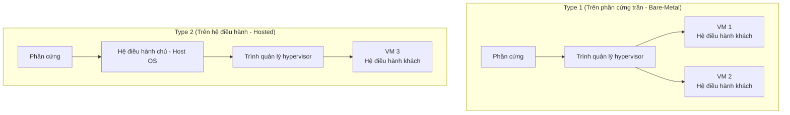
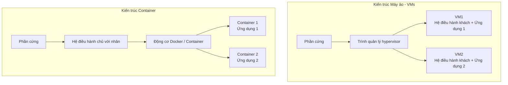

# Chương 11: Ảo hóa và Điện toán Đám mây (Virtualization and Cloud Computing)

Công nghệ ảo hóa (*Virtualization*) giải phóng phần mềm độc lập khỏi giới hạn phần cứng vật lý bên dưới, cho phép nhiều hệ điều hành khác nhau cùng khởi chạy song song trên một máy tính vật lý duy nhất. Điện toán đám mây (*Cloud computing*) được xây dựng dựa trên nền tảng của ảo hóa để phân phối các tài nguyên tính toán dưới dạng các dịch vụ theo yêu cầu. Chương này giải thích về các trình giám sát máy ảo hypervisors, container, các mô hình dịch vụ đám mây, và các sự đánh đổi thiết kế đi kèm.

---

## Khái niệm Máy ảo: Trình giám sát Hypervisor

Một **máy ảo (Virtual Machine - VM)** là một bản giả lập bằng phần mềm của một máy tính vật lý chạy đầy đủ hệ điều hành và các ứng dụng. Trình giám sát **hypervisor** (còn gọi là trình quản lý máy ảo - Virtual Machine Monitor - VMM) là lớp phần mềm chịu trách nhiệm tạo lập và điều phối các máy ảo hoạt động.

### Trình giám sát Loại 1 (Type 1 Hypervisor / Bare‑Metal - Trên phần cứng trần)
Chạy trực tiếp trên phần cứng vật lý của máy tính mà không cần hệ điều hành chủ ở dưới. Nó có quyền truy cập trực tiếp và tối cao vào tài nguyên phần cứng.
- **Ví dụ**: VMware ESXi, Microsoft Hyper-V, KVM (KVM thực chất tích hợp trong nhân Linux), Xen.
- **Ưu điểm**: Hiệu năng rất cao, hao phí hệ thống cực kỳ thấp, bảo mật an toàn tốt.
- **Nhược điểm**: Đòi hỏi phải tích hợp sẵn trình điều khiển (drivers) cho mọi thiết bị phần cứng; quản trị phức tạp hơn.

### Trình giám sát Loại 2 (Type 2 Hypervisor / Hosted - Trực tiếp trên hệ điều hành)
Chạy như một chương trình ứng dụng bình thường trên nền tảng của một hệ điều hành chủ (*Host OS*). Hệ điều hành chủ sẽ chịu trách nhiệm quản lý trực tiếp phần cứng.
- **Ví dụ**: Oracle VirtualBox, VMware Workstation, QEMU (khi không bật gia tốc KVM).
- **Ưu điểm**: Cực kỳ dễ cài đặt và sử dụng, rất phù hợp cho mục đích lập trình phát triển và kiểm thử.
- **Nhược điểm**: Hao phí hệ thống cao (mọi yêu cầu tài nguyên đều phải chuyển qua lớp hệ điều hành chủ), hiệu năng xử lý kém hơn.

**So sánh thực tế**:
- **Loại 1**: Một tòa nhà chung cư cao tầng do ban quản lý tòa nhà trực tiếp vận hành hệ thống điện, thang máy từ gốc.
- **Loại 2**: Một văn phòng đại diện thuê lại phòng bên trong một tòa nhà văn phòng lớn – bạn có không gian riêng, nhưng ban quản lý hạ tầng của cả tòa nhà lớn (*hệ điều hành chủ*) mới là bên kiểm soát điện nước.

---

## Ảo hóa (Virtualization) so với Mô phỏng (Emulation)

| Tiêu chí | Ảo hóa (Virtualization) | Mô phỏng (Emulation) |
| :--- | :--- | :--- |
| **Thực thi lệnh khách** | Chạy trực tiếp trên CPU vật lý (nếu cùng kiến trúc tập lệnh ISA) | Được mô phỏng dịch chuyển bằng phần mềm |
| **Hiệu năng xử lý** | Tiệm cận tốc độ máy vật lý (nhờ hỗ trợ phần cứng) | Rất chậm (tốc độ giảm từ 10 - 100 lần) |
| **Sửa đổi OS khách** | Không yêu cầu (ảo hóa toàn phần) hoặc sửa đổi tối thiểu (cận ảo hóa) | Hoàn toàn không yêu cầu |
| **Ngữ cảnh sử dụng** | Chạy máy ảo Linux x86 trên máy chủ Windows x86 | Chạy phần mềm kiến trúc ARM trên CPU x86, chơi game console giả lập |

**Ảo hóa** yêu cầu hệ điều hành khách (Guest) và hệ điều hành chủ (Host) bắt buộc phải sử dụng chung một kiến trúc tập lệnh (Instruction Set Architecture - ISA). **Mô phỏng** có thể chạy phần mềm của bất kỳ kiến trúc phần cứng nào bằng cách biên dịch và thông dịch từng lệnh máy bằng phần mềm.

---

## Cận ảo hóa (Para‑Virtualization) và Ảo hóa Hỗ trợ Phần cứng

### Cận ảo hóa (Para‑Virtualization)
Hệ điều hành khách được chủ động sửa đổi mã nguồn để nhận biết được nó đang chạy trên một trình giám sát máy ảo. Thay vì cố gắng thực thi các lệnh đặc quyền (gây lỗi bẫy ngắt rất chậm để giả lập), hệ điều hành khách sẽ thực hiện các lời gọi **hypercalls** trực tiếp và công khai đến trình hypervisor.
- **Ưu điểm**: Hiệu năng xử lý rất cao do giảm thiểu tối đa bẫy ngắt.
- **Nhược điểm**: Bắt buộc phải chỉnh sửa nhân hệ điều hành khách (không thể áp dụng cho các hệ điều hành nguồn đóng như Windows).
- **Ví dụ**: Giải pháp cận ảo hóa của Xen thế hệ đầu.

### Ảo hóa Hỗ trợ bằng Phần cứng (Hardware‑Assisted Virtualization)
Các bộ vi xử lý hiện đại (Intel VT-x, AMD-V) bổ sung các tập lệnh phần cứng chuyên dụng để hỗ trợ ảo hóa:
- **Các chế độ hoạt động mới của CPU**: VMX root (dành riêng cho trình hypervisor) và VMX non-root (dành cho hệ điều hành khách).
- **Bảng trang mở rộng (Extended Page Tables - EPT) / Bảng trang lồng (Nested Page Tables - NPT)**: Cơ chế dịch chuyển địa chỉ bộ nhớ ảo của máy ảo bằng phần cứng CPU (giảm thiểu hao phí shadow page tables).
- **VMCS (Virtual Machine Control Structure)**: Cấu trúc dữ liệu phần cứng lưu trữ trạng thái máy ảo.

---

## Container đối với Máy ảo (VMs)

Các **Container** (như Docker, LXC, Podman) thực hiện ảo hóa ở **cấp độ Hệ điều hành**, không phải cấp độ phần cứng. Chúng dùng chung nhân hệ điều hành chủ nhưng cách ly hoàn toàn các không gian tài nguyên của các tiến trình thông qua các namespaces.

| Đặc điểm | Máy ảo (Virtual Machine) | Container |
| :--- | :--- | :--- |
| **Tính cô lập** | Cực cao (mỗi máy ảo sở hữu một nhân hệ điều hành riêng) | Vừa phải (dùng chung nhân, cách ly bằng không gian tên) |
| **Thời gian khởi động** | Vài chục giây đến vài phút (phải boot cả OS) | Mili giây (chỉ đơn giản khởi chạy tiến trình) |
| **Dung lượng lưu trữ** | Vài GB đến hàng chục GB (chứa cả OS) | Vài chục MB (chỉ chứa ứng dụng và thư viện phụ thuộc) |
| **Hao phí hiệu năng** | Thấp (Loại 1) hoặc Vừa phải (Loại 2) | Cực kỳ thấp (tương đương chạy trực tiếp trên máy chủ) |
| **Nhân hệ điều hành** | Mỗi máy ảo chạy một nhân độc lập | Tất cả dùng chung nhân của hệ điều hành chủ |
| **Khả năng chạy OS** | Bất kỳ OS nào (Linux, Windows, BSD...) | Bắt buộc phải tương thích với nhân chủ (chủ Linux chỉ chạy container Linux) |

**Các công cụ cốt lõi tạo nên Container trên Linux**:
- **Namespaces (Không gian tên)**: Cô lập tầm nhìn của tiến trình về tài nguyên hệ thống (PID, mạng, mount points, người dùng...).
- **Cgroups (control groups)**: Giới hạn lượng tài nguyên phần cứng tối đa tiến trình được phép dùng (CPU, RAM, băng thông ổ đĩa).
- **Hệ thống tệp Union (Union filesystems)**: Tạo nên các ảnh container dạng lớp chồng lên nhau cực kỳ tiết kiệm bộ nhớ.

---

## Các Mô hình Điện toán Đám mây

Điện toán đám mây cung cấp các tài nguyên tính toán thông qua mạng Internet dựa trên mô hình trả tiền theo mức độ sử dụng (pay-as-you-go). Ba mô hình dịch vụ chính:

### 1. IaaS (Infrastructure as a Service - Hạ tầng dịch vụ)
Phân phối các tài nguyên cơ bản như máy ảo, không gian lưu trữ và mạng. Khách hàng chịu trách nhiệm cài đặt và quản trị Hệ điều hành, các phần mềm trung gian (middleware) và ứng dụng.
- **Ví dụ**: AWS EC2, Google Compute Engine, Microsoft Azure VMs.
- **So sánh thực tế**: Thuê một mảnh đất trống – bạn tự mình xây dựng bất kỳ công trình gì bạn muốn.

### 2. PaaS (Platform as a Service - Nền tảng dịch vụ)
Cung cấp sẵn một môi trường nền tảng để bạn triển khai ứng dụng mà không cần quan tâm đến việc quản lý hạ tầng bên dưới (như cấu hình hệ điều hành, máy chủ web, cơ sở dữ liệu).
- **Ví dụ**: AWS Elastic Beanstalk, Google App Engine, Heroku.
- **So sánh thực tế**: Thuê một gian bếp được trang bị đầy đủ dụng cụ nấu nướng – bạn chỉ cần mang nguyên liệu đến để chế biến món ăn.

### 3. SaaS (Software as a Service - Phần mềm dịch vụ)
Cung cấp các ứng dụng hoàn chỉnh, sẵn sàng sử dụng ngay qua môi trường web mà không cần cài đặt hay quản trị bất kỳ hạ tầng nào.
- **Ví dụ**: Google Workspace (Gmail, Docs), Salesforce, Microsoft 365.
- **So sánh thực tế**: Đến ăn uống tại một nhà hàng – bạn chỉ cần gọi món và thưởng thức.

---

## Các Thách thức: Tính cô lập, Hiệu năng, An ninh

- **Tính cô lập**: Máy ảo cung cấp tính cô lập cực kỳ mạnh mẽ. Tuy nhiên, các kỹ thuật tấn công kênh kề (side-channel attacks như Spectre, Meltdown) vẫn có thể rò rỉ dữ liệu xuyên qua các máy ảo chạy chung một CPU vật lý. Với **Container**, do dùng chung nhân OS, một lỗ hổng trong nhân hoặc lỗi thoát container (container escape) có thể làm tổn hại đến các container khác trên cùng máy chủ.
- **An ninh**: Cần thường xuyên cập nhật bản vá cho trình hypervisor và nhân hệ điều hành chủ. Cấu hình container ở chế độ không có đặc quyền root (non-root) và khóa hệ thống tệp ở trạng thái chỉ đọc (read-only) là các biện pháp thực hành tốt nhất.

---

## Bảng Tổng kết Chương

| Khái niệm | Điểm cốt lõi cần nhớ |
| :--- | :--- |
| **Hypervisor Loại 1** | Chạy trực tiếp trên phần cứng vật lý bare-metal (ESXi, KVM, Hyper-V). |
| **Hypervisor Loại 2** | Chạy như một ứng dụng bình thường trên Hệ điều hành chủ (VirtualBox, VMware Workstation). |
| **Ảo hóa vs. Mô phỏng** | Ảo hóa: Cùng kiến trúc tập lệnh, tốc độ tiệm cận máy vật lý; Mô phỏng: Khác kiến trúc, tốc độ rất chậm. |
| **Cận ảo hóa** | Chỉnh sửa nhân OS khách để gọi trực tiếp hypercalls; nâng cao hiệu năng. |
| **Ảo hóa hỗ trợ phần cứng** | Tích hợp tập lệnh CPU VT-x/AMD-V giúp tối giản hóa hypervisor và tăng tốc ảo hóa bộ nhớ. |
| **Container** | Ảo hóa cấp OS; siêu nhẹ, khởi động nhanh, dùng chung nhân hệ điều hành chủ. |
| **Các mô hình dịch vụ đám mây** | IaaS (Hạ tầng dịch vụ), PaaS (Nền tảng dịch vụ), SaaS (Phần mềm dịch vụ dùng ngay). |

Ảo hóa và điện toán đám mây đã định hình lại hoàn toàn cách thế giới phát triển, triển khai và vận hành phần mềm. Việc nắm vững các nguyên lý này giúp bạn dễ dàng kết nối kiến thức Hệ điều hành truyền thống với các công cụ DevOps hiện đại.
