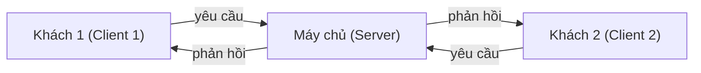
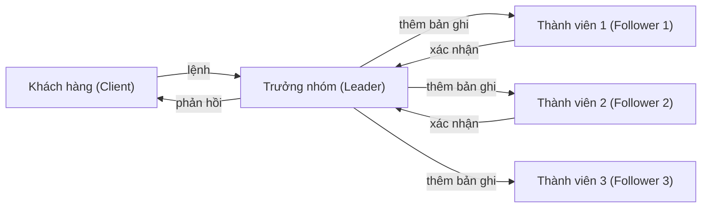

# Chương 12: Hệ điều hành Phân tán (Tổng quan)

Một hệ điều hành phân tán (distributed operating system) quản lý một tập hợp các máy tính độc lập (các nút - node) nhưng hiển thị đối với người dùng như một hệ thống nhất quán duy nhất. Chương này giới thiệu các khái niệm cốt lõi: các mô hình hệ thống, truyền thông, đồng bộ hóa, loại trừ tương hỗ, hệ thống tệp phân tán và các thuật toán đồng thuận.

---

## Các mô hình hệ thống phân tán (Distributed System Models)

Các hệ thống phân tán có thể được phân loại dựa trên cách các nút tương tác và chia sẻ tài nguyên với nhau.

### Mô hình Khách - Chủ (Client‑Server Model)

Một hoặc nhiều **máy chủ (server)** cung cấp dịch vụ (ví dụ: lưu trữ tệp, cơ sở dữ liệu) cho các **máy khách (client)** gửi yêu cầu. Máy chủ hoạt động thụ động (chờ đợi yêu cầu); máy khách hoạt động chủ động (khởi tạo yêu cầu).

- **Ví dụ**: Duyệt web (máy khách là trình duyệt, máy chủ là web server), thư điện tử (máy khách email, máy chủ email).
- **Truyền thông**: Giao thức Yêu cầu - Phản hồi (Request‑reply) qua mạng (thường là TCP/IP).

### Mô hình Ngang hàng (Peer‑to‑Peer - P2P Model)

Tất cả các nút (các nút ngang hàng - peer) đều bình đẳng – mỗi nút vừa có thể đóng vai trò là máy khách vừa là máy chủ. Không có bộ điều phối trung tâm. Tài nguyên được chia sẻ trực tiếp giữa các nút ngang hàng.

- **Ví dụ**: BitTorrent (chia sẻ tệp), Bitcoin (blockchain), Skype (phiên bản đầu tiên).
- **Thách thức**: Phát hiện nút (discovery), bảo mật, khả năng chịu lỗi, cơ chế khuyến khích (incentive).

**So sánh thực tế**:
- **Khách - Chủ**: Một thư viện có một thủ thư trung tâm (máy chủ) – những người mượn sách (máy khách) sẽ yêu cầu thủ thư đưa sách cho họ.
- **Ngang hàng**: Một nhóm học tập nơi mỗi thành viên tự mang sách đến và chia sẻ trực tiếp với nhau – không có trưởng nhóm.

---

## Gọi thủ tục từ xa (RPC) và Truyền thông điệp (Message Passing)

Các thành phần trong hệ thống phân tán giao tiếp với nhau bằng cách gửi các thông điệp qua mạng. Có hai mô hình phổ biến.

### Truyền thông điệp (Message Passing)

Các tiến trình gửi và nhận thông điệp một cách tường minh bằng cách sử dụng các hàm `send(destination, message)` (gửi) và `receive(source, message)` (nhận).

- **Đồng bộ (Synchronous/Blocking)**: Tiến trình gửi sẽ bị chặn (đợi) cho đến khi tiến trình nhận chấp nhận thông điệp. Đơn giản nhưng chậm hơn.
- **Bất đồng bộ (Asynchronous/Non‑blocking)**: Tiến trình gửi tiếp tục thực hiện ngay lập tức; thông điệp được đưa vào bộ đệm. Hiệu quả hơn nhưng đòi hỏi lập trình cẩn thận hơn.

### Gọi thủ tục từ xa (Remote Procedure Call - RPC)

Làm cho việc giao tiếp qua mạng có vẻ giống như một lệnh gọi thủ tục (hàm) cục bộ. Máy khách gọi một hàm; hệ thống RPC sẽ đóng gói các đối số (marshal), gửi yêu cầu tới máy chủ, giải đóng gói kết quả (unmarshal) nhận được và trả về cho máy khách.

**Các bước thực hiện**:
1. Máy khách gọi hàm `foo(args)` (thông qua trình đại diện máy khách - client stub).
2. Trình đại diện (stub) đóng gói (marshal) các đối số (args) vào một thông điệp.
3. Tầng vận chuyển (transport) gửi thông điệp qua mạng tới máy chủ.
4. Trình đại diện máy chủ (server stub) giải đóng gói (unmarshal) các đối số và gọi hàm `foo` cục bộ trên máy chủ.
5. Kết quả trả về được đóng gói và gửi ngược lại.
6. Trình đại diện máy khách giải đóng gói kết quả và trả về cho chương trình của máy khách.

**Thách thức**:
- **Liên kết (Binding)**: Làm thế nào máy khách biết địa chỉ của máy chủ? (Thông qua dịch vụ đăng ký, dịch vụ định danh - registry, naming service).
- **Các dạng lỗi (Failure modes)**: Lỗi sập máy chủ (server crash), phân mảnh mạng (network partition), mất mát thông điệp.
- **Tính lũy đẳng (Idempotency)**: Có thể cần phải thử lại (retry) mà không gây ra các tác dụng phụ bị lặp lại (ví dụ: giao dịch tài khoản).

**So sánh thực tế**: Giống như một cuộc điện thoại thông qua một thông dịch viên. Bạn nói bằng tiếng Anh (gọi cục bộ); thông dịch viên dịch sang tiếng Nhật (gửi thông điệp mạng), người ở đầu dây bên kia trả lời; thông dịch viên dịch ngược lại tiếng Anh cho bạn. Bạn không cần phải biết tiếng Nhật hay chi tiết kết nối của mạng điện thoại.

---

## Tính trong suốt mạng và Định danh (Network Transparency and Naming)

**Trong suốt mạng (Network transparency)** có nghĩa là người dùng và các ứng dụng không thể nhận biết được một tài nguyên là cục bộ (local) hay ở xa (remote). Để đạt được điều này, các hệ thống phân tán cần có một cơ chế **định danh (naming)** thống nhất.

### Các yêu cầu định danh

- **Trong suốt vị trí (Location transparency)**: Tên của tài nguyên không để lộ vị trí vật lý của nó (ví dụ: `file://server/share/doc.txt` – chưa hoàn toàn trong suốt; tốt hơn nên sử dụng UUID).
- **Độc lập vị trí (Location independence)**: Tài nguyên có thể di chuyển sang vị trí vật lý khác mà không cần phải thay đổi tên gọi của nó.

### Các cách tiếp cận

| Tiếp cận | Ví dụ | Mức độ trong suốt |
|----------|---------|--------------|
| **Host+path** (Máy chủ + đường dẫn) | NFS: `server:/path` | Thấp (tên chứa máy chủ) |
| **Global namespace** (Không gian tên toàn cục) | AFS (Andrew File System) – `/afs/cs.cmu.edu/file` | Trung bình (chứa tên phân vùng - cell name) |
| **Unique identifiers** (Định danh duy nhất) | UUID, lưu trữ định danh theo nội dung (IPFS) | Cao (vị trí ẩn hoàn toàn) |

**So sánh thực tế**: 
- **Host+path**: "Anh Nam ở phòng 204" (không trong suốt – di chuyển anh Nam đi phòng khác, tên gọi/cách gọi phải thay đổi).
- **Global namespace**: "Anh Nam, mã nhân viên 4711" (trong suốt – bộ phận nhân sự biết anh Nam ngồi ở đâu dựa trên mã số).
- **UUID**: Bản quét vân tay của anh Nam – bạn quét vân tay để tìm ra anh ấy ở bất cứ đâu.

---

## Đồng bộ hóa phân tán: Đồng hồ Lamport và Đồng hồ Vectơ (Distributed Synchronization: Lamport Clocks and Vector Clocks)

Trong các hệ thống phân tán, đồng hồ vật lý trên các nút khác nhau có thể bị sai lệch (drift). Để thiết lập thứ tự các sự kiện, chúng ta sử dụng **đồng hồ logic (logical clock)**.

### Đồng hồ Lamport (Lamport Timestamp)

Mỗi tiến trình duy trì một bộ đếm (counter). Các quy tắc:
1. Mỗi khi có một sự kiện nội bộ xảy ra trong tiến trình, tăng bộ đếm lên 1.
2. Khi gửi một thông điệp, đính kèm giá trị bộ đếm hiện tại vào thông điệp.
3. Khi nhận được một thông điệp, đặt bộ đếm cục bộ = `max(bộ đếm cục bộ, bộ đếm nhận được) + 1`.

**Quan hệ xảy ra trước (Happens‑before relation - →)**:
- Nếu $a$ và $b$ là các sự kiện trong cùng một tiến trình và $a$ xảy ra trước $b$, thì $a \rightarrow b$.
- Nếu $a$ là sự kiện gửi thông điệp và $b$ là sự kiện nhận thông điệp đó, thì $a \rightarrow b$.
- Nếu $a \rightarrow b$ và $b \rightarrow c$, thì $a \rightarrow c$ (tính chất bắc cầu).

Đồng hồ Lamport thỏa mãn tính chất: nếu $a \rightarrow b$ thì $L(a) < L(b)$. Tuy nhiên, $L(a) < L(b)$ không suy ra được $a \rightarrow b$ (các sự kiện đồng thời có thể có thứ tự ngẫu nhiên).

### Đồng hồ Vectơ (Vector Clock)

Mỗi tiến trình giữ một vectơ có độ dài $N$ (với $N$ là số lượng tiến trình trong hệ thống). Các quy tắc:
- Khi xảy ra sự kiện nội bộ: tăng chỉ mục (entry) của chính tiến trình đó trong vectơ lên 1.
- Khi gửi thông điệp: tăng chỉ mục của chính mình, sau đó gửi toàn bộ vectơ đi.
- Khi nhận thông điệp: cập nhật từng chỉ mục trong vectơ cục bộ bằng `max(chỉ mục cục bộ, chỉ mục nhận được)`, sau đó tăng chỉ mục của chính mình lên 1.

**Tính chất**:
- $V(a) < V(b)$ theo từng thành phần khi và chỉ khi $a \rightarrow b$.
- Các sự kiện đồng thời (concurrent) sẽ có các vectơ không thể so sánh được với nhau.

**So sánh thực tế**:
- **Đồng hồ Lamport**: Phiếu số thứ tự xếp hàng ở tiệm bánh. Số phiếu cho biết thứ tự phục vụ nhưng hai phiếu số 5 và 5 ở các cửa hàng khác nhau có thể không liên quan đến nhau.
- **Đồng hồ Vectơ**: Một nhật ký ghi chép nơi mỗi người có một bộ đếm cá nhân. Việc so sánh các nhật ký này sẽ tiết lộ chính xác ai đã biết thông tin gì và tại thời điểm nào.

---

## Loại trừ tương hỗ phân tán (Distributed Mutual Exclusion)

Nhiều tiến trình chạy trên các máy khác nhau có thể cần truy cập vào một tài nguyên dùng chung (ví dụ: máy in, một tệp dữ liệu). Có ba thuật toán kinh điển để giải quyết vấn đề này.

### 1. Thuật toán tập trung (Centralized Algorithm)

Một bộ điều phối trung tâm (coordinator/server) sẽ cấp quyền truy cập. Một tiến trình gửi yêu cầu; nếu không có tiến trình nào khác đang giữ tài nguyên, bộ điều phối sẽ cấp quyền; ngược lại, tiến trình yêu cầu sẽ được đưa vào hàng đợi.

- **Ưu điểm**: Đơn giản, công bằng, số lượng thông điệp tối thiểu (3 thông điệp cho mỗi lần vào vùng tranh chấp - critical section: yêu cầu, cấp phát, giải phóng).
- **Nhược điểm**: Điểm lỗi duy nhất (Single Point of Failure - SPOF); bộ điều phối dễ trở thành nút thắt cổ chai (bottleneck) về hiệu năng.

### 2. Thuật toán phân tán (Distributed Algorithm - Ricart‑Agrawala)

Mọi tiến trình đều bình đẳng. Khi một tiến trình muốn vào vùng tranh chấp (Critical Section - CS), nó sẽ gửi một thông điệp yêu cầu (kèm theo nhãn thời gian Lamport) tới **tất cả** các tiến trình khác. Nó chỉ vào vùng tranh chấp khi nhận được phản hồi "OK" từ tất cả các tiến trình khác.

- Một tiến trình khác sẽ phản hồi "OK" ngay lập tức nếu nó **không** muốn sử dụng tài nguyên, hoặc nếu yêu cầu của chính nó có nhãn thời gian **muộn hơn** (số nhãn lớn hơn = độ ưu tiên thấp hơn). Ngược lại, nó sẽ trì hoãn phản hồi và đưa yêu cầu vào hàng đợi.
- **Thông điệp**: $2 \times (N - 1)$ thông điệp cho mỗi lần vào vùng tranh chấp (yêu cầu + phản hồi). Chi phí truyền thông rất cao.

### 3. Thuật toán dựa trên thẻ bài (Token‑Based Algorithm - Token Ring)

Một thẻ bài (token) duy nhất được chuyển tuần hoàn giữa các tiến trình trong một vòng logic (logical ring). Một tiến trình chỉ được phép vào vùng tranh chấp khi nó đang giữ thẻ bài.

- **Ưu điểm**: Không xảy ra tình trạng đói tài nguyên (starvation); chi phí thấp khi nhu cầu sử dụng thấp (thẻ bài tự động được truyền đi).
- **Nhược điểm**: Nếu mất thẻ bài thì cần cơ chế khôi phục phức tạp; độ trễ tỷ lệ thuận với kích thước của vòng tròn.

| Thuật toán | Số thông điệp trên mỗi CS | Khả năng chịu lỗi (Fault tolerance) | Cần bộ điều phối (Coordinator)? |
|-----------|----------------|-----------------|-------------|
| **Tập trung** (Centralized) | 3 (yêu cầu, cấp phát, giải phóng) | Thấp (nếu bộ điều phối lỗi) | Có |
| **Phân tán** (Ricart‑Agrawala) | $2(N - 1)$ | Cao (mọi tiến trình đều có thể tự khôi phục) | Không |
| **Vòng thẻ bài** (Token ring) | Từ $0$ đến $N$ (chuyển thẻ bài) | Trung bình (mất thẻ bài) | Không (vòng logic) |

**So sánh thực tế**: Quy tắc sử dụng một chiếc chìa khóa nhà vệ sinh duy nhất trong văn phòng:
- **Tập trung**: Một thư ký (bộ điều phối) giữ chìa khóa và đưa cho người yêu cầu.
- **Phân tán**: Mỗi nhân viên đều có danh sách liên lạc của tất cả mọi người; bạn gọi điện cho từng người để hỏi ý kiến. Nếu có ai đó đang sử dụng nhà vệ sinh, họ sẽ nói "Tôi đang bận" trừ khi độ khẩn cấp (nhãn thời gian) của bạn cao hơn.
- **Vòng thẻ bài**: Các nhân viên ngồi thành một vòng tròn và chuyền tay nhau một chiếc chìa khóa vật lý. Chỉ người cầm chìa khóa mới được phép đi vệ sinh.

---

## Hệ thống tệp phân tán (Distributed File Systems - NFS, AFS)

Hệ thống tệp phân tán cho phép truy cập các tệp nằm trên các máy chủ từ xa như thể chúng đang nằm trên đĩa cục bộ.

### NFS (Network File System)

- **Phát triển bởi**: Sun Microsystems (1984). Được sử dụng rộng rãi trong hệ điều hành Unix/Linux.
- **Giao thức**: Không lưu trạng thái (Stateless) – mỗi yêu cầu độc lập với nhau (máy chủ không lưu thông tin trạng thái của máy khách).
- **Gắn kết (Mounting)**: Máy khách gắn kết (mount) một thư mục từ xa vào một thư mục cục bộ (ví dụ: `mount server:/export /mnt`).
- **Tính trong suốt**: Từng phần – đường dẫn chứa tên máy chủ hoặc quy ước gắn kết.
- **Nhất quán bộ đệm**: Yếu (máy khách lưu bộ đệm trong vài giây; nhất quán dạng `close‑to‑open` - đóng để mở).

### AFS (Andrew File System)

- **Phát triển bởi**: Đại học Carnegie Mellon (những năm 1980s).
- **Giao thức**: Có trạng thái (Stateful) – máy chủ theo dõi máy khách nào đang giữ những tệp nào.
- **Lưu đệm toàn bộ tệp (Whole‑file caching)**: Khi máy khách mở một tệp, toàn bộ tệp đó được tải về đĩa cục bộ (hoặc bộ nhớ). Khi đóng tệp, nếu có sửa đổi, toàn bộ tệp sẽ được gửi ngược lại máy chủ.
- **Khả năng mở rộng**: Sử dụng cấu trúc phân cấp cell; hiệu năng vượt trội trong mạng diện rộng (WAN).
- **Tính nhất quán**: Cơ chế gọi lại (Callback) – máy chủ cam kết sẽ thông báo cho máy khách khi tệp bị thay đổi bởi máy khác.

### So sánh

| Đặc điểm (Feature) | NFS | AFS |
|---------|-----|-----|
| **Trạng thái (State)** | Không trạng thái (Stateless) | Có trạng thái (Stateful - callbacks) |
| **Bộ nhớ đệm (Caching)** | Cấp độ khối (Block-level), thời gian chờ ngắn | Toàn bộ tệp (Whole-file), dài hạn |
| **Khả năng mở rộng (Scalability)** | Tốt trong mạng LAN | Xuất sắc trong mạng WAN |
| **Tính nhất quán (Consistency)** | Close‑to‑open (đóng để mở) | Callback (gọi lại) + phiên bản (version) |
| **Độ phức tạp (Complexity)** | Đơn giản hơn | Phức tạp hơn |

**So sánh thực tế**: 
- **NFS**: Một thư viện nơi bạn chỉ có thể đọc từng trang một tại chỗ, nhưng thủ thư có thể cất cuốn sách đi bất cứ lúc nào (stateless).
- **AFS**: Bạn mượn toàn bộ cuốn sách mang về nhà đọc, và thư viện hứa sẽ gọi điện báo cho bạn nếu có người khác cần cuốn sách đó (callback).

---

## Sự đồng thuận: Paxos và Raft (Khái niệm) (Consensus: Paxos and Raft)

Các thuật toán đồng thuận (consensus algorithm) cho phép một nhóm các tiến trình phân tán đồng ý trên một giá trị duy nhất ngay cả khi một số tiến trình bị lỗi (sập nguồn hoặc mất kết nối mạng). Thường được sử dụng trong các cơ sở dữ liệu phân tán (ví dụ: etcd, ZooKeeper, Spanner).

### Paxos

Được phát triển bởi Leslie Lamport (những năm 1990s). Nổi tiếng vì cực kỳ khó hiểu nhưng hoạt động rất mạnh mẽ và bền bỉ.

**Các vai trò**:
- **Người đề xuất (Proposer)**: Đề xuất một giá trị.
- **Người chấp thuận (Acceptor)**: Bỏ phiếu cho các đề xuất.
- **Người ghi nhận (Learner)**: Ghi nhận giá trị đã được đa số đồng thuận lựa chọn.

**Các giai đoạn của thuật toán Paxos cơ bản**:
1. **Chuẩn bị (Prepare)**: Người đề xuất gửi thông điệp `prepare(proposal_number)` tới đa số các người chấp thuận.
2. **Hứa hẹn (Promise)**: Người chấp thuận hứa sẽ không bao giờ chấp nhận các đề xuất có số hiệu nhỏ hơn; đồng thời trả về giá trị đã chấp nhận gần đây nhất (nếu có).
3. **Chấp nhận (Accept)**: Người đề xuất gửi thông điệp `accept(proposal_number, value)` – giá trị được chọn hoặc là giá trị của chính nó hoặc là giá trị nhận được từ phản hồi hứa hẹn trước đó.
4. **Đã chấp nhận (Accepted)**: Người chấp thuận sẽ đồng ý nếu họ chưa hứa với đề xuất nào có số hiệu cao hơn; khi đạt được đa số đồng ý $\rightarrow$ đạt được sự đồng thuận.

Paxos có thể được mở rộng thành **Multi‑Paxos** để quyết định một chuỗi các giá trị (sao chép nhật ký - log replication).

### Raft

Được thiết kế để dễ hiểu hơn Paxos (do Diego Ongaro phát triển năm 2014). Thuật toán này sử dụng cách tiếp cận **dựa trên trưởng nhóm (leader‑based)**.

**Các thành phần chính**:
- **Bầu chọn trưởng nhóm (Leader election)**: Một máy chủ làm Trưởng nhóm (Leader); các máy còn lại làm Thành viên (Follower). Nếu thành viên không nhận được tín hiệu từ Trưởng nhóm trong một khoảng thời gian chờ (timeout), nó sẽ tự khởi xướng một cuộc bầu chọn trưởng nhóm mới.
- **Sao chép nhật ký (Log replication)**: Trưởng nhóm tiếp nhận các lệnh từ máy khách, ghi thêm vào nhật ký của mình và sao chép lệnh đó tới các thành viên. Khi đa số thành viên xác nhận đã nhận, lệnh sẽ được thực thi chính thức (commit).
- **Tính an toàn (Safety)**: Chỉ thành viên có nhật ký cập nhật mới nhất mới có thể được bầu làm Trưởng nhóm mới (tránh việc ghi đè lên các bản ghi cũ).

**So sánh thực tế**:
- **Paxos**: Một cuộc họp ủy ban không có chủ tịch. Mỗi thành viên có thể đưa ra đề xuất; họ tiến hành bỏ phiếu qua nhiều vòng và một số thành viên có thể vắng mặt (lỗi). Cuối cùng họ cũng thống nhất được một kết quả duy nhất – nhưng quy trình họp cực kỳ phức tạp.
- **Raft**: Một nhóm làm việc có một đội trưởng được bầu chọn (trưởng nhóm). Đội trưởng giao việc cho từng thành viên. Nếu đội trưởng biến mất, nhóm sẽ bầu ra một đội trưởng mới. Đơn giản và dễ thực hiện hơn nhiều.

---

## Tóm tắt (Summary)

| Khái niệm (Concept) | Điểm mấu chốt (Key takeaway) |
|---------|--------------|
| **Khách - Chủ (Client-Server)** | Một máy chủ tập trung phục vụ nhiều máy khách (web, email). |
| **Ngang hàng (Peer-to-Peer)** | Mọi nút đều bình đẳng; không cần bộ điều phối tập trung (BitTorrent). |
| **RPC** | Gọi từ xa trông giống như gọi hàm cục bộ; ẩn đi các chi tiết truyền thông mạng. |
| **Truyền thông điệp** (Message passing) | Gửi/nhận tường minh; linh hoạt hơn nhưng lập trình viên phải trực tiếp quản lý. |
| **Trong suốt mạng** (Network transparency) | Tên tài nguyên ẩn vị trí vật lý; sử dụng không gian tên toàn cục hoặc UUID. |
| **Đồng hồ Lamport** (Lamport clock) | Đồng hồ logic dùng sắp xếp sự kiện; nếu $a \rightarrow b$ thì $L(a) < L(b)$. |
| **Đồng hồ vectơ** (Vector clock) | Ghi nhận quan hệ nhân quả; có thể phát hiện các sự kiện đồng thời (concurrent). |
| **Loại trừ tương hỗ phân tán** (Distributed mutual exclusion) | Các thuật toán chính: tập trung, phân tán (Ricart-Agrawala), dựa trên thẻ bài (vòng thẻ bài). |
| **NFS** | Không trạng thái, đệm cấp khối, đơn giản, tối ưu mạng LAN. |
| **AFS** | Có trạng thái, đệm toàn bộ tệp, cơ chế gọi lại (callback), tối ưu mạng WAN. |
| **Paxos** | Giải pháp đồng thuận cổ điển; mạnh mẽ nhưng cực kỳ phức tạp. |
| **Raft** | Đồng thuận dựa trên cơ chế bầu trưởng nhóm; được tối ưu cho sự dễ hiểu. |

Hệ điều hành phân tán mở rộng khả năng trừu tượng hóa phần cứng của hệ điều hành thông thường qua nhiều thực thể máy vật lý. Mặc dù chương này chỉ cung cấp cái nhìn tổng quan, việc nghiên cứu sâu hơn về mạng máy tính, khả năng chịu lỗi và các thuật toán phân tán là cực kỳ thiết yếu để xây dựng các hệ thống quy mô lớn ngày nay.
