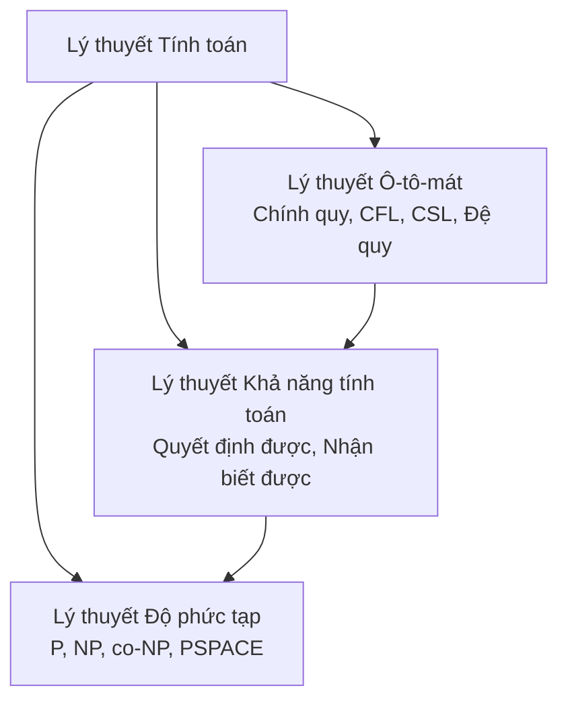
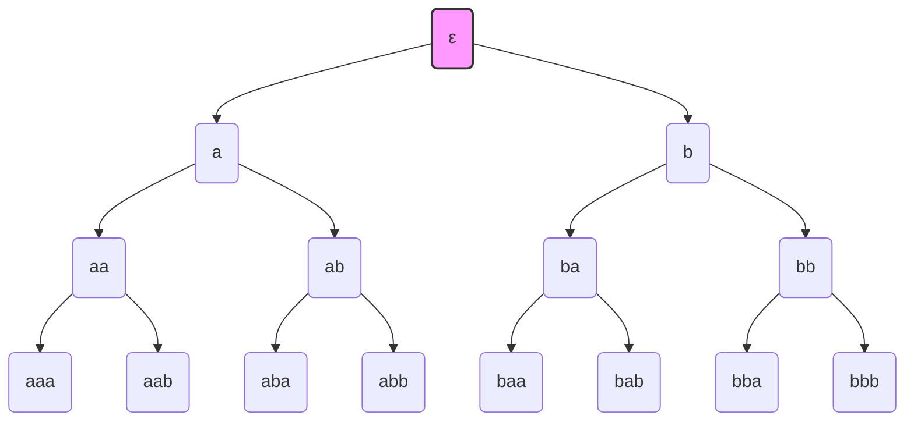
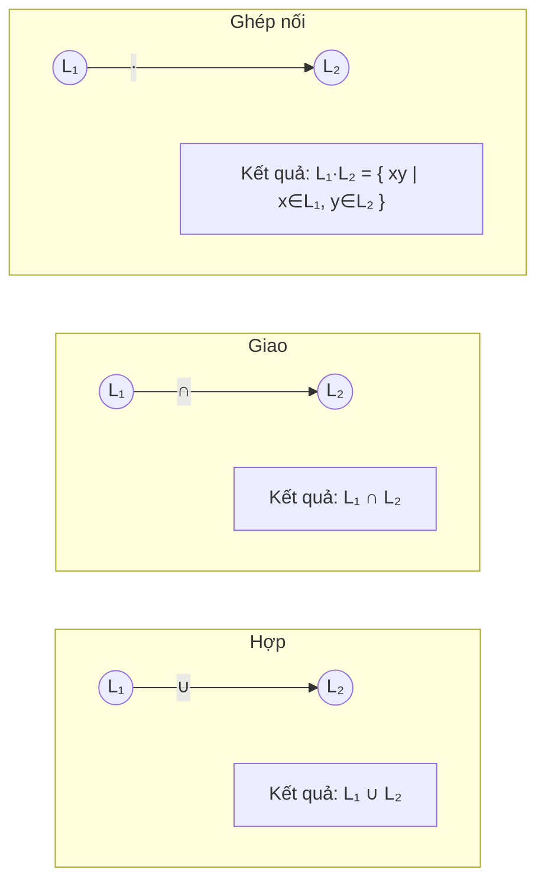
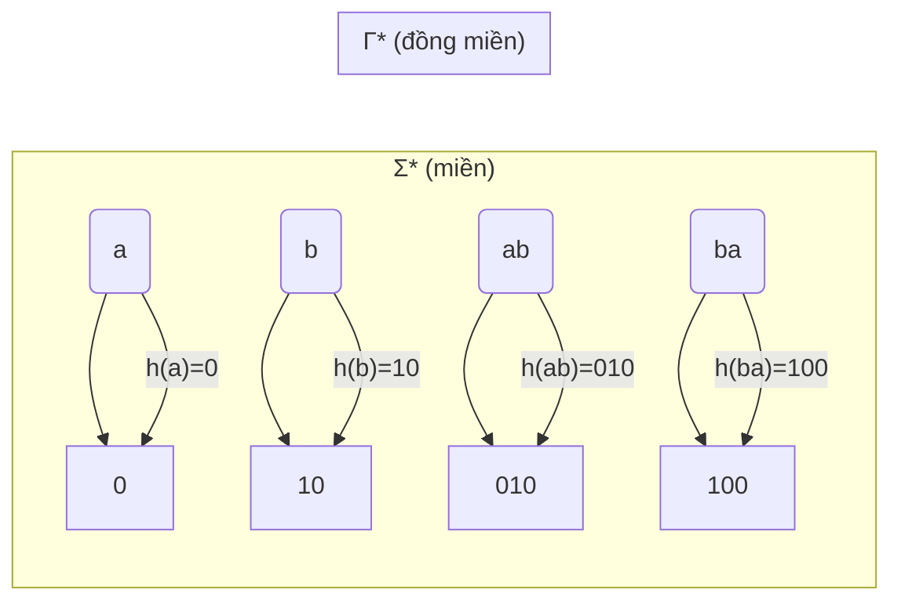

## Chương 1: Giới thiệu về Lý thuyết Tính toán

Chương này cung cấp cái nhìn tổng quan nền tảng về Lý thuyết Tính toán, các nhánh cốt lõi, động lực thực tiễn và các định nghĩa toán học thiết yếu. Tất cả các khái niệm đều được minh họa bằng ví dụ và sơ đồ phù hợp với đối tượng kỹ thuật.

---

## 1. Lý thuyết Tính toán là gì?

Lý thuyết Tính toán là một nhánh của khoa học máy tính nghiên cứu các khả năng và giới hạn cơ bản của máy tính. Nó tìm cách trả lời các câu hỏi như: Máy tính có thể giải quyết những bài toán nào? Chúng có thể được giải hiệu quả như thế nào? Có những bài toán vốn dĩ không thể giải quyết không?

Lĩnh vực này được chia thành ba nhánh lớn:

| Nhánh | Trọng tâm |
|------|-------|
| **Lý thuyết Ô-tô-mát** | Nghiên cứu các máy trừu tượng (ô-tô-mát) và các lớp ngôn ngữ mà chúng định nghĩa. Cung cấp nền tảng toán học cho phân tích từ vựng, phân tích cú pháp và so khớp mẫu. |
| **Lý thuyết Khả năng tính toán** | Điều tra những bài toán nào có thể giải quyết được bởi bất kỳ mô hình tính toán nào (ví dụ: Máy Turing). Xác định các bài toán không quyết định được (ví dụ: bài toán dừng). |
| **Lý thuyết Độ phức tạp** | Phân loại các bài toán dựa trên tài nguyên (thời gian, bộ nhớ) cần thiết để giải chúng. Định nghĩa các lớp như P, NP và PSPACE. |

Mối quan hệ giữa các nhánh có thể được hình dung như sau:

---

## 2. Động lực và Ứng dụng

Lý thuyết Tính toán không hoàn toàn trừu tượng; nó có tác động thực tiễn trực tiếp trên nhiều lĩnh vực.

### 2.1 Trình biên dịch
Lý thuyết ô-tô-mát tạo thành xương sống của phân tích từ vựng (scanning) và phân tích cú pháp. Biểu thức chính quy và ô-tô-mát hữu hạn được sử dụng để tách token mã nguồn. Ví dụ, bộ phân tích từ vựng của trình biên dịch C nhận biết các từ khóa (`if`, `while`), định danh, số và toán tử bằng ô-tô-mát hữu hạn đơn định (DFA).

### 2.2 Kiểm chứng phần mềm
Kiểm tra mô hình (model checking), kỹ thuật kiểm chứng rằng một hệ thống thỏa mãn các tính chất đã cho, phụ thuộc nặng nề vào lý thuyết ô-tô-mát. Các công thức logic thời gian được chuyển đổi thành ô-tô-mát (ví dụ: ô-tô-mát Büchi) và hành vi của hệ thống được kiểm tra đối chiếu với chúng. Điều này được sử dụng trong kiểm chứng phần cứng, giao thức mạng và hệ thống an toàn-tới-hạn.

### 2.3 Trí tuệ nhân tạo
Ô-tô-mát hữu hạn được sử dụng trong xử lý ngôn ngữ tự nhiên để phân tích hình thái học và trong AI game cho các hành vi dựa trên trạng thái. Ngôn ngữ chính quy và bộ chuyển đổi trạng thái hữu hạn được sử dụng trong nhận dạng giọng nói và hệ thống chuyển văn bản thành giọng nói.

### 2.4 Mật mã học
Lý thuyết độ phức tạp cung cấp nền tảng bảo mật cho mật mã học hiện đại. Giả định rằng một số bài toán nhất định (ví dụ: phân tích nhân tử nguyên, logarit rời rạc) không thể giải trong thời gian đa thức làm nền tảng cho các giao thức như RSA và Diffie–Hellman. Hàm một chiều và bằng chứng không tiết lộ thông tin (zero-knowledge proofs) cũng được đặt nền tảng trên các lớp độ phức tạp.

---

## 3. Bảng chữ cái, Chuỗi và Ngôn ngữ – Định nghĩa cơ bản

### 3.1 Bảng chữ cái (Alphabet)
Một **bảng chữ cái** là một tập hữu hạn, không rỗng các ký hiệu. Nó thường được ký hiệu bởi Σ (sigma).

**Ví dụ:**  
Σ = {0, 1}  (bảng chữ cái nhị phân)  
Σ = {a, b, c, …, z}  (chữ cái thường)

### 3.2 Chuỗi (String)
Một **chuỗi** (hay **từ**) là một dãy hữu hạn các ký hiệu lấy từ bảng chữ cái. Độ dài của chuỗi w, ký hiệu |w|, là số ký hiệu mà nó chứa. Chuỗi duy nhất có độ dài bằng không được gọi là **chuỗi rỗng** và được ký hiệu ε (epsilon).

**Ví dụ:**  
Với Σ = {0,1}: các chuỗi bao gồm ε, 0, 1, 00, 01, 10, 11, 000, …

### 3.3 Ngôn ngữ (Language)
Một **ngôn ngữ** (trên bảng chữ cái Σ) là bất kỳ tập hợp nào các chuỗi được tạo từ Σ. Ngôn ngữ có thể hữu hạn hoặc vô hạn. Tập hợp tất cả các chuỗi có thể có trên Σ (bao gồm ε) được ký hiệu Σ*.

**Ví dụ:**  
Σ = {a, b}  
L₁ = {ε, a, b}  (hữu hạn)  
L₂ = { w ∈ Σ* : w có số lượng a chẵn }  (vô hạn)  
L₃ = { aⁿ bⁿ : n ≥ 0 } = {ε, ab, aabb, aaabbb, …}

Biểu diễn trực quan của Σ* dưới dạng cây (tất cả các chuỗi có độ dài 0,1,2,…) thường hữu ích:

*Lưu ý: Cây tiếp tục vô hạn; chỉ hiển thị ba cấp đầu tiên.*

---

## 4. Các phép toán trên Chuỗi

Chuỗi hỗ trợ một số phép toán cơ bản.

### 4.1 Ghép nối (Concatenation)
Nếu x và y là các chuỗi, **ghép nối** của chúng xy là chuỗi được tạo bằng cách viết x theo sau là y. Chính thức, nếu x = a₁a₂…aₘ và y = b₁b₂…bₙ, thì xy = a₁a₂…aₘb₁b₂…bₙ. Chuỗi rỗng ε là phần tử đơn vị: εx = xε = x.

**Ví dụ:**  
x = "hello", y = "world" → xy = "helloworld"

### 4.2 Đảo ngược (Reversal)
**Đảo ngược** của chuỗi w, ký hiệu wᴿ, là w được viết ngược lại. Nếu w = a₁a₂…aₙ, thì wᴿ = aₙ…a₂a₁.

**Ví dụ:**  
w = "abc" → wᴿ = "cba"  
εᴿ = ε

### 4.3 Chuỗi con (Substring)
Một **chuỗi con** của w là bất kỳ khối ký hiệu liên tiếp nào xuất hiện trong w. Chính thức hơn, v là chuỗi con của w nếu tồn tại các chuỗi x và y sao cho w = xvy.

**Ví dụ:**  
w = "abcdef"  
Các chuỗi con bao gồm "abc", "cde", "f", ε và toàn bộ chuỗi. "ace" **không phải** chuỗi con (không liên tiếp).

### 4.4 Độ dài (Length)
**Độ dài** |w| của chuỗi w là số ký hiệu trong w.

**Tính chất:**  
|x y| = |x| + |y|  
|wᴿ| = |w|  
ε có độ dài 0.

| Phép toán | Ký hiệu | Ví dụ (w₁ = "ab", w₂ = "cd") |
|-----------|----------|--------------------------------|
| Ghép nối | w₁ w₂ | "abcd" |
| Đảo ngược | wᴿ | "ba" |
| Chuỗi con | v ⊑ w | "bc" ⊑ "abcd" |
| Độ dài | \|w\| | \|"ab"\| = 2 |

---

## 5. Các phép toán trên Ngôn ngữ

Vì ngôn ngữ là tập hợp các chuỗi, các phép toán tập hợp áp dụng trực tiếp. Các phép toán bổ sung đặc thù cho tập hợp chuỗi.

Cho L, L₁, L₂ là các ngôn ngữ trên bảng chữ cái Σ.

### 5.1 Hợp (Union)
L₁ ∪ L₂ = { w : w ∈ L₁ hoặc w ∈ L₂ }

**Ví dụ:**  
L₁ = {ε, a}, L₂ = {a, b} → L₁ ∪ L₂ = {ε, a, b}

### 5.2 Giao (Intersection)
L₁ ∩ L₂ = { w : w ∈ L₁ và w ∈ L₂ }

**Ví dụ:**  
L₁ = {ε, a}, L₂ = {a, b} → L₁ ∩ L₂ = {a}

### 5.3 Ghép nối (Concatenation)
L₁ L₂ = { xy : x ∈ L₁, y ∈ L₂ }

**Ví dụ:**  
L₁ = {a, b}, L₂ = {c, d} → L₁ L₂ = {ac, ad, bc, bd}

### 5.4 Bù (Complement)
Bù của L (đối với Σ*) là L̅ = { w ∈ Σ* : w ∉ L }.

**Ví dụ:**  
Σ = {0,1}, L = { tất cả các chuỗi kết thúc bằng 0 }  
L̅ = { tất cả các chuỗi kết thúc bằng 1 } ∪ {ε} (nếu ε không thuộc L)

### 5.5 Bao đóng Kleene (Kleene Star)
L* = ⋃_{i=0}^{∞} Lⁱ, trong đó L⁰ = {ε} và Lⁱ = L L … L (i lần).  
L* chứa tất cả các ghép nối của không hoặc nhiều chuỗi từ L.

**Ví dụ:**  
L = {a} → L* = {ε, a, aa, aaa, …} = a* (ký hiệu biểu thức chính quy)

### 5.6 Bao đóng dương (Positive Closure)
L⁺ = ⋃_{i=1}^{∞} Lⁱ = L L* (giống bao đóng Kleene nhưng không có ε trừ khi ε ∈ L).

**Ví dụ:**  
L = {a} → L⁺ = {a, aa, aaa, …} (không có ε)

### Sơ đồ: Các phép toán Ngôn ngữ (kiểu Venn)

*Lưu ý: Ghép nối không phải là giao tập hợp – sơ đồ minh họa phép toán một cách ký hiệu.*

### Bảng các phép toán Ngôn ngữ

| Phép toán | Ký hiệu | Định nghĩa | Ví dụ (Σ={a,b}) |
|-----------|--------|-------------|-------------------|
| Hợp | ∪ | {w : w∈L₁ ∨ w∈L₂} | L₁={a}, L₂={b} → {a,b} |
| Giao | ∩ | {w : w∈L₁ ∧ w∈L₂} | L₁={a,b}, L₂={a} → {a} |
| Ghép nối | · hoặc không có | {xy : x∈L₁, y∈L₂} | {a}·{b} = {ab} |
| Bù | ̅  hoặc ^c | Σ* \\ L | Σ={a}, L={a} → {ε} |
| Bao đóng Kleene | * | ⋃_{i≥0} Lⁱ | {a}* = {ε,a,aa,…} |
| Bao đóng dương | + | ⋃_{i≥1} Lⁱ | {a}+ = {a,aa,aaa,…} |

---

## 6. Đồng cấu và Đồng cấu ngược

### 6.1 Đồng cấu (Homomorphism)
Một **đồng cấu** (trên chuỗi) là hàm h : Σ* → Γ* (trong đó Σ, Γ là các bảng chữ cái) sao cho với mọi chuỗi x, y ∈ Σ*:
h(xy) = h(x) h(y)
và h(ε) = ε.  
Một đồng cấu được xác định duy nhất bởi ánh xạ của nó trên mỗi ký hiệu của Σ.

**Ví dụ:**  
Cho Σ = {a, b}, Γ = {0,1}. Định nghĩa h(a) = 0, h(b) = 10. Khi đó  
h(ab) = h(a)h(b) = 0 10 = "010".  
h(ba) = h(b)h(a) = 10 0 = "100".  
h(aab) = h(a)h(a)h(b) = 0 0 10 = "0010".

Với ngôn ngữ L ⊆ Σ*, **ảnh đồng cấu** là h(L) = { h(w) : w ∈ L }.

### 6.2 Đồng cấu ngược (Inverse Homomorphism)
Với đồng cấu h : Σ* → Γ*, **đồng cấu ngược** h⁻¹ : Γ* → 2^(Σ*) được định nghĩa bởi:
h⁻¹(v) = { w ∈ Σ* : h(w) = v }.

Tức là, h⁻¹ ánh xạ chuỗi v trên Γ tới tập hợp tất cả các chuỗi trên Σ mà ánh xạ tới v dưới h.

**Ví dụ:**  
Sử dụng cùng h (h(a)=0, h(b)=10).  
h⁻¹(0) = { a } vì h(a)=0, và không có chuỗi nào khác ánh xạ tới 0 (h(b)=10, h(aa)=00, v.v.).  
h⁻¹(10) = { b }? Thực tế h(b)=10, nhưng cũng xem xét h(?) = 10? h(aa)=00, không. Vậy chỉ có b.  
h⁻¹(010) = { ab } vì h(ab)=010. Có thể có chuỗi nào khác? h(aab)=0010, không. Vậy {ab}.

Với ngôn ngữ M ⊆ Γ*, **ảnh đồng cấu ngược** là h⁻¹(M) = { w ∈ Σ* : h(w) ∈ M }.

### Các tính chất quan trọng
- Nếu L là ngôn ngữ chính quy, thì h(L) là ngôn ngữ chính quy (ngôn ngữ chính quy đóng đối với đồng cấu).
- Nếu L là ngôn ngữ chính quy, thì h⁻¹(L) là ngôn ngữ chính quy (ngôn ngữ chính quy đóng đối với đồng cấu ngược).
- Đồng cấu bảo toàn phép ghép nối; đồng cấu ngược hữu ích cho việc đơn giản hóa các chứng minh về ngôn ngữ.

### Biểu diễn trực quan của Đồng cấu

---

## Tóm tắt

Chương này đã giới thiệu các khái niệm cốt lõi của Lý thuyết Tính toán:

- Ba trụ cột: Ô-tô-mát, Khả năng tính toán, Độ phức tạp.
- Các động lực thực tiễn trong trình biên dịch, kiểm chứng, AI và mật mã học.
- Các khối xây dựng cơ bản: bảng chữ cái, chuỗi, ngôn ngữ.
- Các phép toán trên chuỗi: ghép nối, đảo ngược, chuỗi con, độ dài.
- Các phép toán trên ngôn ngữ: hợp, giao, ghép nối, bù, bao đóng Kleene, bao đóng dương.
- Đồng cấu và đồng cấu ngược, với các tính chất đóng.

Các định nghĩa này tạo thành ngôn ngữ cần thiết để nghiên cứu ô-tô-mát hữu hạn, ô-tô-mát đẩy xuống, Máy Turing và các lớp độ phức tạp trong các chương tiếp theo.
