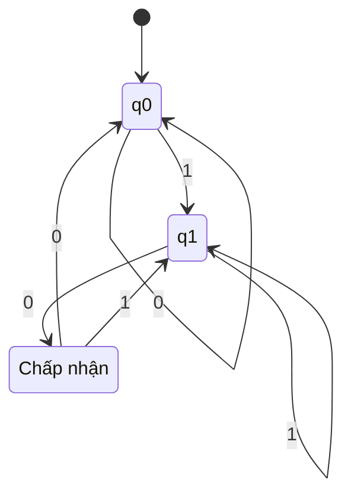
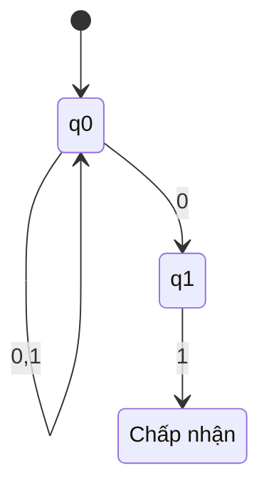
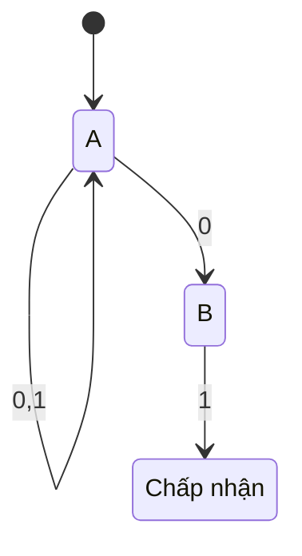
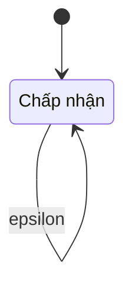
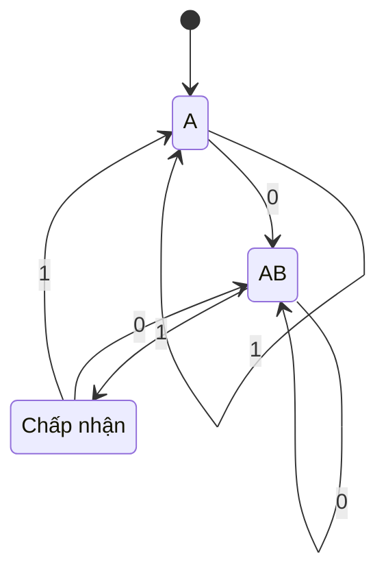
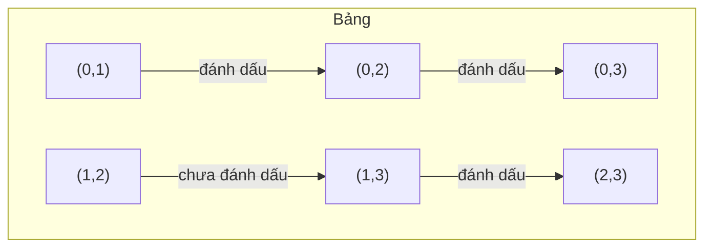
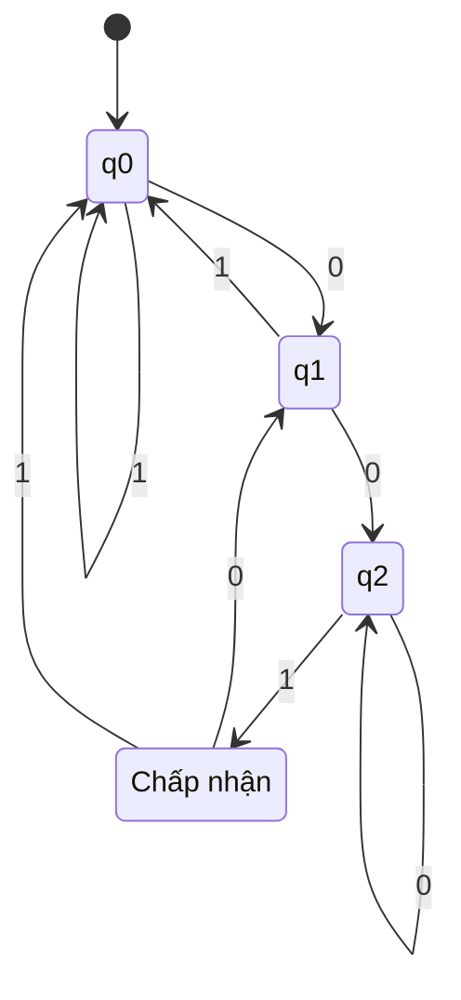
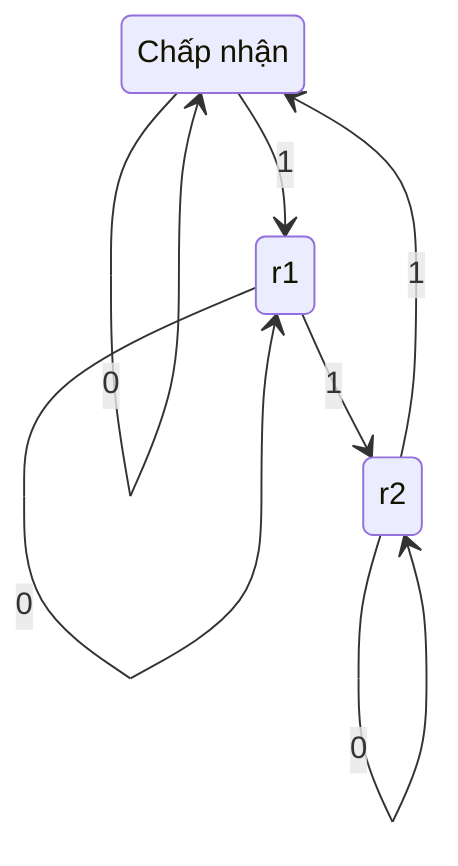

## Ô-tô-mát hữu hạn (Finite Automata)

Chương này giới thiệu lớp đơn giản nhất của các máy trừu tượng: ô-tô-mát hữu hạn. Đây là các mô hình tính toán với bộ nhớ hữu hạn, được sử dụng để nhận biết ngôn ngữ chính quy. Chúng ta sẽ đề cập đến các biến thể đơn định (DFA), không đơn định (NFA) và epsilon-NFA, tính tương đương của chúng, các thuật toán chuyển đổi, thu gọn và các chiến lược thiết kế thực tiễn.

---

## 2.1 Ô-tô-mát hữu hạn đơn định (DFA – Deterministic Finite Automata)

DFA là một máy đơn giản đọc chuỗi đầu vào từ trái sang phải, thay đổi trạng thái nội bộ theo một hàm chuyển trạng thái cố định. Tại bất kỳ thời điểm nào, trạng thái tiếp theo được xác định duy nhất bởi trạng thái hiện tại và ký hiệu đầu vào.

### 2.1.1 Định nghĩa hình thức (Bộ 5 thành phần)

DFA là một bộ 5 thành phần `M = (Q, Σ, δ, q0, F)` trong đó:

- `Q` - một tập hữu hạn các **trạng thái**
- `Σ` - một **bảng chữ cái** hữu hạn các ký hiệu đầu vào
- `δ: Q x Σ -> Q` - **hàm chuyển trạng thái** (đơn định)
- `q0 in Q` - **trạng thái bắt đầu**
- `F ⊆ Q` - tập các **trạng thái chấp nhận (kết thúc)**

### 2.1.2 Hàm chuyển trạng thái và Sơ đồ trạng thái

Hàm chuyển trạng thái `δ(q, a)` cho biết sẽ chuyển đến trạng thái nào khi đọc ký hiệu `a` trong khi đang ở trạng thái `q`. Nó có thể được biểu diễn dưới dạng **sơ đồ trạng thái** (một đồ thị có hướng) hoặc **bảng chuyển trạng thái**.

**Ví dụ:** DFA chấp nhận tất cả các chuỗi nhị phân kết thúc bằng `01`.

- `Q = {q0, q1, q2}`
- `Σ = {0,1}`
- `q0` là trạng thái bắt đầu
- `F = {q2}`
- Hàm chuyển trạng thái:

| Trạng thái | Đầu vào 0 | Đầu vào 1 |
|-------|---------|---------| 
| q_0 | q_0 | q_1 |
| q_1 | q_2 | q_1 |
| q_2 | q_0 | q_1 |

**Sơ đồ trạng thái Mermaid:**



### 2.1.3 Ngôn ngữ được chấp nhận bởi DFA

Hàm chuyển trạng thái mở rộng `δ_hat: Q x Σ* -> Q` được định nghĩa đệ quy:

- `δ_hat(q, epsilon) = q`
- `δ_hat(q, wa) = δ(δ_hat(q, w), a)` với `w in Σ*` và `a in Σ`

DFA `M` **chấp nhận** chuỗi `w` nếu `δ_hat(q0, w) in F`. **Ngôn ngữ được nhận biết** bởi `M` là:

`L(M) = { w in Σ* | δ_hat(q0, w) in F }`

---

## 2.2 Ô-tô-mát hữu hạn không đơn định (NFA – Non-Deterministic Finite Automata)

NFA nới lỏng yêu cầu đơn định: từ một trạng thái cho trước với một ký hiệu cho trước, có thể có **không, một hoặc nhiều** trạng thái tiếp theo. NFA chấp nhận chuỗi nếu **có** một chuỗi lựa chọn dẫn đến trạng thái chấp nhận.

### 2.2.1 Định nghĩa

NFA là một bộ 5 thành phần `M = (Q, Σ, δ, q0, F)` trong đó:

- `Q, Σ, q0, F` như trong DFA
- `δ: Q x Σ -> 2^Q` (tập lũy thừa của `Q`)

Hàm chuyển trạng thái trả về một **tập** các trạng thái tiếp theo có thể có.

### 2.2.2 Tại sao tính không đơn định hữu ích

- **Ngắn gọn**: Nhiều ngôn ngữ có mô tả NFA nhỏ hơn nhiều so với DFA.
- **Thiết kế mô-đun**: NFA có thể được xây dựng bằng hợp, ghép nối, bao đóng Kleene trực tiếp từ biểu thức chính quy.
- **Mô phỏng tính song song**: NFA có thể được xem là khám phá tất cả các đường đi có thể đồng thời.

**Ví dụ:** NFA cho các chuỗi kết thúc bằng `01` (cùng ngôn ngữ với DFA trước). Nó chỉ sử dụng hai trạng thái:



Cẩn thận: Biểu diễn trên thực sự giống DFA hơn. NFA đúng đắn cho `(0+1)*01` có thể là:



Ở đây, từ `A` khi đọc `0`, ta đến cả `A` và `B` (tính không đơn định). Khi đọc `1` từ `A`, chỉ đến `A`.

### 2.2.3 epsilon-NFA và epsilon-bao đóng

Một **epsilon-NFA** cho phép các chuyển trạng thái trên chuỗi rỗng epsilon, nghĩa là máy có thể thay đổi trạng thái mà không tiêu thụ bất kỳ ký hiệu đầu vào nào.

**Định nghĩa hình thức:** `δ: Q x (Σ U {epsilon}) -> 2^Q`.

**epsilon-bao đóng** của một tập trạng thái `S` là tập tất cả các trạng thái có thể đến từ `S` bằng cách đi theo không hoặc nhiều chuyển trạng thái epsilon. Ký hiệu `ECLOSE(S)`.

**Ví dụ epsilon-NFA:** Chấp nhận các chuỗi trên `{a,b}` trong đó số lượng `a` là chẵn (có thể được xây dựng với các chuyển epsilon để mô hình hóa tính chẵn lẻ). Phổ biến hơn: epsilon-NFA cho biểu thức chính quy `a*`:



Nhưng các chuyển epsilon thường được sử dụng để kết nối các ô-tô-mát nhỏ hơn.

**Thuật toán tính epsilon-bao đóng:**
```
ECLOSE(S):
    closure = S
    stack = S (dưới dạng danh sách)
    while stack không rỗng:
        lấy ra trạng thái p
        for each q in δ(p, epsilon):
            if q không thuộc closure:
                thêm q vào closure
                đẩy q vào stack
    return closure
```

---

## 2.3 Tính tương đương của DFA, NFA và epsilon-NFA

Cả ba mô hình đều nhận biết đúng cùng một lớp ngôn ngữ: **ngôn ngữ chính quy**.

- Mọi DFA đều hiển nhiên là NFA (bằng cách xem δ(q,a) là một tập đơn).
- Mọi NFA đều có thể được chuyển đổi sang DFA tương đương (xây dựng tập con – Mục 2.4).
- Mọi epsilon-NFA đều có thể được chuyển đổi sang NFA tương đương (bằng cách loại bỏ các chuyển epsilon qua epsilon-bao đóng) và sau đó sang DFA.

**Phác thảo chứng minh (epsilon-NFA -> NFA):**  
Cho epsilon-NFA `E = (Q_E, Σ, δ_E, q0, F_E)`, xây dựng NFA `N = (Q_E, Σ, δ_N, q0, F_N)` trong đó:

- `δ_N(q, a) = ECLOSE(U over p in δ_E(q, a) of ECLOSE(p))` với `a in Σ`
- `F_N = { q | ECLOSE(q) giao F_E != rỗng }`

NFA này chấp nhận cùng ngôn ngữ mà không có các chuyển epsilon.

**Định lý tương đương:** Với bất kỳ epsilon-NFA nào, tồn tại một DFA nhận biết cùng ngôn ngữ, và ngược lại.

---

## 2.4 Chuyển đổi NFA sang DFA (Xây dựng tập con)

**Xây dựng tập con** (còn gọi là xây dựng tập lũy thừa) chuyển đổi NFA `N = (Q_N, Σ, δ_N, q0, F_N)` thành DFA `D = (Q_D, Σ, δ_D, qD0, F_D)` trong đó:

- Mỗi trạng thái trong `Q_D` là một **tập trạng thái** của `N`
- `Q_D ⊆ 2^(Q_N)` (chỉ các tập con có thể đạt tới)
- Trạng thái bắt đầu: `qD0 = {q0}` (hoặc epsilon-bao đóng với epsilon-NFA)
- Với trạng thái `S ⊆ Q_N` và ký hiệu `a in Σ`:
    `δ_D(S, a) = U over p in S of δ_N(p, a)`
- `F_D = { S ⊆ Q_N | S giao F_N != rỗng }`

**Thuật toán (chỉ các tập con có thể đạt tới):**
```
Khởi tạo hàng đợi với {q0}
Khởi tạo Q_D = {{q0}}
while hàng đợi không rỗng:
    S = dequeue()
    for each a in Σ:
        T = hợp của p in S của δ_N(p,a)
        if T không thuộc Q_D:
            thêm T vào Q_D
            enqueue T
        δ_D(S,a) = T
```

**Ví dụ:** Chuyển đổi NFA cho `(0+1)*01` (các trạng thái A, B, C, trong đó A bắt đầu, C chấp nhận, δ(A,0)={A,B}, δ(A,1)={A}, δ(B,1)={C}) sang DFA.

Các tập con có thể đạt tới:
- {A} (bắt đầu)
  - khi đọc 0: {A,B}
  - khi đọc 1: {A}
- {A,B}
  - khi đọc 0: δ(A,0) U δ(B,0) = {A,B} U {} = {A,B}
  - khi đọc 1: δ(A,1) U δ(B,1) = {A} U {C} = {A,C}
- {A,C}
  - khi đọc 0: {A,B} U {} = {A,B}
  - khi đọc 1: {A} U {} = {A}
- Không có tập mới.

Các tập con chấp nhận: những tập chứa C -> {A,C} là tập chấp nhận.

DFA kết quả có 3 trạng thái. Sơ đồ trạng thái:



---

## 2.5 Thu gọn DFA (DFA Minimization)

Cho một DFA, ta thường muốn **DFA tối thiểu** (với số trạng thái ít nhất) nhận biết cùng ngôn ngữ. Hai cách tiếp cận chính: thuật toán điền bảng (dựa trên Myhill-Nerode) và thuật toán Hopcroft (hiệu quả hơn).

### 2.5.1 Thuật toán điền bảng (Myhill-Nerode)

Thuật toán xác định các cặp trạng thái **phân biệt được** (tức là, tồn tại một chuỗi dẫn một trạng thái đến chấp nhận và trạng thái kia đến từ chối). Các trạng thái không phân biệt được có thể được hợp nhất.

**Các bước:**

1. **Cơ sở:** Đánh dấu tất cả các cặp `(p, q)` trong đó một trạng thái là kết thúc và trạng thái kia không.
2. **Bước quy nạp:** Với mỗi cặp chưa đánh dấu `(p, q)`, với mỗi ký hiệu `a` trong Σ, nếu `(δ(p,a), δ(q,a))` đã được đánh dấu, thì đánh dấu `(p, q)`.
3. Lặp lại cho đến khi không có đánh dấu mới nào xuất hiện.
4. Các cặp chưa đánh dấu là tương đương – hợp nhất chúng.

**Ví dụ:** Thu gọn DFA từ xây dựng tập con (các trạng thái A, AB, AC).

Ban đầu: tập kết thúc {AC} so với tập không kết thúc {A, AB}. Đánh dấu (A, AC) và (AB, AC).

Bây giờ kiểm tra (A, AB):
- Khi đọc 0: δ(A,0)=AB, δ(AB,0)=AB -> (AB,AB) không phải một cặp (cùng trạng thái) -> không đánh dấu.
- Khi đọc 1: δ(A,1)=A, δ(AB,1)=AC -> (A,AC) đã được đánh dấu -> vì vậy đánh dấu (A,AB).
Bây giờ tất cả các cặp liên quan đến A và AB đều được đánh dấu. Không còn cặp chưa đánh dấu nào. Vậy không thể hợp nhất – DFA đã tối thiểu.

**Biểu diễn Mermaid của bảng đánh dấu** (cho DFA khác với các trạng thái 0,1,2,3):



### 2.5.2 Thuật toán Hopcroft

Thuật toán Hopcroft phân hoạch các trạng thái bằng kỹ thuật **tách**. Nó chạy trong thời gian `O(n log n)` (với cài đặt cẩn thận) so với `O(n^2)` cho thuật toán điền bảng.

**Ý tưởng:** Bắt đầu với hai nhóm: kết thúc và không kết thúc. Liên tục chọn một nhóm và một ký hiệu để tách các nhóm hoạt động khác nhau trên ký hiệu đó.

Mã giả (đơn giản hóa):
```
P = {F, Q \ F}
Danh sách công việc = {F, Q \ F} (nếu không rỗng)
while Danh sách công việc không rỗng:
    lấy nhóm G từ Danh sách công việc
    for each a in Σ:
        for each nhóm H trong P:
            tách = { q in H | δ(q,a) in G }
            if tách không rỗng và tách != H:
                thay H bằng tách và H\tách trong P
                thêm tách và H\tách vào Danh sách công việc
```

### 2.5.3 Định lý Myhill-Nerode

Định lý Myhill-Nerode cung cấp đặc trưng lý thuyết về các trạng thái DFA tối thiểu. Nó phát biểu rằng ngôn ngữ `L` là chính quy khi và chỉ khi quan hệ tương đương `equiv_L` trên các chuỗi (hai chuỗi tương đương khi với mọi hậu tố `z`, `xz in L <=> yz in L`) có một số hữu hạn các lớp tương đương. Số lượng lớp bằng số trạng thái trong DFA tối thiểu của `L`.

Định lý này là nền tảng của việc thu gọn DFA.

---

## 2.6 Thiết kế Ô-tô-mát hữu hạn cho các Ngôn ngữ cho trước

Thiết kế DFA hoặc NFA từ mô tả ngôn ngữ đòi hỏi lý luận có hệ thống. Dưới đây là các mẫu phổ biến.

### 2.6.1 Chuỗi kết thúc bằng một mẫu cụ thể

Ngôn ngữ: `{ w in {0,1}* | w kết thúc bằng 001 }`

Cách tiếp cận thiết kế: Xây dựng một "bộ phát hiện hậu tố" sử dụng các trạng thái ghi nhớ hậu tố dài nhất khớp với tiền tố của mục tiêu.

**Các trạng thái DFA:** q0 (epsilon), q1 (0), q2 (00), q3 (001 – chấp nhận). Các chuyển trạng thái trên 0/1 mở rộng khớp hoặc quay lại tiền tố phù hợp.



### 2.6.2 Chuỗi chứa một chuỗi con

Ngôn ngữ: `{ w in {a,b}* | w chứa "ab" }`

**NFA (dễ dàng):** các trạng thái A (chưa có 'ab'), B (đã thấy 'a'), C (đã thấy 'ab' – chấp nhận). Các chuyển trạng thái: A khi a -> A và B, A khi b -> A; B khi b -> C; B khi a -> B; C khi a,b -> C.

**DFA:** Có thể được rút ra qua xây dựng tập con, nhưng thiết kế trực tiếp: các trạng thái: q0 (không có 'a' đang chờ, không có 'ab'), q1 (ký tự cuối là 'a' nhưng chưa có 'ab'), q2 ('ab' đã được thấy – chấp nhận hấp thụ).

### 2.6.3 Chuỗi với điều kiện modulo

Ngôn ngữ: `{ w in {0,1}* | số lượng 1 mod 3 = 0 }`

DFA với 3 trạng thái (số dư 0,1,2). Trạng thái bắt đầu là số dư 0 (chấp nhận). Chuyển trạng thái: khi đọc 1, số dư = (r+1) mod 3; khi đọc 0, số dư không đổi.



### 2.6.4 Chuỗi có số lượng chuỗi con `01` và `10` bằng nhau

Đây là tính chất "độ dài đoạn chạy" cổ điển. Sự khác biệt giữa số lượng `01` và `10` được xác định bởi ký hiệu đầu tiên và cuối cùng. DFA tối thiểu có 4 trạng thái theo dõi ký hiệu đầu tiên (nếu có) và ký hiệu cuối cùng.

---

## Tóm tắt

| Mô hình | Chuyển trạng thái | Tính đơn định | Chuyển epsilon | Năng lực |
|-------|-----------|-------------|---------|-------|
| DFA | δ: QxΣ -> Q | Có | Không | Ngôn ngữ chính quy |
| NFA | δ: QxΣ -> 2^Q | Không | Không | Ngôn ngữ chính quy |
| epsilon-NFA | δ: Qx(Σ U {epsilon})->2^Q | Không | Có | Ngôn ngữ chính quy |

Các điểm chính:
- DFA, NFA, epsilon-NFA **có năng lực biểu diễn ngang nhau**.
- Xây dựng tập con chuyển đổi NFA/epsilon-NFA sang DFA (bùng nổ theo hàm mũ trong trường hợp xấu nhất).
- Thu gọn DFA cho một DFA tối thiểu duy nhất (đồng cấu).
- Định lý Myhill-Nerode cho cơ sở lý thuyết của việc thu gọn.
