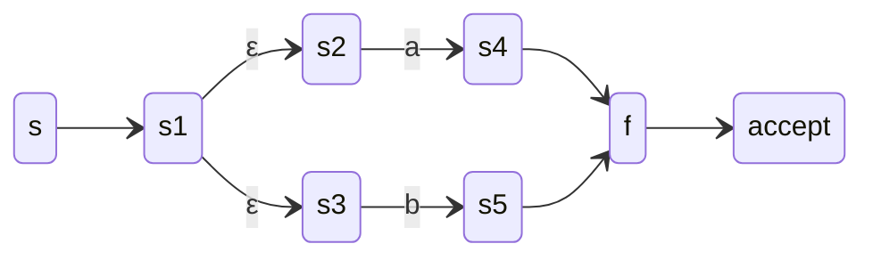
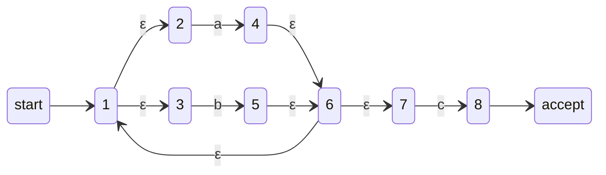
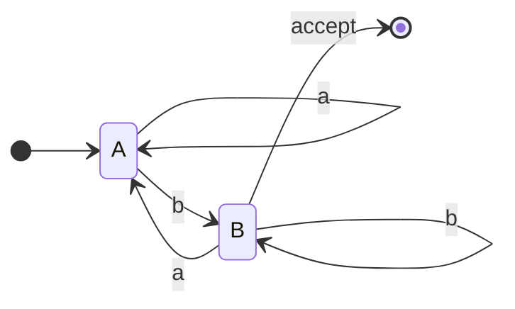
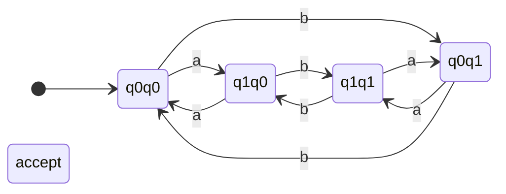

# Chương 3: Ngôn ngữ chính quy và Biểu thức chính quy

Chương này đề cập đến các khái niệm cơ bản về ngôn ngữ chính quy, biểu diễn của chúng bằng biểu thức chính quy, các phép chuyển đổi giữa biểu thức chính quy và ô-tô-mát hữu hạn, tính chất đóng và các thuật toán quyết định.

---

## 1. Ngôn ngữ chính quy và Tính chất của chúng

Một **ngôn ngữ chính quy** là ngôn ngữ có thể được nhận biết bởi ô-tô-mát hữu hạn (DFA hoặc NFA), hoặc tương đương, được mô tả bởi một biểu thức chính quy. Ngôn ngữ chính quy đóng đối với nhiều phép toán, nghĩa là áp dụng các phép toán này cho ngôn ngữ chính quy cho ta một ngôn ngữ chính quy khác.

### Các tính chất chính:
- **Đóng đối với**: hợp, giao, bù, ghép nối, bao đóng Kleene, đảo ngược, đồng cấu, và nhiều hơn nữa.
- **Tính quyết định**: tính rỗng, tính hữu hạn, thuộc tư cách thành viên, tính tương đương đều quyết định được.

---

## 2. Biểu thức chính quy: Cú pháp và Ngữ nghĩa

Biểu thức chính quy (regex) là ký hiệu đại số để mô tả ngôn ngữ chính quy. Nó sử dụng các hằng số và toán tử.

### Cú pháp (Định nghĩa hình thức):
Cho Σ là bảng chữ cái. Biểu thức chính quy R trên Σ được định nghĩa đệ quy:

- **ε** (chuỗi rỗng) là biểu thức chính quy.
- **∅** (ngôn ngữ rỗng) là biểu thức chính quy.
- **a** với mỗi a ∈ Σ là biểu thức chính quy.
- Nếu R₁ và R₂ là biểu thức chính quy, thì:
    - **(R₁ | R₂)** – xen kẽ (hợp)
    - **(R₁ · R₂)** – ghép nối
    - **(R₁ \*)** – bao đóng Kleene (không hoặc nhiều lần lặp lại)
- Dấu ngoặc có thể bỏ với độ ưu tiên: \* > · > |

### Ngữ nghĩa (Ngôn ngữ được biểu thị):
Mỗi regex R biểu thị ngôn ngữ L(R) ⊆ Σ\*:

| Biểu thức | Ngôn ngữ |
|------------|----------|
| ε          | { ε } |
| ∅          | { } (tập rỗng) |
| a (∈ Σ)    | { a } |
| R₁ \| R₂   | L(R₁) ∪ L(R₂) |
| R₁·R₂      | { uv \| u ∈ L(R₁), v ∈ L(R₂) } |
| R\*        | { u₁u₂…uₖ \| k ≥ 0, mỗi uᵢ ∈ L(R) } |

### Ví dụ:
- `a|b` → {a, b}
- `(a|b)*` → tất cả các chuỗi trên {a,b}
- `a·b*` → các chuỗi bắt đầu bằng 'a' theo sau là không hoặc nhiều 'b' (ví dụ: a, ab, abb)
- `(0|1)*·0` → chuỗi nhị phân kết thúc bằng 0

---

## 3. Chuyển đổi Biểu thức chính quy sang Ô-tô-mát hữu hạn (Xây dựng Thompson)

Xây dựng Thompson xây dựng một **ε-NFA** (NFA với các chuyển ε) cho bất kỳ biểu thức chính quy nào. Mỗi thành phần regex được chuyển đổi thành một ε-NFA nhỏ, sau đó được kết hợp bằng các chuyển ε.

### Các trường hợp cơ sở:
- **ε**:  
  ```mermaid
  stateDiagram-v2
      direction LR
      start --> q0
      q0 --> q1 : ε
      q1 --> accept
  ```
- **a** (ký hiệu đơn):  
  ```mermaid
  stateDiagram-v2
      direction LR
      start --> q0
      q0 --> q1 : a
      q1 --> accept
  ```
- **∅** (không có đường đến trạng thái chấp nhận): một trạng thái đơn không có chuyển trạng thái.

### Các bước quy nạp (cho R₁ | R₂, R₁·R₂, R₁\*):
Cho các NFA của R₁ và R₂ với một trạng thái bắt đầu và chấp nhận duy nhất:

1. **Hợp (R₁ | R₂)** – thêm các trạng thái bắt đầu và chấp nhận mới với các chuyển ε đến/từ các NFA thành phần.
2. **Ghép nối (R₁·R₂)** – kết nối trạng thái chấp nhận của R₁ với trạng thái bắt đầu của R₂ qua ε.
3. **Bao đóng Kleene (R₁\*)** – thêm các chuyển ε từ trạng thái chấp nhận về đầu bắt đầu và từ trạng thái bắt đầu mới đến trạng thái chấp nhận mới.

#### Ví dụ: Xây dựng ε-NFA cho `(a|b)*c`

**Bước 1:** NFA cho `a|b` (hợp):


**Bước 2:** Bao đóng Kleene `(a|b)*` (thêm vòng lặp ε từ f về s).

**Bước 3:** Ghép nối với `c` (chỉ là chuyển trạng thái khi đọc c từ trạng thái chấp nhận của `(a|b)*` đến một trạng thái chấp nhận mới).

**ε-NFA cuối cùng** (dạng đơn giản hóa):


Xây dựng Thompson đảm bảo số trạng thái là O(|regex|) và mỗi bước thêm tối đa 2 trạng thái.

---

## 4. Chuyển đổi Ô-tô-mát hữu hạn sang Biểu thức chính quy

Hai phương pháp tiêu chuẩn: **loại bỏ trạng thái** và **định lý Arden**.

### 4.1 Loại bỏ trạng thái
Dần dần loại bỏ các trạng thái (trừ bắt đầu và chấp nhận) trong khi thêm nhãn trên các cạnh biểu diễn biểu thức chính quy.
- Với mỗi trạng thái bị loại bỏ q, cập nhật các đường đi giữa các hàng xóm của nó p và r: nhãn mới = `R_pr | (R_pq · R_qq* · R_qr)`

**Ví dụ:** Chuyển đổi DFA này sang regex (ngôn ngữ: chuỗi kết thúc bằng 'b'):

**Loại bỏ B** (giữ A là bắt đầu và chấp nhận):  
Từ A đến A qua B: `A -> B (b) -> A (a)` → `b a` + vòng lặp trên B (b) → `b b* a` = `b+ a`.  
Từ A đến A ban đầu: `a`. Vòng lặp tự thân mới trên A: `a | b+ a`.  
Từ A đến chấp nhận (trước đây là B): đường đi `A -> B (b)` với vòng lặp trên B (b*) → `b b*` = `b+`.  
Vậy regex: `(a | b+ a)* b+` đơn giản hóa thành `(a | b a)* b+`.

### 4.2 Định lý Arden
Với phương trình dạng `X = A X | B`, trong đó A, B là regex và ε ∉ L(A), nghiệm duy nhất là `X = A* B`. Được sử dụng để giải hệ phương trình tuyến tính từ DFA.

**Ví dụ cho cùng DFA:**  
Cho A = ngôn ngữ từ bắt đầu đến A (chấp nhận). B = ngôn ngữ từ bắt đầu đến B (không chấp nhận). Phương trình:
- A = A·a | B·a | ε   (ε vì A là bắt đầu)
- B = A·b | B·b
Từ phương trình thứ hai: B = (A·b) | (B·b) → B = A·b · b* = A b b* = A b+  
Thay vào phương trình đầu: A = A a | (A b+) a | ε = A (a | b+ a) | ε. Theo Arden: A = (a | b+ a)*. Vì trạng thái chấp nhận là B? Thực ra, trong DFA gốc, trạng thái chấp nhận duy nhất là B. Vậy ngôn ngữ L = B = A b+ = (a | b+ a)* b+.

---

## 5. Tính chất đóng của Ngôn ngữ chính quy

Ngôn ngữ chính quy đóng đối với nhiều phép toán. Với mỗi phép toán, ta xây dựng một ô-tô-mát mới hoặc sử dụng các tương đương đã biết.

| Phép toán | Xây dựng / Chứng minh |
|-----------|----------------------|
| **Hợp** | Cho DFA M₁, M₂, xây dựng DFA tích với các trạng thái (q₁,q₂). Chấp nhận nếu một trong hai chấp nhận ban đầu. |
| **Giao** | Cùng tích, nhưng chấp nhận nếu cả hai chấp nhận. |
| **Bù** | Với DFA, đổi chỗ các trạng thái chấp nhận/không chấp nhận (yêu cầu DFA đầy đủ). |
| **Ghép nối** | Kết nối các trạng thái chấp nhận của M₁ với bắt đầu của M₂ qua ε (NFA) hoặc dùng regex. |
| **Bao đóng Kleene** | Thêm vòng lặp ε từ chấp nhận về bắt đầu trong NFA. |
| **Đảo ngược** | Đảo ngược tất cả các cạnh, đổi chỗ bắt đầu và chấp nhận (NFA → DFA). |
| **Đồng cấu** | Áp dụng thay thế chuỗi cho mỗi ký hiệu và chạy ô-tô-mát. |

### Ví dụ: Hợp qua xây dựng tích
Cho L₁ = các chuỗi kết thúc bằng 'a', L₂ = các chuỗi có số lượng 'b' chẵn. DFA hợp của chúng:

Ở đây trạng thái `xy` có nghĩa: x = ký tự cuối là 'a'? (q0=không, q1=có), y = tính chẵn lẻ của b (q0=chẵn, q1=lẻ). Chấp nhận nếu x=1 (kết thúc bằng a) HOẶC y=0 (số 'b' chẵn).

---

## 6. Tính chất quyết định

Tất cả các tính chất quyết định cho ngôn ngữ chính quy đều quyết định được (có thể giải theo thuật toán). Cho các biểu diễn (DFA, NFA, regex, ε-NFA).

### 6.1 Tính rỗng (L = ∅?)
- **Thuật toán**: Từ trạng thái bắt đầu, thực hiện BFS/DFS tìm bất kỳ trạng thái chấp nhận nào. Nếu có thể đến → không rỗng.
- **Ví dụ**: DFA không có đường đến trạng thái chấp nhận → rỗng.

### 6.2 Tính hữu hạn (L hữu hạn hay vô hạn?)
- **Thuật toán**:
    1. Loại bỏ tất cả các trạng thái không thể đến từ bắt đầu.
    2. Loại bỏ tất cả các trạng thái không thể đến trạng thái chấp nhận.
    3. Nếu đồ thị còn lại có vòng lặp, ngôn ngữ là vô hạn; nếu không thì hữu hạn.
- **Ví dụ**: DFA có vòng lặp trên a → vô hạn (chứa a*).

### 6.3 Thuộc tư cách thành viên (w ∈ L?)
- **Thuật toán**: Mô phỏng ô-tô-mát (DFA) trên w. Nếu kết thúc ở trạng thái chấp nhận → có. Với NFA, chuyển đổi sang DFA hoặc mô phỏng tất cả các đường đi.
- **Thời gian**: O(|w|) với DFA.

### 6.4 Tính tương đương (L₁ = L₂?)
- **Thuật toán**: Xây dựng sai phân đối xứng: (L₁ ∩ bù(L₂)) ∪ (bù(L₁) ∩ L₂). Kiểm tra xem có rỗng không.
- Ngoài ra, thu gọn cả hai DFA và so sánh dạng chuẩn.
- **Ví dụ**: `(a|b)*` và `(a*b*)*` là tương đương.

### Bảng tóm tắt các thủ tục quyết định

| Tính chất | Đầu vào | Độ phức tạp |
|----------|-------|-------------|
| Tính rỗng | DFA | O(n²) (khả năng đạt tới) |
| Tính hữu hạn | DFA | O(n²) (phát hiện vòng lặp) |
| Thuộc tư cách thành viên | DFA, từ w | O(\|w\|) |
| Tính tương đương | DFA | O(n log n) (thu gọn) |

---

## Kết luận

Ngôn ngữ chính quy tạo thành lớp đơn giản nhất trong phân cấp Chomsky. Tính tương đương của chúng với ô-tô-mát hữu hạn và biểu thức chính quy cung cấp các công cụ mạnh mẽ cho so khớp mẫu, phân tích từ vựng và kiểm chứng hình thức. Các tính chất đóng và quyết định cho phép xây dựng có hệ thống các bộ xử lý ngôn ngữ và chứng minh tính đúng đắn.

**Đọc thêm**:
- Chuyển đổi ε-NFA sang DFA (xây dựng tập con)
- Bổ đề bơm cho ngôn ngữ không chính quy
- Các quy luật đại số cho biểu thức chính quy
