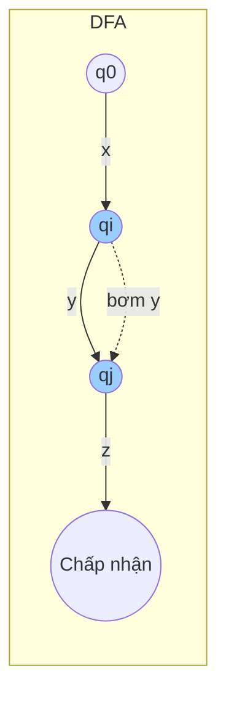
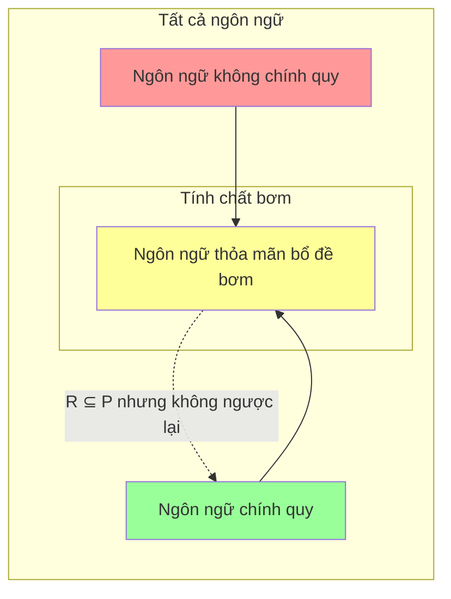

# Chương 4: Bổ đề bơm cho Ngôn ngữ chính quy

Bổ đề bơm (Pumping Lemma) là một công cụ mạnh mẽ được sử dụng để chứng minh rằng một số ngôn ngữ nhất định **không phải** là ngôn ngữ chính quy. Nó mô tả một tính chất mà mọi ngôn ngữ chính quy phải thỏa mãn. Nếu một ngôn ngữ vi phạm tính chất này, nó không thể là ngôn ngữ chính quy.

---

## 1. Phát biểu của Bổ đề bơm

Cho $L$ là một **ngôn ngữ chính quy**. Khi đó tồn tại một số nguyên $p \geq 1$ (gọi là **độ dài bơm**) sao cho **mọi** chuỗi $s \in L$ với $|s| \ge p$ đều có thể viết dưới dạng $s = xyz$, thỏa mãn:

1. $|y| \ge 1$ (phần được bơm không rỗng)
2. $|xy| \le p$ (p ký hiệu đầu tiên chứa phần bơm)
3. Với mọi $i \ge 0$, $xy^i z \in L$ (chuỗi có thể được "bơm" bất kỳ số lần nào)

> Trong bất kỳ chuỗi đủ dài nào của ngôn ngữ chính quy, đều có một chuỗi con không rỗng gần đầu có thể được lặp lại bất kỳ số lần nào (kể cả không lần), và các chuỗi kết quả vẫn thuộc ngôn ngữ.

---

## 2. Ý tưởng chứng minh Bổ đề bơm

Chứng minh dựa trên thực tế rằng ngôn ngữ chính quy được chấp nhận bởi **Ô-tô-mát hữu hạn đơn định (DFA)** với số trạng thái hữu hạn.

- Cho DFA có $p$ trạng thái.
- Xét chuỗi $s$ có độ dài $\ge p$.
- Khi DFA đọc $s$, nó trải qua một chuỗi trạng thái: $q_0 \to q_1 \to \cdots \to q_n$ trong đó $n = |s|$.
- Vì chỉ có $p$ trạng thái, theo nguyên lý hộp thư (pigeonhole principle), một trạng thái nào đó phải lặp lại trong $p+1$ bước đầu tiên.
- Cho $q_i = q_j$ là lần lặp đầu tiên ($i < j \le p$).
- Khi đó chuỗi con $y$ giữa $q_i$ và $q_j$ có thể được **bơm** – lặp lại bất kỳ số lần nào – và DFA vẫn sẽ kết thúc ở trạng thái chấp nhận (nếu chuỗi ban đầu được chấp nhận).

### DFA với một vòng bơm

- $x$ di chuyển từ bắt đầu $q_0$ đến lần xuất hiện đầu tiên của trạng thái lặp $q_i$.
- $y$ di chuyển từ $q_i$ đến $q_j$ (vòng lặp, có thể lặp lại).
- $z$ di chuyển từ $q_j$ đến trạng thái chấp nhận.

Vì $q_i = q_j$, ta có thể đi quanh vòng lặp $i$ lần, cho $xy^i z$ với bất kỳ $i \ge 0$.

---

## 3. Áp dụng Bổ đề bơm

Để chứng minh ngôn ngữ $L$ **không phải** chính quy, ta sử dụng **chứng minh bằng mâu thuẫn**:

1. **Giả sử** $L$ là chính quy. Khi đó bổ đề bơm thỏa mãn với một số độ dài bơm $p$.
2. **Chọn** một chuỗi $s \in L$ khéo léo với $|s| \ge p$ sẽ dẫn đến mâu thuẫn.
3. **Xét tất cả các cách** tách $s = xyz$ thỏa mãn $|y| \ge 1$ và $|xy| \le p$.
4. **Chứng minh** rằng với mỗi cách tách như vậy, tồn tại $i \ge 0$ sao cho $xy^i z \notin L$.
5. **Kết luận** rằng giả sử của ta là sai – $L$ không phải chính quy.

### Ví dụ: Chứng minh $L = \{ 0^n 1^n \mid n \ge 0 \}$ không phải chính quy

- Giả sử $L$ là chính quy với độ dài bơm $p$.
- Chọn $s = 0^p 1^p$ (độ dài $2p \ge p$).
- Theo bổ đề, $s = xyz$ với $|xy| \le p$ và $|y| \ge 1$.
- Vì $|xy| \le p$, phần $xy$ nằm hoàn toàn trong khối $0$.
  Vậy $y = 0^k$ với $k \ge 1$.
- Bơm $y$ **lên** (chọn $i = 2$):
  $xy^2 z = 0^{p+k} 1^p$.
  Chuỗi này có nhiều $0$ hơn $1$, vậy nó **không** thuộc $L$.
- Mâu thuẫn. Do đó $L$ không phải chính quy.

---

## 4. Các kỹ thuật chứng minh Ngôn ngữ không chính quy

### 4.1 Chiến lược Bổ đề bơm chuẩn

- Chọn $s$ phụ thuộc vào $p$.
- Đảm bảo $|xy| \le p$ buộc $y$ nằm trong một phần cụ thể của $s$.
- Bơm lên hoặc xuống để phá vỡ mẫu.

### 4.2 Tính chất đóng + Bổ đề bơm

Đôi khi dễ hơn khi kết hợp bổ đề bơm với các phép toán bảo toàn tính chính quy.

**Ví dụ**: Chứng minh $L = \{ w \mid w \text{ có số lượng 0 và 1 bằng nhau} \}$ không phải chính quy.

- Giao $L$ với ngôn ngữ chính quy $0^*1^*$.
  Kết quả là $\{ 0^n1^n \}$, là ngôn ngữ không chính quy.
- Nếu $L$ là chính quy, phép giao cũng sẽ là chính quy (ngôn ngữ chính quy đóng đối với phép giao). Mâu thuẫn.

### 4.3 Sử dụng Đồng cấu

Áp dụng đồng cấu chuỗi để ánh xạ ngôn ngữ sang một ngôn ngữ không chính quy đã biết.

### 4.4 Định lý Myhill-Nerode (thay thế cho bơm)

Định lý Myhill-Nerode đưa ra điều kiện cần và đủ cho tính chính quy (số vô hạn các tiền tố có thể phân biệt). Đôi khi nó có thể chứng minh tính không chính quy dễ dàng hơn, nhưng bổ đề bơm phổ biến hơn trong các khóa học nhập môn.

### 4.5 Ví dụ: Ngôn ngữ Palindrome

Chứng minh $L = \{ w \in \{0,1\}^* \mid w = w^R \}$ (palindromes) không phải chính quy.

- Chọn $s = 0^p 1 0^p$.
- Với $|xy| \le p$, $y$ chỉ bao gồm các $0$ từ khối đầu tiên.
- Bơm thay đổi số lượng $0$ đầu nhưng không thay đổi $0$ cuối, phá vỡ tính chất palindrome.

---

## 5. Hạn chế của Bổ đề bơm

Bổ đề bơm là điều kiện **cần** cho tính chính quy, nhưng **không đủ**.
Một số ngôn ngữ không chính quy **thỏa mãn** bổ đề bơm – chúng có thể "bơm" nhưng vẫn không phải chính quy.

### 5.1 Ví dụ: Ngôn ngữ không chính quy thỏa mãn Bổ đề bơm

Cho $L = \{ a^i b^j c^k \mid i,j,k \ge 0 \text{ và nếu } i=1 \text{ thì } j=k \}$

- Ngôn ngữ này không phải chính quy (có thể chứng minh bằng Myhill-Nerode).
- Tuy nhiên nó **thỏa mãn** bổ đề bơm (chọn độ dài bơm cẩn thận).

### 5.2 Điều bổ đề bơm không thể làm

- Nó **không thể chứng minh** rằng ngôn ngữ **là** chính quy.
- Nó có thể thất bại với các ngôn ngữ cần lập luận phức tạp hơn (ví dụ: cần bổ đề bơm phi ngữ cảnh cho $\{ a^n b^n c^n \}$).
- Một số ngôn ngữ không chính quy cần **bổ đề Ogden** (phiên bản mạnh hơn cho ngôn ngữ phi ngữ cảnh) hoặc định lý Myhill-Nerode.

### 5.3 Khi Bổ đề bơm không chứng minh được tính không chính quy

Xét $L = \{ a^n b^m \mid n \neq m \}$.
Bổ đề bơm **có thể** chứng minh nó không phải chính quy (chọn $s = a^p b^{p+p!}$ hoặc tương tự).
Nhưng nếu ngôn ngữ thỏa mãn bổ đề bơm, bạn phải sử dụng các phương pháp khác.

### Sơ đồ: Tổng quan về Hạn chế

**Điểm mấu chốt**
- Mọi ngôn ngữ chính quy đều thỏa mãn bổ đề bơm ($R \subseteq P$).
- Một số ngôn ngữ không chính quy cũng thỏa mãn ($P \nsubseteq R$).
- Do đó, thỏa mãn bổ đề bơm **không** đảm bảo tính chính quy.

---

## Bảng tóm tắt

| Khía cạnh | Mô tả |
|-----------------------|-------------------------------------------------------------------------------|
| **Phát biểu** | Mọi chuỗi đủ dài đều có thể tách thành xyz, trong đó y có thể được bơm. |
| **Ý tưởng chứng minh** | DFA có số trạng thái hữu hạn → một trạng thái lặp lại trong p ký hiệu đầu → vòng lặp. |
| **Áp dụng** | Giả sử L là chính quy, tìm mâu thuẫn bằng cách bơm một chuỗi được chọn cẩn thận. |
| **Các kỹ thuật phổ biến** | Chọn s phụ thuộc p, buộc y vào một vùng cụ thể, bơm lên/xuống. |
| **Hạn chế** | Không đủ (một số ngôn ngữ không chính quy thỏa mãn nó); không thể chứng minh tính chính quy. |

---

*Bổ đề bơm là công cụ cơ bản trong lý thuyết tính toán, nhưng phải được áp dụng cẩn thận. Sử dụng tính chất đóng hoặc Myhill-Nerode khi bổ đề bơm không có kết luận.*
