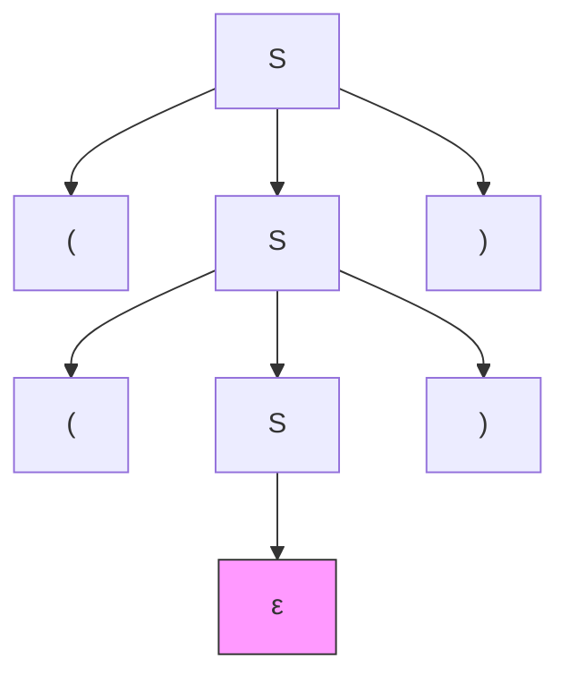
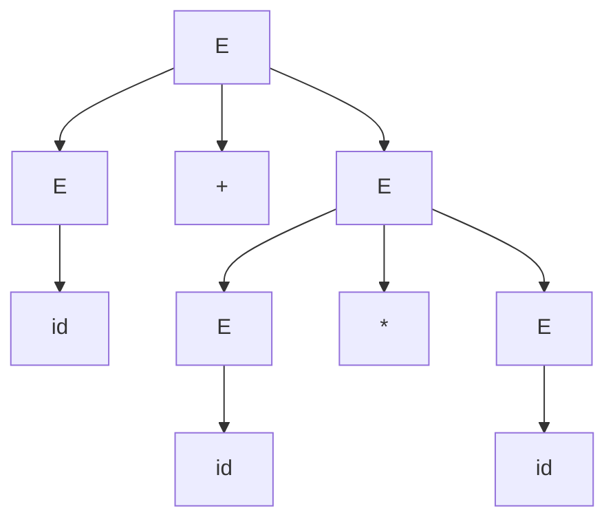
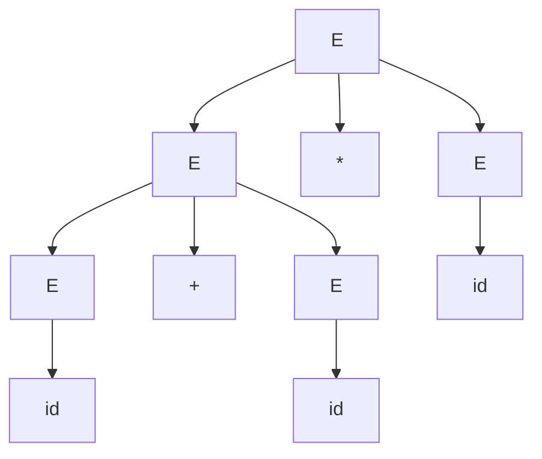
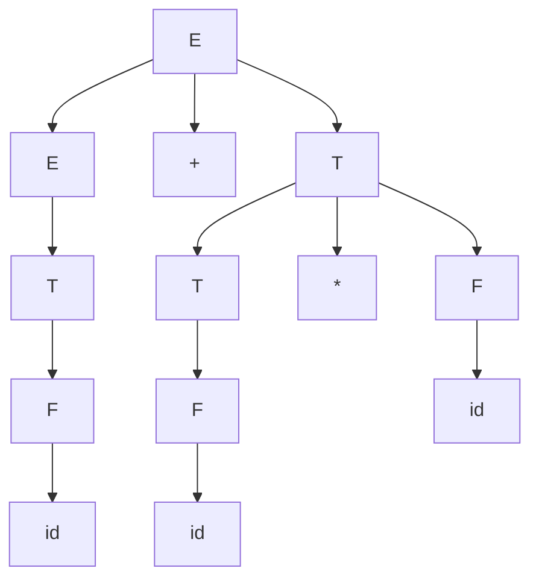

# Chương 5: Văn phạm phi ngữ cảnh (CFG – Context‑Free Grammars)

Văn phạm phi ngữ cảnh sinh ra ngôn ngữ phi ngữ cảnh, là tập chứa của ngôn ngữ chính quy. Chúng là nền tảng trong cú pháp ngôn ngữ lập trình, xử lý ngôn ngữ tự nhiên và thiết kế trình biên dịch.

---

## 1. Các thành phần của CFG (V, Σ, R, S)

Văn phạm phi ngữ cảnh là một bộ 4 thành phần $G = (V, \Sigma, R, S)$:

- **V** – tập hữu hạn các ký hiệu *không kết cuối* (biến)
- **Σ** – tập hữu hạn các ký hiệu *kết cuối* (bảng chữ cái), rời rạc với V
- **R** – tập hữu hạn các *quy tắc sinh* có dạng $A \to \alpha$, trong đó $A \in V$ và $\alpha \in (V \cup \Sigma)^*$ (bất kỳ chuỗi nào của các kết cuối và không kết cuối)
- **S** – *ký hiệu bắt đầu* ($S \in V$)

### Ví dụ: Văn phạm cho dấu ngoặc cân bằng
- $V = \{S\}$
- $\Sigma = \{(,)\}$
- $R = \{ S \to \varepsilon,\; S \to (S),\; S \to SS \}$
- $S$ là ký hiệu bắt đầu

---

## 2. Dẫn xuất và Dạng câu

Một **dẫn xuất** là một chuỗi các phép thay thế ký hiệu không kết cuối bằng các quy tắc sinh, bắt đầu từ $S$ và kết thúc bằng một chuỗi chỉ gồm các kết cuối (một câu).

Nếu $\alpha \Rightarrow \beta$ (một bước), thay thế một không kết cuối trong $\alpha$ bằng một quy tắc.  
Bao đóng phản xạ-bắc cầu $\Rightarrow^*$ có nghĩa là không hoặc nhiều bước.

Một **dạng câu** là bất kỳ chuỗi nào của kết cuối và không kết cuối xuất hiện trong dẫn xuất (bao gồm các bước trung gian).

### Ví dụ dẫn xuất (văn phạm dấu ngoặc cân bằng):
$S \Rightarrow SS \Rightarrow (S)S \Rightarrow (SS)S \Rightarrow (()S)S \Rightarrow (())S \Rightarrow (())$  

Ở đây $SS, (S)S, (SS)S, (()S)S, (())S, (())$ là các dạng câu; cái cuối cùng là một câu.

---

## 3. Dẫn xuất trái nhất và Dẫn xuất phải nhất

- **Dẫn xuất trái nhất** – luôn thay thế ký hiệu không kết cuối ngoài cùng bên trái.
- **Dẫn xuất phải nhất** – luôn thay thế ký hiệu không kết cuối ngoài cùng bên phải.

Với cùng một câu, dẫn xuất trái nhất và phải nhất có thể khác nhau.

### Ví dụ: Văn phạm $S \to AB,\; A \to a,\; B \to b$

- Trái nhất: $S \Rightarrow AB \Rightarrow aB \Rightarrow ab$  
- Phải nhất: $S \Rightarrow AB \Rightarrow Ab \Rightarrow ab$

Trong văn phạm không mơ hồ, cả hai đều duy nhất với một câu cho trước. Trong văn phạm mơ hồ, tồn tại nhiều dẫn xuất trái nhất (hoặc phải nhất).

---

## 4. Cây phân tích cú pháp (Parse Tree)

Cây phân tích cú pháp là biểu diễn đồ họa của một dẫn xuất.  
- Gốc: ký hiệu bắt đầu $S$  
- Các nút bên trong: ký hiệu không kết cuối  
- Các con: vế phải của quy tắc áp dụng cho nút cha  
- Các lá: ký hiệu kết cuối (hoặc ε) theo thứ tự từ trái sang phải tạo thành câu.

### Sơ đồ Mermaid của cây phân tích cho `(())` từ văn phạm $S \to \varepsilon \mid (S) \mid SS$:



(Chúng ta thường viết ε như một lá không có ký hiệu, nhưng để nhìn thấy rõ hơn, ta đặt một nút có nhãn ε.)

Cây phân tích cú pháp trừu tượng hóa thứ tự thay thế (trái nhất vs phải nhất) và chỉ hiển thị cấu trúc nhóm.

---

## 5. Sự mơ hồ trong Văn phạm phi ngữ cảnh

Một văn phạm là **mơ hồ** nếu tồn tại ít nhất một chuỗi có nhiều hơn một cây phân tích cú pháp khác nhau (tương đương, nhiều hơn một dẫn xuất trái nhất hoặc nhiều hơn một dẫn xuất phải nhất).

### Ví dụ: Văn phạm mơ hồ cổ điển cho biểu thức số học
$E \to E+E \mid E*E \mid (E) \mid id$

Chuỗi `id+id*id` có hai cây phân tích:

**Cây 1** (nhân trước cộng – đúng):


**Cây 2** (cộng trước nhân – ưu tiên sai):


Vậy văn phạm này là mơ hồ.

### Loại bỏ sự mơ hồ (Khi có thể)

Một số văn phạm mơ hồ có thể được viết lại thành không mơ hồ bằng cách giới thiệu các quy tắc về độ ưu tiên và kết hợp.

**Phiên bản không mơ hồ** cho số học:

- $E \to E+T \mid T$
- $T \to T*F \mid F$
- $F \to (E) \mid id$

Bây giờ `id+id*id` chỉ có một cây phân tích: phép nhân sâu hơn (ưu tiên cao hơn).

Không phải mọi CFG đều có thể làm cho không mơ hồ (xem ngôn ngữ mơ hồ vốn dĩ bên dưới).

---

## 6. Ngôn ngữ mơ hồ vốn dĩ (Inherently Ambiguous Languages)

Một **ngôn ngữ phi ngữ cảnh** $L$ là **mơ hồ vốn dĩ** nếu mọi CFG sinh ra $L$ đều mơ hồ. Không tồn tại văn phạm không mơ hồ nào cho $L$.

### Ví dụ cổ điển: $L = \{ a^n b^n c^m \mid n,m \ge 0 \} \cup \{ a^n b^m c^m \mid n,m \ge 0 \}$

- Các chuỗi dạng $a^n b^n c^n$ có hai cách diễn giải cấu trúc khác nhau: hoặc là một phần của tập đầu tiên (khớp a và b trước) hoặc là tập thứ hai (khớp b và c).
- Được chứng minh thông qua bổ đề Ogden (một tổng quát hóa của bổ đề bơm cho CFL).

Ví dụ khác: $\{ a^i b^j c^k \mid i=j \text{ hoặc } j=k \}$.

### Tại sao sự mơ hồ vốn dĩ quan trọng:
- Một số cấu trúc ngôn ngữ lập trình (ví dụ: `if-then-else` mơ hồ có thể được giải quyết bằng các quy tắc định hướng, nhưng ngôn ngữ không mơ hồ vốn dĩ).
- Với các bộ sinh phân tích cú pháp, sự mơ hồ vốn dĩ có nghĩa là không có bộ phân tích đơn định nào tồn tại cho ngôn ngữ đó.

---

## Bảng so sánh: CFG vs Văn phạm chính quy

| Tính chất | Văn phạm chính quy (Kiểu 3) | CFG (Kiểu 2) |
|----------|--------------------------|---------------|
| Dạng quy tắc | $A \to aB \mid \varepsilon$ | $A \to \alpha, \alpha \in (V\cup\Sigma)^*$ |
| Năng lực dẫn xuất | Không thể đếm dấu ngoặc lồng nhau | Có thể đếm (dấu ngoặc cân bằng) |
| Có thể mơ hồ? | Không (ngôn ngữ chính quy có DFA không mơ hồ, do đó regex không mơ hồ) | Có |
| Bổ đề bơm | $uv^iw$ | $uv^ixy^iz$ (với hai phần bơm) |
| Tính chất đóng | Đóng đối với hợp, giao, bù, v.v. | Đóng đối với hợp, ghép nối, bao đóng Kleene, nhưng **không** đối với giao hoặc bù |

---

## Ví dụ: CFG đầy đủ cho số học đơn giản (không mơ hồ)

$G = (V,\Sigma,R,E)$  
- $V = \{E, T, F\}$  
- $\Sigma = \{+, *, (, ), id\}$  
- $R$:
    1. $E \to E+T \mid T$  
    2. $T \to T*F \mid F$  
    3. $F \to (E) \mid id$

**Dẫn xuất trái nhất của `id+id*id`:**  
```text
E => E+T => T+T => F+T => id+T => id+T*F => id+F*F => id+id*F => id+id*id
```

**Cây phân tích**:


Văn phạm này không mơ hồ, khác với phiên bản mơ hồ trước đó.

---

## Tính chất quyết định của CFL (sơ lược)

Không giống ngôn ngữ chính quy, nhiều tính chất của CFL là **không quyết định được**:
- Tính rỗng: quyết định được (kiểm tra xem ký hiệu bắt đầu có thể sinh ra chuỗi kết cuối nào không)
- Tính hữu hạn: quyết định được (kiểm tra các vòng lặp sinh chuỗi vô hạn)
- Thuộc tư cách thành viên (thuật toán CYK cho văn phạm CNF): quyết định được, $O(n^3)$
- **Tính tương đương** của hai CFG: không quyết định được
- **Sự mơ hồ** (một CFG cho trước có mơ hồ không): không quyết định được
- **Sự mơ hồ vốn dĩ** của ngôn ngữ: không quyết định được

---

## Tóm tắt

- CFG bao gồm các ký hiệu không kết cuối, kết cuối, quy tắc sinh và ký hiệu bắt đầu.
- Dẫn xuất (trái nhất/phải nhất) và cây phân tích cú pháp nắm bắt cấu trúc cú pháp.
- Sự mơ hồ xảy ra khi một chuỗi có nhiều cây phân tích; một số văn phạm có thể làm cho không mơ hồ, nhưng một số ngôn ngữ mơ hồ vốn dĩ.
- CFG mạnh hơn biểu thức chính quy nhưng vẫn có hạn chế (ví dụ: không thể kiểm tra $a^n b^n c^n$).

**Đọc thêm**: Dạng chuẩn Chomsky (CNF), thuật toán CYK, ô-tô-mát đẩy xuống (PDA), CFL đơn định vs không đơn định, bổ đề Ogden.
