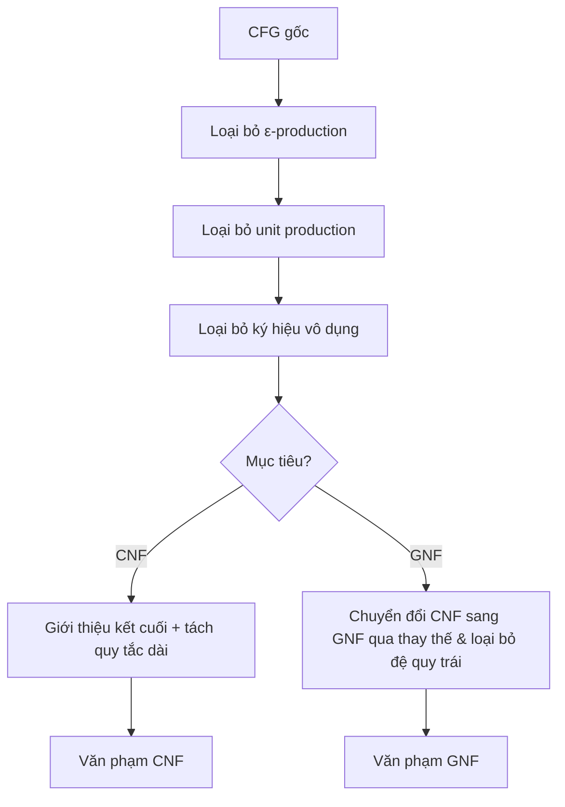

# Chương 6: Đơn giản hóa và Dạng chuẩn của CFG

Văn phạm phi ngữ cảnh có thể được đơn giản hóa bằng cách loại bỏ một số loại quy tắc nhất định mà không thay đổi ngôn ngữ được sinh ra. Việc đơn giản hóa này cần thiết cho các thuật toán phân tích cú pháp (ví dụ: CYK yêu cầu CNF) và phân tích lý thuyết.

---

## 1. Loại bỏ ε-production (Ký hiệu nullable)

Một **ε-production** là quy tắc có dạng $A \to \varepsilon$.  
Một ký hiệu không kết cuối $A$ là **nullable** nếu $A \Rightarrow^* \varepsilon$.

### Thuật toán loại bỏ ε-production:
1. Tìm tất cả các ký hiệu không kết cuối nullable.
2. Với mỗi quy tắc sinh $A \to X_1 X_2 \dots X_k$, sinh tất cả các quy tắc có thể trong đó bất kỳ tập con nào của ký hiệu nullable bị bỏ qua (nhưng không phải tất cả nếu chuỗi gốc không có kết cuối và trở thành ε, ngoại trừ ký hiệu bắt đầu).
3. Loại bỏ tất cả ε-production.
4. Nếu ký hiệu bắt đầu $S$ là nullable, thêm $S' \to S \mid \varepsilon$ với ký hiệu bắt đầu mới $S'$.

### Ví dụ:
Văn phạm:  

```ebnf
S → AB
A → aA | ε
B → bB | ε
```

Nullable: $A, B$ (vì mỗi cái có thể dẫn xuất ε), do đó $S$ cũng nullable (qua $S \Rightarrow AB \Rightarrow^* \varepsilon$).

Các quy tắc mới:
- Với $S \to AB$: giữ $AB$, cũng $A$ (bỏ B), $B$ (bỏ A), và $\varepsilon$ (bỏ cả hai). Nhưng ta sẽ xử lý ký hiệu bắt đầu riêng.
- Với $A \to aA$: giữ $aA$, và $a$ (bỏ A).
- Với $B \to bB$: giữ $bB$, và $b$ (bỏ B).

Sau khi loại bỏ ε-production (và thêm start mới):

```ebnf
S' → S | ε
S → AB | A | B
A → aA | a
B → bB | b
```

---

## 2. Loại bỏ Unit Production

Một **unit production** có dạng $A \to B$ trong đó cả $A$ và $B$ đều là ký hiệu không kết cuối.

### Thuật toán:
1. Tính **quan hệ cặp đơn vị**: $(A,B)$ nếu $A \Rightarrow^* B$ chỉ dùng unit production.
2. Với mỗi cặp như vậy $(A,B)$ và mỗi quy tắc không phải đơn vị $B \to \alpha$ (trong đó $\alpha$ không phải ký hiệu không kết cuối đơn), thêm $A \to \alpha$.
3. Loại bỏ tất cả unit production.

### Ví dụ (tiếp từ trên):
Văn phạm có: $S \to A$, $S \to B$ (unit production). Cũng có $A \to aA \mid a$, $B \to bB \mid b$.

Các cặp đơn vị: $(S,S), (S,A), (S,B)$ và các cặp tầm thường.

Từ $B \to bB \mid b$, thêm $S \to bB \mid b$.  
Từ $A \to aA \mid a$, thêm $S \to aA \mid a$.

Sau khi loại bỏ unit production:

```ebnf
S' → S | ε
S → AB | aA | a | bB | b
A → aA | a
B → bB | b
```

Lưu ý: $S \to AB$ vẫn giữ vì $AB$ không phải ký hiệu không kết cuối đơn.

---

## 3. Loại bỏ Ký hiệu vô dụng

Một ký hiệu (kết cuối hoặc không kết cuối) là **hữu ích** nếu nó xuất hiện trong một dẫn xuất từ $S$ đến chuỗi kết cuối. Nếu không thì nó là **vô dụng**.  
Ký hiệu vô dụng có hai loại:

- **Không sinh** – không thể dẫn xuất chuỗi kết cuối.
- **Không đến được** – không thể đến từ ký hiệu bắt đầu.

### Thuật toán (hai bước):
1. **Tìm ký hiệu sinh**:  
   Khởi tạo tập Gen = { tất cả kết cuối }.  
   Lặp: nếu $A \to \alpha$ và mọi ký hiệu trong $\alpha$ đều trong Gen, thêm $A$ vào Gen.  
   Loại bỏ tất cả ký hiệu không sinh không kết cuối và các quy tắc chứa chúng.
2. **Tìm ký hiệu có thể đến được**:  
   Bắt đầu từ $S$, duyệt đồ thị các quy tắc (coi ký hiệu không kết cuối là các nút).  
   Chỉ giữ các ký hiệu có thể đến được và các quy tắc của chúng.

### Ví dụ:

```ebnf
S → AB | a
A → a
B → bB
C → c
```

- **Sinh**: các kết cuối $\{a,b,c\}$.  
  $A \to a$ → A sinh.  
  $S \to a$ → S sinh.  
  $B \to bB$ cần B là sinh – nhưng B chưa biết. Vì không có trường hợp cơ sở cho B, B không sinh. C không bao giờ dùng từ S, nhưng ngay cả khi có thể đến được, nó sinh ($C \to c$). Tuy nhiên C không thể đến được.  
  Loại bỏ B và quy tắc của nó.
- **Có thể đến được** từ S: S, sau đó A (qua $S \to AB$ nhưng B đã mất? Thực ra sau khi loại bỏ, $S \to AB$ bị xóa, $S \to a$ còn lại, vậy A không thể đến được vì không còn quy tắc nào từ S đến A. C cũng không thể đến được.  
- Văn phạm cuối cùng: $S \to a$.

Vậy ký hiệu vô dụng được loại bỏ chính xác.

---

## 4. Dạng chuẩn Chomsky (CNF – Chomsky Normal Form)

CFG ở **Dạng chuẩn Chomsky** nếu mọi quy tắc có dạng:

- $A \to BC$ trong đó $B, C$ là ký hiệu không kết cuối (không phải ký hiệu bắt đầu)
- $A \to a$ trong đó $a$ là kết cuối
- Tùy chọn $S \to \varepsilon$ (chỉ cho ký hiệu bắt đầu)

### Thuật toán chuyển đổi (từng bước):

**Bước 1:** Loại bỏ ε-production (như trên).  
**Bước 2:** Loại bỏ unit production (như trên).  
**Bước 3:** Loại bỏ ký hiệu vô dụng (như trên) – tùy chọn nhưng hữu ích.  
**Bước 4:** Chuyển đổi tất cả các quy tắc còn lại sang CNF:

- **Với kết cuối trong quy tắc dài**: Với mỗi kết cuối $a$ xuất hiện trong quy tắc có độ dài $\ge 2$, giới thiệu ký hiệu không kết cuối mới $T_a$ và thêm $T_a \to a$. Thay thế $a$ bằng $T_a$.
- **Tách vế phải dài**: Với mỗi quy tắc $A \to X_1 X_2 \dots X_k$ với $k \ge 3$, thay thế bằng:
  $A \to X_1 A_1$,  
  $A_1 \to X_2 A_2$, …,  
  $A_{k-2} \to X_{k-1} X_k$,  
  trong đó mỗi $A_i$ là ký hiệu không kết cuối mới.

### Ví dụ: Chuyển đổi văn phạm sau sang CNF

Gốc (sau khi loại bỏ ε và đơn vị, và loại bỏ vô dụng – nhưng hãy bắt đầu từ văn phạm điển hình):

```ebnf
S → AB | a
A → aAB | b
B → BA | a
```

**Bước 4a – giới thiệu kết cuối**:
- Các kết cuối: a, b. Tạo $T_a \to a$, $T_b \to b$.
- Thay a bằng $T_a$, b bằng $T_b$ trong RHS có độ dài $\ge 2$.

Các quy tắc trở thành:

```ebnf
S → AB | a          (giữ S → a như vậy)
A → T_a A B | b
B → B A | a
T_a → a
T_b → b
```

**Bước 4b – tách RHS dài**:
- $A \to T_a A B$ có độ dài 3. Giới thiệu $A_1$ mới:
  $A \to T_a A_1$  
  $A_1 \to A B$
- Các quy tắc khác đã có độ dài 1 hoặc 2:  
  $S \to AB$ (OK), $A \to b$ (OK), $B \to BA$ (OK), $B \to a$ (OK), $T_a \to a$ (OK), $T_b \to b$ (OK).

Văn phạm CNF cuối cùng:

```ebnf
S → AB | a
A → T_a A_1 | b
A_1 → AB
B → BA | a
T_a → a
T_b → b
```

Lưu ý: $S \to a$ được phép (quy tắc kết cuối). Tất cả các cặp không kết cuối đều đúng quy cách.

---

## 5. Dạng chuẩn Greibach (GNF – Greibach Normal Form)

CFG ở **Dạng chuẩn Greibach** nếu mọi quy tắc có dạng:

$A \to a \alpha$  

trong đó $a$ là kết cuối, và $\alpha$ là chuỗi (có thể rỗng) của các ký hiệu không kết cuối.

Ngoài ra, $S \to \varepsilon$ được phép chỉ khi $\varepsilon$ thuộc ngôn ngữ.

### Ý nghĩa:
- Mỗi bước dẫn xuất sinh đúng một kết cuối.
- Hữu ích cho việc xây dựng ô-tô-mát đẩy xuống đọc một ký hiệu đầu vào mỗi bước.

### Cách tiếp cận chuyển đổi (khái niệm):
1. Chuyển đổi văn phạm sang CNF.
2. Đổi tên ký hiệu không kết cuối thành $A_1, A_2, \dots, A_n$.
3. Sửa các quy tắc sao cho với mỗi $A_i \to A_j \gamma$, ta có $i < j$ (loại bỏ đệ quy trái).
4. Với $i = n$ xuống đến 1, chuyển đổi tất cả quy tắc $A_i$ sang GNF bằng cách thay thế các ký hiệu không kết cuối đứng đầu.
5. Cuối cùng, bất kỳ quy tắc $A_i \to A_i \gamma$ (đệ quy trái) nào đều được thay thế bằng phương pháp loại bỏ đệ quy trái chuẩn.

**Ví dụ về GNF**:  

```ebnf
S → aAB | bB
A → aA | a
B → b
```

Đây đã ở GNF (mỗi RHS bắt đầu bằng một kết cuối).

---

## 6. Chuyển đổi từng bước bất kỳ CFG sang CNF (Ví dụ đầy đủ)

Hãy lấy một CFG tùy ý và đi qua tất cả các bước đơn giản hóa + CNF.

### Văn phạm gốc:

```ebnf
S → A | B
A → aAb | ε
B → bBa | ε
```

**Bước 1: Loại bỏ ε-production**

Tìm nullable: $A$ (vì $A \to \varepsilon$), $B$ (vì $B \to \varepsilon$), do đó $S$ nullable (qua $S \to A$ hoặc $B$).

Thêm start mới $S' \to S \mid \varepsilon$.

Với $A \to aAb$: sinh $aAb$, $ab$ (bỏ A ở giữa). Vậy $A \to aAb \mid ab$. $A \to \varepsilon$ gốc bị xóa.

Tương tự với $B \to bBa$: sinh $bBa \mid ba$.

Bây giờ ta có:

```ebnf
S' → S | ε
S → A | B
A → aAb | ab
B → bBa | ba
```

**Bước 2: Loại bỏ unit production**

Các cặp đơn vị: $(S',S), (S,A), (S,B)$.

Từ $A \to aAb \mid ab$, thêm $S \to aAb \mid ab$.  
Từ $B \to bBa \mid ba$, thêm $S \to bBa \mid ba$.  
Cũng $S' \to S$ trở thành $S' \to aAb \mid ab \mid bBa \mid ba$ (cộng $S' \to \varepsilon$).

Loại bỏ tất cả unit production:

```ebnf
S' → aAb | ab | bBa | ba | ε
A → aAb | ab
B → bBa | ba
```

**Bước 3: Loại bỏ ký hiệu vô dụng**

Tất cả các ký hiệu đều sinh: $a,b$ là kết cuối, A và B dẫn xuất kết cuối, S' dẫn xuất kết cuối. Tất cả có thể đến từ S'. Không có ký hiệu vô dụng.

**Bước 4: Chuyển đổi sang CNF**

Giới thiệu ký hiệu không kết cuối kết cuối:  
$T_a \to a$, $T_b \to b$.

Thay kết cuối trong RHS có độ dài $\ge 2$:

```ebnf
S' → T_a A T_b | T_a T_b | T_b B T_a | T_b T_a | ε
A → T_a A T_b | T_a T_b
B → T_b B T_a | T_b T_a
T_a → a
T_b → b
```

Bây giờ tách RHS dài ($\ge 3$):
- $S' \to T_a A T_b$: giới thiệu $X_1 \to A T_b$, rồi $S' \to T_a X_1$
- $S' \to T_b B T_a$: giới thiệu $X_2 \to B T_a$, rồi $S' \to T_b X_2$
- $A \to T_a A T_b$: giới thiệu $Y_1 \to A T_b$, rồi $A \to T_a Y_1$
- $B \to T_b B T_a$: giới thiệu $Z_1 \to B T_a$, rồi $B \to T_b Z_1$

Tất cả các quy tắc khác đã có độ dài 1 hoặc 2:  
$S' \to T_a T_b$ (OK), $S' \to T_b T_a$ (OK), $A \to T_a T_b$ (OK), $B \to T_b T_a$ (OK), và các kết cuối.

Văn phạm CNF cuối cùng:

```ebnf
S' → T_a X_1 | T_a T_b | T_b X_2 | T_b T_a | ε
X_1 → A T_b
X_2 → B T_a
A → T_a Y_1 | T_a T_b
Y_1 → A T_b
B → T_b Z_1 | T_b T_a
Z_1 → B T_a
T_a → a
T_b → b
```

Tất cả các quy tắc thỏa mãn CNF.

---

## Tóm tắt các Dạng chuẩn

| Dạng chuẩn | Hạn chế quy tắc | Trường hợp sử dụng |
|-------------|------------------------|----------|
| **CNF** | $A \to BC$ hoặc $A \to a$ | Phân tích CYK, thuật toán quyết định |
| **GNF** | $A \to a\alpha$ ($\alpha \in V^*$) | Xây dựng PDA đọc một kết cuối mỗi bước |

Cả hai dạng đều bảo toàn ngôn ngữ (trừ việc loại bỏ $\varepsilon$ khỏi start trong CNF cần xử lý đặc biệt).

---

## Sơ đồ luồng quyết định cho Đơn giản hóa



---

**Đọc thêm**: Chuyển đổi sang CNF và GNF là thuật toán; nhiều sách giáo khoa trình bày chi tiết loại bỏ đệ quy trái cho GNF. Văn phạm đơn giản hóa rất cần thiết để chứng minh các tính chất của CFL (ví dụ: bổ đề bơm cho CFL sử dụng CNF).
