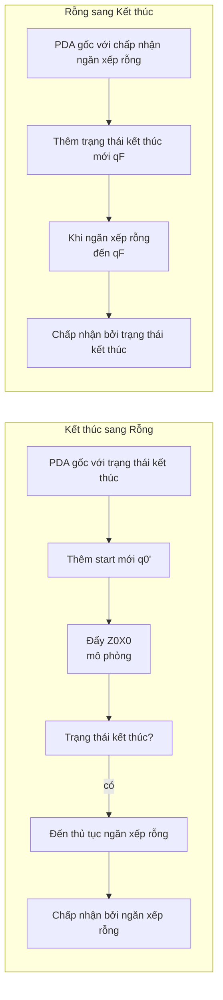
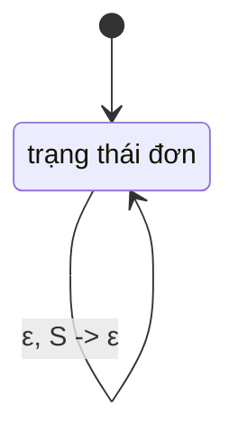
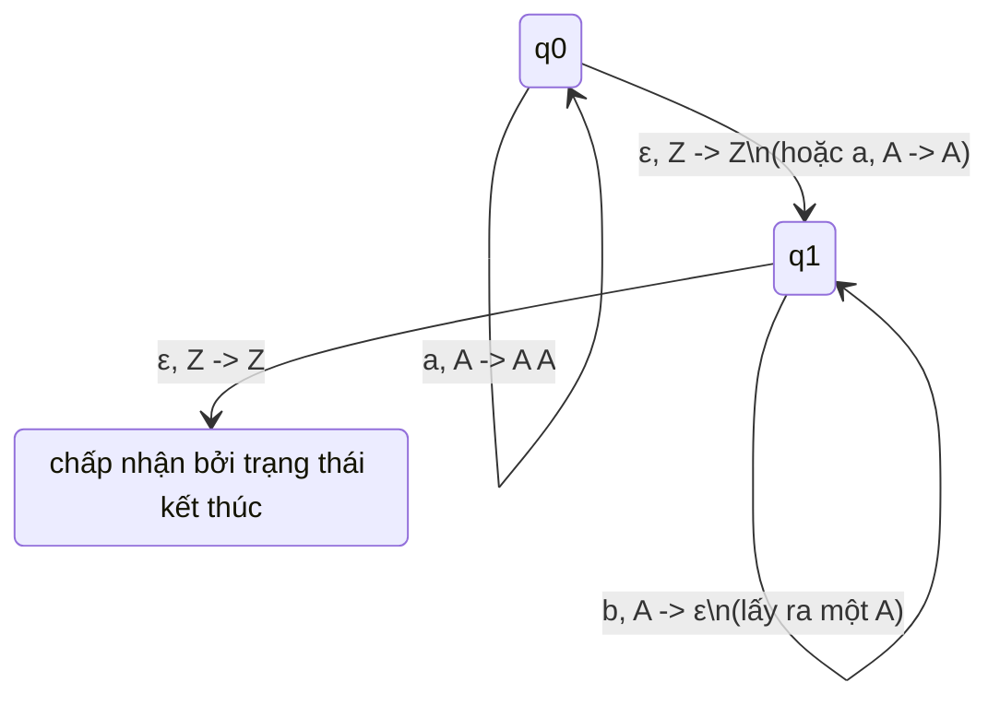

## Chương 7: Ô-tô-mát đẩy xuống (PDA – Pushdown Automata)

Một **Ô-tô-mát đẩy xuống (PDA)** mở rộng ô-tô-mát hữu hạn với một ngăn xếp không giới hạn, cho phép nó nhận biết ngôn ngữ phi ngữ cảnh. Chương này đề cập đến định nghĩa hình thức, ngữ nghĩa vận hành, các chế độ chấp nhận, tính tương đương với văn phạm phi ngữ cảnh và các cách xây dựng thực tiễn.

---

### 7.1 Định nghĩa và Các thành phần (Bộ 7)

PDA được định nghĩa hình thức là một bộ 7 thành phần

```

M = (Q, Σ, Γ, δ, q₀, Z₀, F)

````

trong đó

| Thành phần | Ý nghĩa |
|-----------|---------| 
| Q | tập hữu hạn các **trạng thái** |
| Σ | **bảng chữ cái đầu vào** hữu hạn |
| Γ | **bảng chữ cái ngăn xếp** hữu hạn |
| δ | **hàm chuyển trạng thái**: Q × (Σ ∪ {ε}) × Γ → P(Q × Γ*) |
| q₀ ∈ Q | **trạng thái bắt đầu** |
| Z₀ ∈ Γ | **ký hiệu ngăn xếp ban đầu** |
| F ⊆ Q | tập **trạng thái kết thúc** (để chấp nhận bởi trạng thái kết thúc) |

Chuyển trạng thái δ(q, a, X) = {(p, γ)} có nghĩa là:  
Ở trạng thái q, đọc đầu vào a (hoặc ε với chuyển epsilon), với X ở đỉnh ngăn xếp, PDA có thể chuyển đến trạng thái p và thay thế X bằng chuỗi γ (các phép đẩy/lấy ra được mã hóa trong γ).

- **Đẩy** Y: γ = YX (thêm Y vào đỉnh)
- **Lấy ra** X: γ = ε
- **Không thay đổi**: γ = X

> **Biểu diễn Mermaid** (ví dụ chuyển trạng thái):

```mermaid
stateDiagram-v2
    q0 --> q1 : a, X -> ε\n(lấy ra X)
    q1 --> q2 : b, Y -> ZY\n(đẩy Z)
````

---

### 7.2 Các phép toán ngăn xếp và Mô tả tức thời (ID)

Một **Mô tả tức thời** (ID) là một bộ ba (q, w, γ) biểu diễn trạng thái hiện tại q, đầu vào còn lại w và nội dung ngăn xếp γ (đỉnh được viết bên trái nhất).

**Một bước di chuyển** ⊢ được định nghĩa:
(q, a w, X γ) ⊢ (p, w, β γ) nếu (p, β) ∈ δ(q, a, X) (trong đó a ∈ Σ ∪ {ε}).

Ta viết ⊢* cho không hoặc nhiều bước di chuyển.

**Ví dụ chuỗi** cho L = {aⁿ bⁿ} (lấy ra a cho mỗi b):

```
(q₀, aabb, Z₀) ⊢ (q₀, abb, A Z₀) ⊢ (q₀, bb, AA Z₀) ⊢ (q₁, b, A Z₀) ⊢ (q₁, ε, Z₀)
```

---

### 7.3 Chấp nhận bởi Ngăn xếp rỗng vs Trạng thái kết thúc

PDA có thể chấp nhận chuỗi theo hai cách tương đương:

#### A. Chấp nhận bởi **Trạng thái kết thúc** (F)

```
L(M) = { w | (q₀, w, Z₀) ⊢* (q, ε, γ) với q ∈ F, γ ∈ Γ* }
```

Nội dung ngăn xếp khi chấp nhận là không liên quan.

#### B. Chấp nhận bởi **Ngăn xếp rỗng** (E)

```
N(M) = { w | (q₀, w, Z₀) ⊢* (q, ε, ε) với q ∈ Q }
```

Ngăn xếp phải hoàn toàn rỗng; các trạng thái kết thúc không được sử dụng.

#### Tính tương đương của hai chế độ

> **Định lý:** Ngôn ngữ được chấp nhận bởi PDA bởi trạng thái kết thúc **khi và chỉ khi** nó được chấp nhận bởi một PDA (có thể khác) bởi ngăn xếp rỗng.

**Xây dựng (kết thúc → rỗng):**
Thêm trạng thái bắt đầu mới q'₀ và ký hiệu đáy ngăn xếp mới X₀. Đẩy Z₀X₀, sau đó mô phỏng PDA gốc. Khi PDA gốc vào trạng thái kết thúc, nhảy đến trạng thái mới làm rỗng ngăn xếp.

**Xây dựng (rỗng → kết thúc):**
Thêm trạng thái kết thúc mới q_f. Khi ngăn xếp rỗng, nhảy đến q_f. Cũng đảm bảo từ q_f bạn có thể lấy ra bất kỳ ký hiệu ngăn xếp còn lại nào (dù không còn ký hiệu nào).



---

### 7.4 Tính tương đương của PDA và Văn phạm phi ngữ cảnh

**Định lý chính:** Ngôn ngữ là phi ngữ cảnh **khi và chỉ khi** nó được chấp nhận bởi một PDA.

Ta chứng minh hai chiều:

#### 7.4.1 CFG → PDA (Xây dựng một trạng thái)

Cho CFG G = (V, Σ, R, S) ở **dạng chuẩn Greibach** (tất cả quy tắc A → a α trong đó a ∈ Σ, α ∈ V*), ta xây dựng PDA với **một trạng thái**:

```
M = ({q}, Σ, V, δ, q, S, ∅)
```

Các chuyển trạng thái:

* Với mỗi quy tắc A → a B₁ B₂ ... Bₖ:
  δ(q, a, A) chứa (q, B₁ B₂ ... Bₖ)
* Với mỗi kết cuối a (nếu có quy tắc A → a):
  δ(q, a, A) chứa (q, ε)

**Trực giác:** Ngăn xếp giữ dẫn xuất trái nhất của văn phạm. Đọc ký hiệu đầu vào khớp với kết cuối được sinh ở đỉnh ngăn xếp.

**Ví dụ:** S → a S b | ε được chuyển sang Greibach:
S → a S B, B → b, cộng S → ε.

Các chuyển trạng thái PDA:



---

### 7.4.2 PDA → CFG (từ chấp nhận ngăn xếp rỗng)

Cho PDA M = (Q, Σ, Γ, δ, q₀, Z₀, ∅) chấp nhận bởi ngăn xếp rỗng, ta xây dựng CFG G với các ký hiệu không kết cuối [pXq].

---

### 7.5 Xây dựng PDA cho các Ngôn ngữ cho trước

#### Ví dụ 1: L = {aⁿ bⁿ | n ≥ 0}



---

### Tóm tắt

* PDA là bộ 7 thành phần với ngăn xếp, cấp cho nó bộ nhớ.
* **Mô tả tức thời** theo dõi trạng thái, đầu vào còn lại, ngăn xếp.
* Chấp nhận bởi **trạng thái kết thúc** và **ngăn xếp rỗng** là tương đương.
* PDA và CFG có năng lực biểu diễn ngang nhau.
