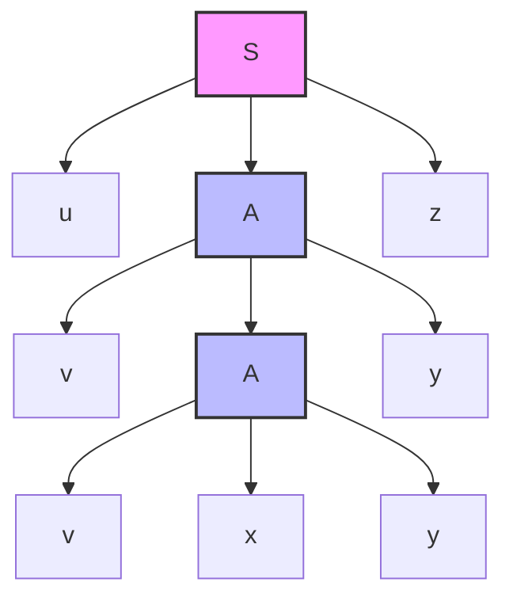
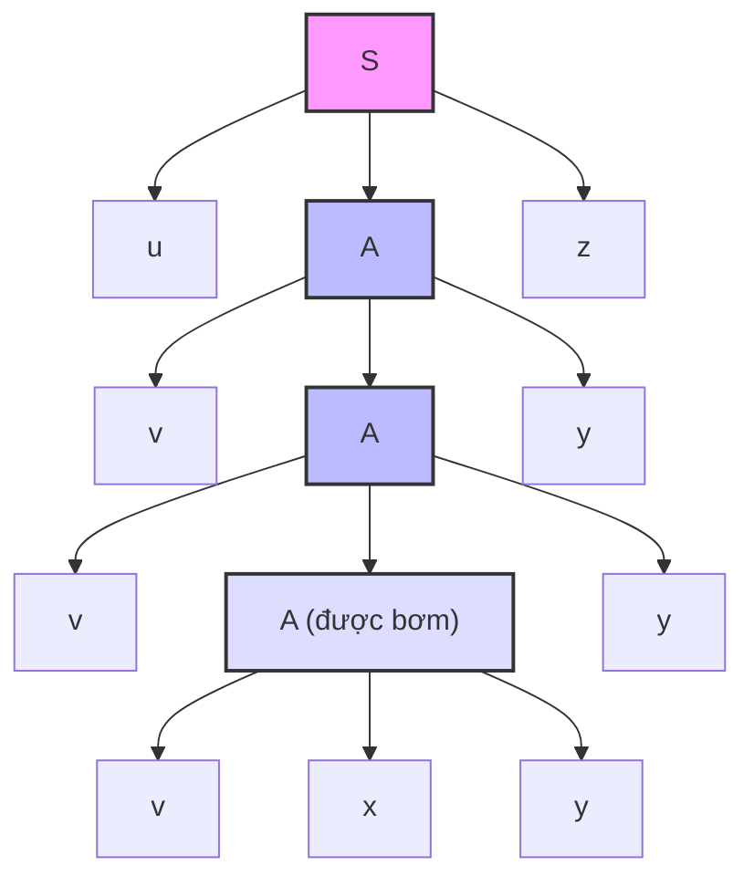
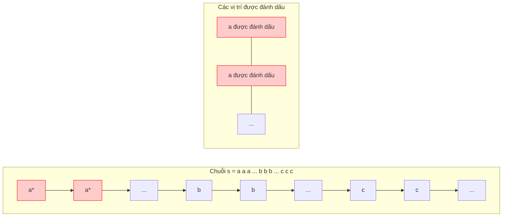

## Chương 8: Bổ đề bơm cho Ngôn ngữ phi ngữ cảnh

## 1. Phát biểu của Bổ đề bơm (Quan điểm Cây phân tích)

### Định lý (Bổ đề bơm cho CFL)

Cho $L$ là ngôn ngữ phi ngữ cảnh. Khi đó tồn tại hằng số $p > 0$ (gọi là độ dài bơm) sao cho bất kỳ chuỗi $s \in L$ với $|s| \ge p$ đều có thể viết dưới dạng:

$$
s = uvxyz
$$

với các tính chất sau:

1. $|vxy| \le p$ (phần ở giữa bị giới hạn)
2. $|vy| \ge 1$ (ít nhất một trong $v$ hoặc $y$ không rỗng)
3. $uv^i x y^i z \in L$ với mọi $i \ge 0$

---

### Trực giác từ Cây phân tích

Giả sử văn phạm ở **Dạng chuẩn Chomsky (CNF)**. Nếu chuỗi đủ dài, một ký hiệu không kết cuối lặp lại dọc theo một đường từ gốc đến lá. Ký hiệu không kết cuối lặp lại tạo ra một cây con có thể được nhân bản hoặc xóa bỏ.

Cách tách là:
- $u$: phần bên trái của $A$ phía trên
- $v$: phần được sinh trước khi đạt đến $A$ phía dưới
- $x$: kết quả ở giữa của $A$ phía dưới
- $y$: phần được sinh sau $A$ phía dưới
- $z$: phần bên phải của $A$ phía trên

Bằng cách lặp cây con có gốc tại $A$ phía dưới, ta được $uv^i x y^i z$.

---

## 2. Ứng dụng: Chứng minh Ngôn ngữ không phải phi ngữ cảnh

Để chứng minh ngôn ngữ $L$ không phải phi ngữ cảnh, giả sử nó là phi ngữ cảnh và rút ra mâu thuẫn bằng bổ đề bơm.

### Ví dụ 1

$$
L_1 = \{a^n b^n c^n \mid n \ge 0\}
$$

**Phác thảo chứng minh:**
Giả sử $L_1$ là phi ngữ cảnh. Cho $p$ là độ dài bơm. Chọn:

$$
s = a^p b^p c^p \in L_1, \quad |s| = 3p \ge p
$$

Theo bổ đề, $s = uvxyz$ với $|vxy| \le p$ và $|vy| \ge 1$.
Vì $|vxy| \le p$, chuỗi con $vxy$ không thể bao phủ cả ba khối ký hiệu ($a$, $b$ và $c$). Xét các trường hợp:

- **Trường hợp 1:** $vxy$ không chứa $c$. Bơm chỉ thay đổi $a$ và/hoặc $b$, vậy số lượng không còn bằng nhau.
- **Trường hợp 2:** $vxy$ không chứa $a$. Bơm chỉ thay đổi $b$ và/hoặc $c$, lại phá vỡ sự bằng nhau.
- **Trường hợp 3:** $vxy$ không chứa $b$. Bơm chỉ thay đổi $a$ và/hoặc $c$, phá vỡ sự bằng nhau.

Tất cả các trường hợp đều mâu thuẫn với tư cách thành viên trong $L_1$. Do đó $L_1$ không phải phi ngữ cảnh.

---

### Ví dụ 2

$$
L_2 = \{ww \mid w \in \{a,b\}^*\}
$$

Chọn $s = a^p b^p a^p b^p$. Vì $|vxy| \le p$, đoạn được bơm nằm trong một vùng nhỏ (hoặc vượt qua trung tâm chỉ một chút). Bơm phá hủy cấu trúc hai bản sao chính xác $ww$. Mâu thuẫn từ phân tích các trường hợp.

---

### Ví dụ 3 (Ngôn ngữ phi ngữ cảnh để so sánh)

$$
L = \{a^n b^m c^n d^m \mid n,m \ge 0\}
$$

Văn phạm cho $L$ là:

$$
S \to aSc \mid T, \quad T \to bTd \mid \varepsilon
$$

Điều này nhắc ta rằng bổ đề bơm không phải là công cụ để chứng minh ngôn ngữ là phi ngữ cảnh; nó chủ yếu được dùng để bác bỏ tính phi ngữ cảnh.

---

## 3. Hạn chế của Bổ đề bơm CFL và Bổ đề Ogden

Bổ đề bơm đưa ra điều kiện **cần** cho CFL, không phải điều kiện đủ. Một số ngôn ngữ không phải CFL vẫn có thể thỏa mãn điều kiện bơm chuẩn.

### Bổ đề Ogden (Công cụ mạnh hơn)

Bổ đề Ogden cho phép ta đánh dấu các vị trí trong chuỗi. Các phần có thể bơm phải tương tác với các vị trí được đánh dấu, làm cho các chứng minh mạnh hơn.

**Phát biểu đơn giản:**
Với bất kỳ CFL $L$ nào, tồn tại hằng số $p$ sao cho với bất kỳ chuỗi $s \in L$ có ít nhất $p$ vị trí được đánh dấu, ta có thể viết $s = uvxyz$ với:

1. $|vxy| \le p$
2. $|vy| \ge 1$
3. $v$ và $y$ cùng nhau bao gồm ít nhất một vị trí được đánh dấu
4. $uv^i x y^i z \in L$ với mọi $i \ge 0$

---

### Tại sao việc Đánh dấu hữu ích

Việc đánh dấu buộc bơm phải ảnh hưởng đến vùng quan trọng thay vì vùng không liên quan.

---

### Ví dụ thường được xử lý tốt hơn với Bổ đề Ogden

$$
L = \{a^i b^j c^k \mid i = j \text{ hoặc } j = k, \text{ nhưng không phải cả hai}\}
$$

Ngôn ngữ này không phải phi ngữ cảnh, nhưng chứng minh bằng bổ đề bơm chuẩn khó khăn và có thể thất bại. Bổ đề Ogden có thể nhắm vào các vị trí đúng để rút ra mâu thuẫn rõ ràng.

---

### So sánh

| Tính chất | Bổ đề bơm chuẩn | Bổ đề Ogden |
| --- | --- | --- |
| Điều kiện cần cho CFL | Có (yếu hơn) | Có (mạnh hơn) |
| Điều kiện đủ | Không | Không |
| Chứng minh $\{a^n b^n c^n\}$ không phải CFL | Có | Có |
| Xử lý tốt hơn các xen kẽ phức tạp | Hạn chế | Tốt hơn |

---

### Điểm mấu chốt

Sử dụng bổ đề bơm chuẩn cho các chứng minh không phải CFL cổ điển. Nếu giới hạn đoạn $|vxy| \le p$ quá yếu để buộc mâu thuẫn, sử dụng bổ đề Ogden bằng cách đánh dấu các vị trí được chọn chiến lược.
