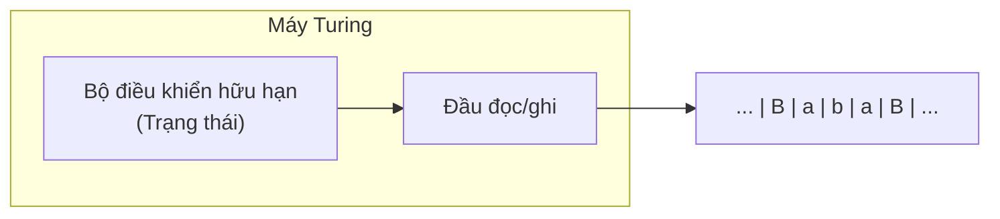
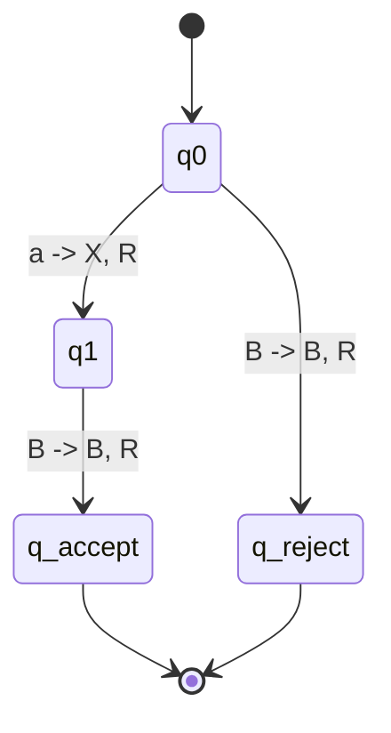
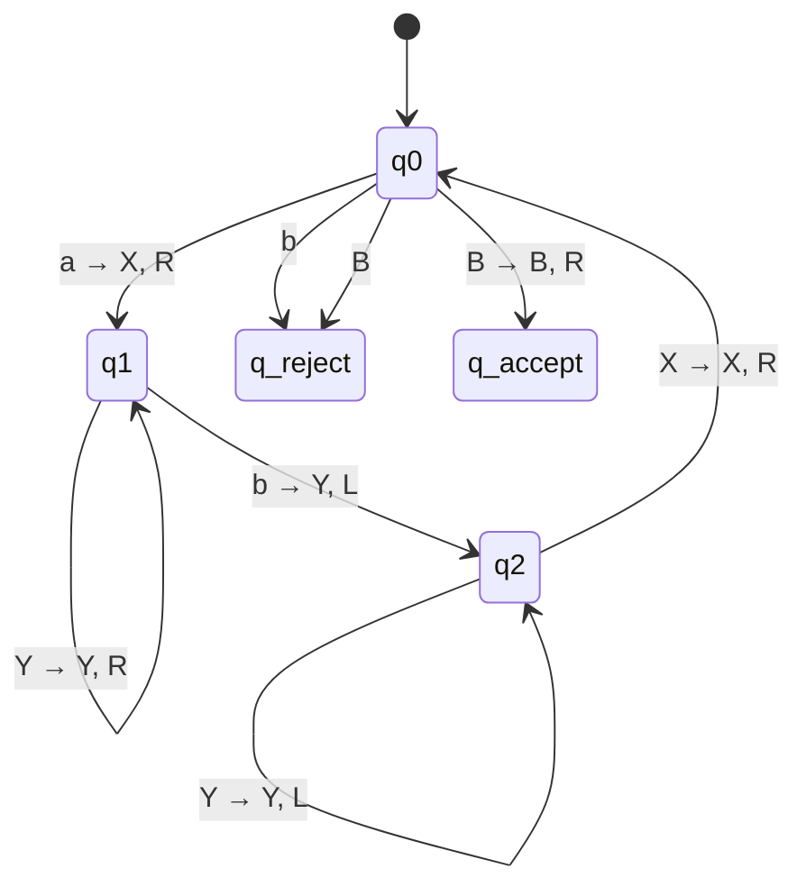
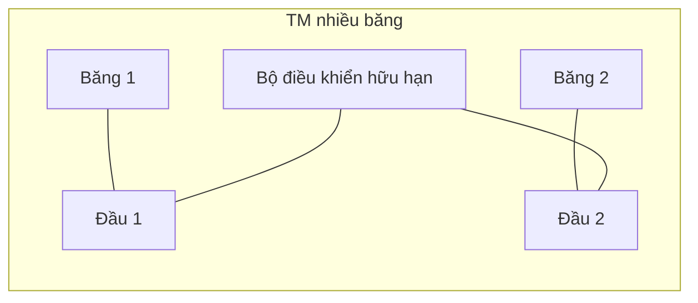
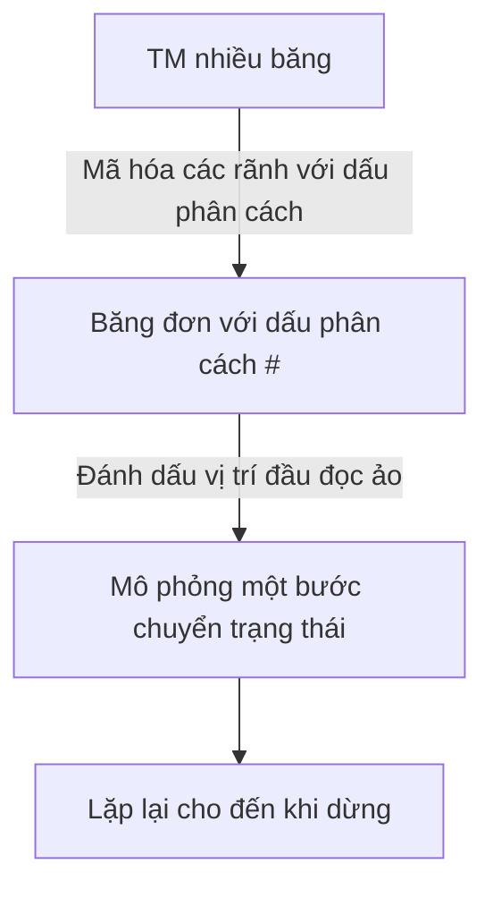

## Chương 9: Máy Turing (Turing Machine)

Chương này giới thiệu mô hình tính toán cổ điển mạnh mẽ nhất: **Máy Turing (TM)**. Máy Turing hình thức hóa khái niệm thuật toán và tạo thành nền tảng của lý thuyết khả năng tính toán và độ phức tạp.

---

## 1. Định nghĩa và Các thành phần của Máy Turing (Bộ 7)

Máy Turing đơn định được định nghĩa bởi:

- Một tập hữu hạn các trạng thái $Q$
- Bảng chữ cái đầu vào $\Sigma$ (không bao gồm ký hiệu trắng)
- Bảng chữ cái băng $\Gamma$ ($\Sigma \subseteq \Gamma$, và ký hiệu trắng thuộc $\Gamma$)
- Hàm chuyển trạng thái $\delta: Q \times \Gamma \to Q \times \Gamma \times \{L, R\}$
- Trạng thái bắt đầu $q_0 \in Q$
- Trạng thái chấp nhận $q_{accept} \in Q$
- Trạng thái từ chối $q_{reject} \in Q$, trong đó $q_{accept} \ne q_{reject}$

Bộ 7 hình thức:

$$
M = (Q, \Sigma, \Gamma, \delta, q_0, q_{accept}, q_{reject})
$$

### Sơ đồ của Máy Turing

Băng về mặt khái niệm là vô hạn theo cả hai chiều. Ban đầu, đầu vào được ghi trên băng với các ký hiệu trắng xung quanh, và đầu đọc bắt đầu ở ký hiệu đầu vào đầu tiên.

---

## 2. Mô tả tức thời (ID) và Tính toán

Một **Mô tả tức thời (ID)** nắm bắt một cấu hình đầy đủ của máy: nội dung băng, vị trí đầu đọc và trạng thái hiện tại.

Ký hiệu phổ biến là:

$$
x_1 x_2 \dots x_{i-1}\; q\; x_i x_{i+1} \dots x_n
$$

trong đó đầu đọc quét $x_i$ và trạng thái hiện tại là $q$.

Ví dụ ID:

$$
B\ a\ b\ q_2\ c\ B
$$

Điều này có nghĩa là đầu đọc đang ở $c$, và máy đang ở trạng thái $q_2$.

### Cách TM tính toán

1. Bắt đầu ở $q_0$ với đầu vào $w$ trên băng.
2. Lặp đi lặp lại áp dụng các chuyển trạng thái.
3. Nếu $\delta(q, a) = (q', b, d)$, thì:
   - ghi $b$
   - di chuyển đầu đọc theo hướng $d \in \{L, R\}$
   - thay đổi trạng thái sang $q'$
4. Dừng khi vào $q_{accept}$ hoặc $q_{reject}$.

TM **chấp nhận** $w$ nếu nó cuối cùng vào $q_{accept}$. Nó **từ chối** nếu vào $q_{reject}$. Nếu không bao giờ dừng, thì nó không chấp nhận.

### Sơ đồ chuyển trạng thái (TM đơn giản)

---

## 3. Ngôn ngữ được chấp nhận bởi Máy Turing

Ngôn ngữ được nhận biết bởi TM $M$ là:

$$
L(M) = \{\, w \in \Sigma^* \mid M \text{ chấp nhận } w \,\}
$$

- Các ngôn ngữ được nhận biết bởi TM được gọi là **Turing-nhận biết được** (hoặc đệ quy liệt kê).
- Nếu TM dừng với mọi đầu vào, ngôn ngữ của nó là **quyết định được** (đệ quy).

---

## 4. Thiết kế TM cho các Ngôn ngữ đơn giản

### Ví dụ 1

$$
L = \{a^n b^n \mid n \ge 1\}
$$

Chiến lược:

- Đánh dấu $a$ chưa đánh dấu ngoài cùng bên trái là $X$
- Di chuyển sang phải và đánh dấu $b$ khớp là $Y$
- Quay lại trái và lặp lại
- Chấp nhận khi tất cả ký hiệu đều khớp

### Ví dụ 2

$$
L = \{ww^R \mid w \in \{0,1\}^*\}
$$

(palindromes)

Chiến lược:

- So sánh ký hiệu đầu tiên và cuối cùng chưa khớp
- Đánh dấu các ký hiệu đã khớp và thu hẹp vào trong
- Từ chối khi không khớp, chấp nhận khi tất cả ký hiệu đều khớp

---

## 5. Các biến thể của Máy Turing

Tất cả các biến thể dưới đây đều tương đương về năng lực nhận biết ngôn ngữ với TM đơn định một băng chuẩn.

### 5.1 TM nhiều băng

- Có $k$ băng và $k$ đầu đọc
- Dạng chuyển trạng thái:
  $$
  \delta(q, a_1, \dots, a_k) = (q', b_1, \dots, b_k, d_1, \dots, d_k)
  $$
- Có thể được mô phỏng bởi TM một băng (chi phí đa thức)

### 5.2 TM không đơn định (NDTM)

Quan hệ chuyển trạng thái:

$$
\delta: Q \times \Gamma \to \mathcal{P}(Q \times \Gamma \times \{L, R\})
$$

TM đơn định có thể mô phỏng NDTM (có thể chậm hơn theo hàm mũ), vậy NDTM không tăng năng lực khả năng tính toán.

### 5.3 Các biến thể tương đương khác

- TM nhiều đầu đọc
- TM băng 2D
- TM ngoại tuyến (băng đầu vào chỉ đọc + băng làm việc)

Tất cả đều có thể được mã hóa bởi mô hình chuẩn.

---

## 6. Luận đề Church-Turing

> **Luận đề Church-Turing:** Mọi hàm có thể tính toán hiệu quả đều có thể tính toán bởi Máy Turing.

Đây là luận đề, không phải định lý, vì nó kết nối mô hình hình thức với khái niệm thuật toán không hình thức.

Tại sao nó được chấp nhận:

- Nhiều mô hình độc lập (lambda calculus, hàm đệ quy, máy thanh ghi) có cùng năng lực với TM.
- Không có mô hình chung nào có thể thực hiện vật lý nào được chứng minh vượt quá TM-khả năng tính toán cho các nhiệm vụ thuật toán.

Hệ quả:

Nếu bài toán có thể giải theo thuật toán, thì có một TM giải nó.

---

## Bảng tóm tắt

| Biến thể | Mô tả | Tương đương DTM một băng? |
| --- | --- | --- |
| DTM một băng | Mô hình chuẩn | Có |
| DTM nhiều băng | Nhiều băng | Có |
| TM không đơn định | Nhiều lựa chọn cho mỗi bước | Có |
| TM nhiều đầu đọc | Nhiều đầu đọc trên một băng | Có |
| TM băng 2D | Băng kiểu lưới | Có |
| TM ngoại tuyến | Băng đầu vào chỉ đọc riêng | Có |

**Điểm mấu chốt:** Máy Turing cung cấp định nghĩa vững chắc và ổn định về tính toán. Các biến thể TM tương đương củng cố luận đề Church-Turing và giúp phân loại các bài toán có thể tính toán so với không thể tính toán.

---

## Mermaid: Mô phỏng nhiều băng bằng một băng

Một băng đơn có thể lưu trữ tất cả các rãnh băng với dấu phân cách và dấu đánh dấu, chứng minh tính tương đương trong năng lực tính toán.
